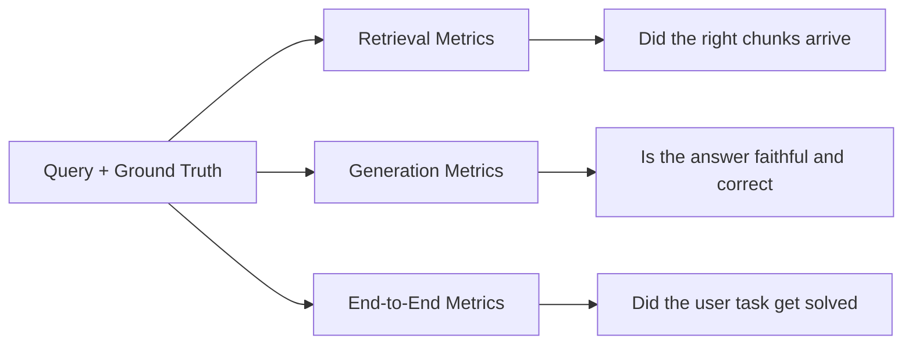

---
topic:
  - AI & ML
subtopic:
  - LLM
summary: "Decomposes into retrieval, generation, and end-to-end layers so regressions isolate to one layer."
level:
  - "2"
priority: High
tags:
  - FolderNote
publish: true
status: Done
---

# Intro

RAG evaluation decomposes into three layers: retrieval quality, generation quality, and end-to-end usefulness. Without this decomposition, teams observe "quality dropped" but cannot isolate whether chunking, embedding, retrieval ranking, prompt assembly, or model behavior caused the regression.

The mechanism: each layer has its own metrics, its own failure modes, and its own fix. Retrieval metrics measure whether the right evidence reaches the generator. Generation metrics measure whether the output is faithful to that evidence and actually answers the question. End-to-end metrics measure whether the user's task got solved. A pipeline can have perfect retrieval but poor generation (model ignores context), or perfect generation but poor retrieval (model faithfully summarizes irrelevant documents).



Example: a support bot returns the correct policy document (retrieval passes) but the model misreads a date constraint and answers with the wrong deadline (generation fails). Without layer separation, the team would chase retrieval improvements that cannot fix a generation problem.

```datacorejsx
const { FolderStructureMap } = await dc.require("Assets/components/devbook-folder-map.jsx");
return FolderStructureMap;
```

## Questions

> [!QUESTION]- Why decompose RAG evaluation into separate retrieval, generation, and end-to-end layers?
> Because a single "quality" score tells you something broke but not where, and the fix is completely different per layer. Retrieval metrics ask whether the right evidence even reached the generator; generation metrics ask whether the answer is faithful to that evidence and actually addresses the question; end-to-end asks whether the user's task got solved. The decomposition is what separates the two failures that look identical from outside: perfect retrieval with a model that ignores the context, and flawless generation over irrelevant documents the retriever never should have returned. Without it you chase retrieval tuning that can't fix a generation bug — and burn a sprint doing it.

> [!QUESTION]- What belongs in RAG evaluation specifically versus general LLM evaluation?
> RAG reuses the whole general eval stack — LLM-as-a-judge, deterministic checks, golden sets, synthetic generation, the online/A-B loop — and adds only what's genuinely RAG-shaped on top. That specific part is three things: retrieval-quality metrics (did the right chunks arrive, ranked well), faithfulness/groundedness (is the answer supported by the retrieved evidence rather than the model's parametric memory), and the labeling problem of which chunks count as relevant when a query maps to several. Everything else is inherited. Keeping that line clean is what stops the eval system from being rebuilt per domain — the general machinery lives once, and RAG, agents, and plain prompts each specialize it.

## References

- [RAGAS metrics reference -- faithfulness, context precision, answer correctness (RAGAS docs)](https://docs.ragas.io/en/stable/concepts/metrics/available_metrics/)
- [RAG evaluators -- groundedness, relevance, completeness (Azure AI Foundry)](https://learn.microsoft.com/en-us/azure/ai-foundry/concepts/evaluation-evaluators/rag-evaluators)
