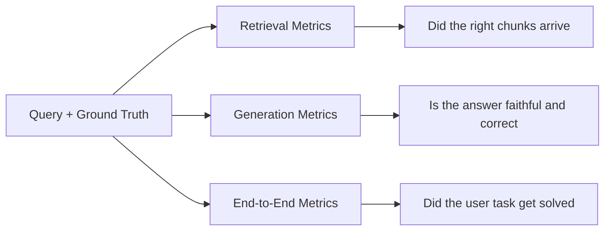

RAG can fail before generation starts. It can also retrieve the right evidence and still produce a bad answer. Evaluation therefore separates retrieval from generation, then checks the finished system against the user's task. One blended quality score cannot show which part needs repair.

Retrieval metrics ask whether relevant chunks reached the model and whether they were ranked well. Generation metrics check that the answer uses those chunks faithfully. End-to-end evaluation looks at the actual outcome. The distinction matters because prompt changes cannot recover a document that retrieval never found, while another embedding model will not fix a generator that ignores clear evidence already in context.


```mermaid
flowchart LR
    Q[Query + Ground Truth] --> RM[Retrieval Metrics]
    Q --> GM[Generation Metrics]
    Q --> EM[End-to-End Metrics]
    RM --> D1[Did the right chunks arrive]
    GM --> D2[Is the answer faithful and correct]
    EM --> D3[Did the user task get solved]
```

A support bot may retrieve the correct policy and still misread its date constraint. Retrieval passes. Generation fails. Without separate scores, that defect looks like a search problem and sends work toward the wrong component.

```datacorejsx
const { FolderStructureMap } = await dc.require("Assets/components/devbook-folder-map.jsx");
return FolderStructureMap;
```

# Questions

> [!QUESTION]- Why decompose RAG evaluation into separate retrieval, generation, and end-to-end layers?
> The layers fail for different reasons and need different fixes. Retrieval scoring shows whether relevant evidence arrived. Generation scoring checks whether the answer follows that evidence, while the end-to-end score records whether the task was solved. This separates a model that ignores a good context from one that faithfully summarizes irrelevant chunks. A single score makes both failures look the same.

> [!QUESTION]- What belongs in RAG evaluation specifically versus general LLM evaluation?
> RAG adds retrieval relevance, ranking quality, and faithfulness to the evidence placed in context. It also needs labels for queries with several acceptable chunks. Golden sets, deterministic checks, semantic judges, and online experiments remain general LLM evaluation machinery. Reusing that shared layer prevents every RAG pipeline from inventing its own evaluation system.

# References

- [RAGAS metrics reference](https://docs.ragas.io/en/stable/concepts/metrics/available_metrics/)
- [RAG evaluators in Azure AI Foundry](https://learn.microsoft.com/en-us/azure/ai-foundry/concepts/evaluation-evaluators/rag-evaluators)
