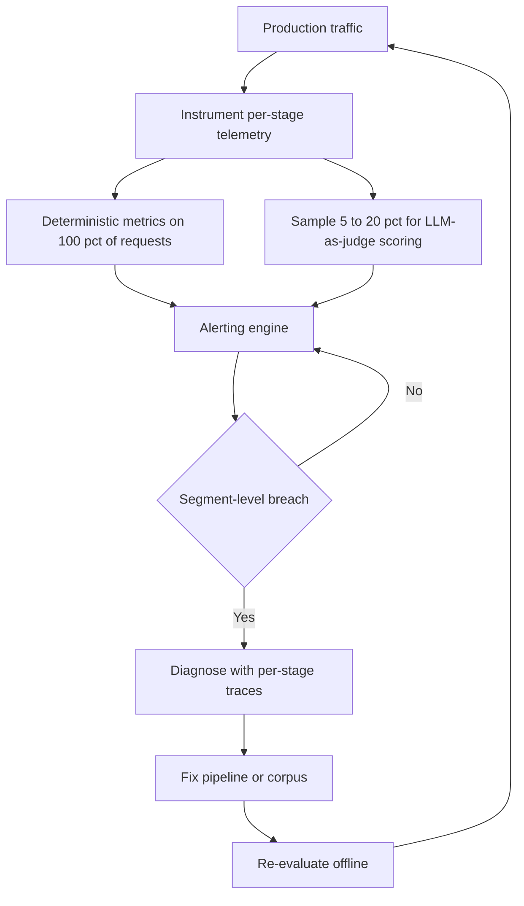

---
topic:
  - AI & ML
subtopic:
  - LLM
summary: "Continuously observing a deployed RAG pipeline per stage to catch regressions before users do."
level:
  - "2"
priority: High
status: Done
publish: true
---

RAG monitoring watches a deployed pipeline for regressions in answer quality, latency, and source freshness. Offline [[Home/AI & ML/LLM/Context Engineering/RAG/Evaluation/Evaluation|Evaluation]] answers whether a version is safe to ship. Monitoring asks whether that version still works on today's traffic.

The distinction is operational. Production adds query patterns that were absent from the eval set. Documents change shape. Providers update models. Load exposes slow paths. A request also crosses several independent boundaries, from query translation through retrieval and generation, so an end-to-end score alone cannot identify the broken stage.

Useful monitoring combines per-stage traces with cheap metrics on every request and sampled semantic scoring through [[LLM-as-a-Judge|LLM-as-judge]]. Alerts compare each segment with its own recent baseline. A global faithfulness score can hold at 0.91 while one tenant falls to 0.72 after a new document format breaks chunking. The aggregate stays green because the healthy tenants outnumber the broken slice.

# Instrumentation

Instrumentation sets the ceiling on diagnosis. OpenTelemetry's GenAI semantic conventions define common names for token usage, operation duration, and time to first token. Provider extensions can carry the extra attributes needed for OpenAI, Anthropic, AWS Bedrock, or Azure AI Inference without tying the trace model to one observability vendor.

Each pipeline stage emits a child span under the request trace. The `gen_ai.operation.name` attribute distinguishes operations such as `retrieval`, `embeddings`, and `chat`. This structure exposes latency, errors, and payload size at every boundary.

The original query remains beside any translated query. Retrieved document IDs, relevance scores, token counts through `gen_ai.usage.input_tokens` / `gen_ai.usage.output_tokens`, and model metadata form the structured record. Full prompts and responses are expensive and may contain sensitive data, so their retention belongs to an approved sample. Structured metadata can cover all traffic.

# Quality Metrics

Quality signals come from two sources. Deterministic metrics are cheap enough for every request. Semantic metrics need a judge model and usually run asynchronously on a sample.

## Deterministic Metrics

These metrics cover every request.

**Empty-result rate** measures queries that return no documents. A new cluster of empty results usually means missing corpus coverage, an over-restrictive filter, or a translated query that lands far from the indexed material.

**Retrieval count distribution** catches sudden changes in candidate volume. A drop points to an index or filter problem. A spike often follows a looser relevance threshold or an overly broad rewrite.

**Citation rate** tracks whether answers contain citations when the prompt requires them. A drop can reveal prompt regression or a model update that changed instruction following.

**Abstention rate** counts declined answers. It only becomes useful when paired with abstention correctness: was evidence genuinely absent, or did the generator refuse despite good retrieval?

**Response length** tracks median and p95 output tokens. Abrupt shifts often come from prompt changes, provider updates, or context assembly defects.

| Metric | What it answers | Alert when |
| --- | --- | --- |
| Empty-result rate | Are there corpus coverage gaps? | Exceeds 2× historical segment average |
| Retrieval count distribution | Is the index returning expected volumes? | Sudden drop or spike outside normal range |
| Citation rate | Does output include the required citation syntax? | Drops from baseline. Early format or instruction-following signal |
| Abstention rate | Is the system refusing correctly? | Spikes (over-refusal) or drops with low-evidence queries |
| Response length | Is context assembly behaving normally? | p95 shifts abruptly in either direction |

## Retrieval Quality Metrics

Retrieval quality needs a labeled set of queries with known relevant documents. The measurement runs on every deployment or on a schedule. Live counters show whether retrieval returned something. These metrics show whether it returned the right evidence.

**Recall@k** is the fraction of relevant documents present in the top k. Recall@5 of 0.8 means four-fifths of the known evidence appeared in the first five results. Missing evidence cannot be recovered during generation. A fall from 0.87 to 0.71 after an FAQ import may trace back to a schema change that split related content across chunk boundaries.

**Precision@k** is the relevant share of the first k results. Precision@5 of 0.6 means three chunks are useful and two are noise. Increasing k can improve recall while damaging precision. A reranker is often the cheapest way to keep the extra coverage without sending all of that noise to the model.

**HitRate@k** is the share of queries with at least one relevant result in the first k. It is a blunt but useful floor. HitRate@5 of 0.92 means 8% of queries receive no useful context at all. Segmenting it can separate a product-specific coverage gap from a general ranking problem.

**MRR (Mean Reciprocal Rank)** averages `1 / rank` for the first relevant result. It rewards putting one good document near the top. This matters when generation sees only one or two chunks. An embedding upgrade can improve Recall@10 while pushing the best result down to position three or four. MRR exposes that regression.

**MAP (Mean Average Precision)** averages precision at every rank where a relevant document appears. It is more informative than MRR when the answer needs several sources. A legal assistant may have MRR of 0.88 because it finds one case early, yet MAP of 0.51 because the remaining relevant cases are missing or buried.

**nDCG@k (Normalized Discounted Cumulative Gain)** supports graded relevance and discounts lower positions. nDCG@5 of 0.83 means the observed ranking achieved 83% of the ideal gain. A strong nDCG@10 with weak nDCG@3 says the right documents exist in the candidate set but reach the generator too late.

| Metric | What it answers | When to prefer |
| --- | --- | --- |
| Recall@k | Were the relevant documents found? | Primary metric. Always track |
| Precision@k | How much noise is in the context? | Context window is tight or token cost matters |
| HitRate@k | Does any relevant doc appear? | Minimum-bar coverage check. Fast to interpret |
| MRR | Is the best result ranked first? | Generator uses only top-1 or top-2 chunks |
| MAP | Are all relevant docs found and ranked high? | Multiple relevant documents expected per query |
| nDCG@k | Is the full ranking quality good? | Generator uses all k chunks with position-aware weighting |

The full set is tracked against the golden queries. Recall@k and nDCG@k make good deployment gates. MRR and HitRate make failures easier to classify.

## LLM-as-Judge Metrics

Semantic scoring runs asynchronously on a sample of production traffic. Binary pass/fail rubrics are usually easier to calibrate than 1–5 scales. A smaller judge can handle routine scoring, while a stronger model and human labels provide periodic calibration. The model names matter less than stable rubrics and measured agreement.

**Faithfulness (groundedness)** checks whether each answer claim is supported by the retrieved context. A judge splits the response into claims and tests them against the passages. `supported_claims / total_claims` gives the score. For high-volume systems, a smaller classifier such as RAGAS FaithfulnesswithHHEM can trade some flexibility for lower cost.

**Answer relevancy** asks whether the response addresses the query. RAGAS estimates it by generating questions from the answer and comparing them with the original query. A model can faithfully summarize irrelevant context, so faithfulness alone is insufficient. This metric needs no reference answer.

**Context relevancy** scores the retrieved passages against the query. It can fall before answer metrics do because the generator may compensate from parametric knowledge. That temporary stability is dangerous: evidence quality has already weakened even if the answers still look plausible.

**Answer correctness** compares the response with a reference answer. A response can be grounded and still miss the decisive constraint. Because references are required, correctness belongs in offline evaluation rather than arbitrary production samples.

**Citation validity** checks each cited passage against the claim attached to it. Overall grounding can be high while a particular citation points to the wrong source. This metric matters whenever citations are part of the trust contract.

**Response completeness** checks whether every requested part was answered. It needs either a reference answer or a rubric for the query type.

**Noise Sensitivity** measures wrong claims induced by irrelevant retrieved chunks. Recall can stay healthy because the right evidence was present, and faithfulness can remain high because most claims were supported. The extra false claim is the failure. This metric needs a reference. Lower is better.

**Context Entities Recall** compares entities in the reference answer with entities present in the retrieved context. It catches missing names, dates, or identifiers that a broad relevance label may overlook. A reference is required.

| Metric | What it answers | Reference needed |
| --- | --- | --- |
| Faithfulness | Are all claims grounded in retrieved context? | No |
| Answer relevancy | Does the response address the question? | No |
| Context relevancy | Were retrieved documents relevant to the query? | No |
| Answer correctness | Does the answer actually solve the question? | Yes |
| Citation validity | Does each citation support its attached claim? | No |
| Response completeness | Are all aspects of the query covered? | Reference answer or query-type rubric |
| Noise Sensitivity | Does noisy context introduce fabricated claims? | Yes |
| Context Entities Recall | Are required named entities present in context? | Yes |

## Performance and Cost Metrics

**Per-stage latency** tracks p50, p95, and p99 for each stage. End-to-end latency may stay inside budget while reranking degrades, so the stage breakdown is what makes the regression actionable.

**End-to-end latency** measures the user-visible request duration. The SLO applies to this total, while diagnosis uses the child spans.

**Token usage** records input and output tokens through `gen_ai.client.token.usage`. Per-query and daily totals expose cost. A sudden rise usually points to prompt growth or oversized context.

**Cache hit rate** belongs to each [[Home/AI & ML/LLM/Context Engineering/RAG/Caching|Caching]] layer. A drop after a corpus update is expected. A sustained drop on stable data points to key design or invalidation.

**Error rate** counts failed requests and assigns them to the stage that failed. Model API errors should not be mixed with retrieval timeouts or response parsing defects.

| Metric | What it answers | Alert when |
| --- | --- | --- |
| Per-stage latency | Which stage is the bottleneck? | p95 for any stage exceeds SLO budget |
| End-to-end latency | Is the overall SLO being met? | p95 exceeds SLO for 10+ minutes |
| Token usage | Is prompt assembly efficient? | Per-query cost increases >30% from baseline |
| Cache hit rate | Is caching working correctly? | Sustained drop on a stable corpus |
| Error rate | Are pipeline stages failing? | Exceeds historical baseline per stage |

## Data Health Metrics

**Index freshness lag** measures the delay between a source update and the corresponding searchable embedding. A distribution matters more than one average: a two-hour median can coexist with a three-day p99, leaving a small set of documents silently stale.

**Ingestion failure rate** measures documents lost during embedding or indexing. Silent failures later appear as unexplained coverage gaps.

**Corpus size** tracks document and chunk counts over time. An unexpected drop suggests deletion or an ingestion defect.

| Metric | What it answers | Alert when |
| --- | --- | --- |
| Index freshness lag | Are documents being indexed promptly? | p99 lag exceeds acceptable staleness window |
| Ingestion failure rate | Are documents being lost silently? | Exceeds 1% of scheduled ingestions |
| Corpus size | Is the index growing or shrinking as expected? | Unexpected drop (deletion or pipeline failure) |

# Segmentation

Global averages hide local damage. A change can improve overall faithfulness by 2% while cutting it by 20% for a tenant whose documents use a different format.

Useful segment dimensions include:

- **Tenant or user group:** multi-tenant systems must catch per-tenant regressions.
- **Query cluster:** group similar queries by intent or embedding proximity and track metrics per cluster.
- **Document source type:** PDFs, wikis, APIs, and databases fail differently during chunking and retrieval.
- **Language:** each language has its own retrieval and generation quality profile.

Segment-level alerts are mandatory in multi-tenant or mixed-domain systems. The average can stay healthy while one important slice is already broken.

# Alerting

Relative thresholds work better for regression detection than one permanent number. A fixed faithfulness floor becomes stale after corpus changes or model updates. The values below are examples: each production threshold should come from historical variance, the applicable SLO, and the cost of a missed regression.

| Signal | Alert condition | Why |
| --- | --- | --- |
| Faithfulness (sampled) | Drops >5% from 7-day rolling baseline for any segment | Catches hallucination regressions before user impact |
| Empty-result rate | Exceeds 2x the historical segment average | Signals index coverage gap or filter misconfiguration |
| p95 end-to-end latency | Exceeds SLO budget for 10+ minutes | Performance regression or upstream dependency issue |
| Ingestion failure rate | Exceeds 1% of scheduled ingestions | Silent data loss accumulating |
| Token cost per query | Increases >30% from baseline | Prompt bloat, context window misuse, or upstream retrieval change |

An intentional model, prompt, or index change does not erase the old baseline immediately. Keep the previous version as the control during canary or shadow comparison, then promote the accepted candidate only after its release gates pass. The same control-versus-candidate principle appears in [[Home/AI & ML/LLM/Context Engineering/RAG/Evaluation/Evaluation|Evaluation]]. Relative alerts still need a slower absolute check because gradual drift can move the baseline itself.

# Pitfalls

## Monitoring Only Latency While Quality Degrades

A pipeline can meet every latency SLO while answers become less grounded. A faster provider model or a stale response cache may even improve the performance dashboard.

Latency and sampled quality belong on the same dashboard. "Faithfulness fell 8% for legal documents" identifies a real incident. "All systems nominal" does not.

## Judge Drift Without Calibration

Judge behavior changes when the provider updates the model or production traffic shifts. Scores can move slowly enough to look credible.

A set of 50–100 human-labeled examples provides scheduled calibration. Judge-human agreement is the control signal. A material drop means the rubric, prompt, or judge must be recalibrated. This is the production counterpart to the bias problem described in [[LLM-as-a-Judge]].

## Alerting on Global Aggregates Instead of Segments

Global faithfulness is 0.92. One tenant is at 0.68. An alert on the global number never fires, so the tenant discovers the failure first.

Alerts operate at segment level. High-priority tenants or high-risk domains may page immediately, while lower-priority segments can enter a daily report when alert volume is high.

## Sampling Bias in Quality Scoring

Uniform random sampling under-represents rare query types, even when those types fail more often than ordinary traffic.

Stratified sampling gives small query clusters judge coverage. Risk signals can also drive oversampling, for example low retrieval scores or unusual token use.

# Tradeoffs

| Approach | Coverage | Cost | Latency impact | Reliability |
| --- | --- | --- | --- | --- |
| Deterministic metrics only | Low — catches format and count anomalies, not semantic quality | Lowest — no model calls | Zero — computed from existing data | Reproducible, but only as valid as the encoded proxy |
| Full LLM-as-judge on every request | Highest — every response scored | Highest — model API cost per request | High if synchronous, zero if async | Subject to judge drift and prompt sensitivity |
| Sampled LLM-as-judge (5–20%) | High — covers the distribution statistically | Moderate — proportional to sample rate | Zero if async | Requires careful sampling to avoid bias |
| Human review of flagged samples | Highest precision — catches judge errors | Highest in human time | Delayed — hours to days | Gold standard for calibration, low throughput |
| Embedding drift detection | Medium — catches retrieval distribution shifts | Low — statistical comparison | Zero — computed offline | Detects slow drift, not sudden failures |

The practical default is deterministic metrics on all traffic, asynchronous judge scoring on a measured sample, and periodic human calibration. Embedding-drift checks can warn about slow retrieval changes between semantic scoring cycles.

# Questions

> [!QUESTION]- How does monitoring differ from evaluation in a RAG system, and why are both needed?
> Evaluation gates a candidate pipeline against a controlled dataset before release. Monitoring observes live traffic after release, where query distribution and source data keep changing. Production failures found through monitoring should become new evaluation cases. Without that loop, evaluation misses new incidents and monitoring keeps rediscovering old ones.

# References

- [OpenTelemetry GenAI semantic conventions — metrics, spans, and events for LLM operations (OpenTelemetry)](https://opentelemetry.io/docs/specs/semconv/gen-ai/)
- [LangSmith evaluation concepts — offline vs. online evaluation architecture and production trace scoring (LangSmith docs)](https://docs.smith.langchain.com/evaluation/concepts)
- [Phoenix LLM tracing — OpenTelemetry-native observability for RAG pipelines (Arize AI)](https://docs.arize.com/phoenix/tracing/llm-traces)
- [Embedding drift detection methods — statistical approaches for retrieval distribution monitoring (Evidently AI)](https://www.evidentlyai.com/blog/embedding-drift-detection)
