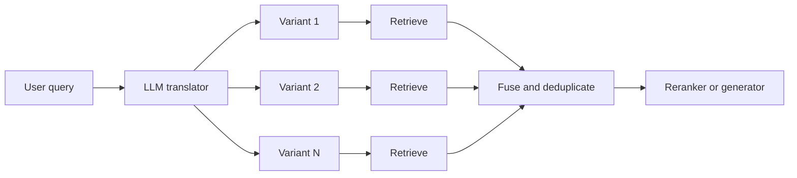

---
topic:
  - AI & ML
subtopic:
  - LLM
summary: "Rewrites a user question into retrieval-optimized variants so phrasing mismatches don't sink retrieval."
level:
  - "2"
priority: High
status: Done
publish: true
---

Query translation changes a user's wording before search so that retrieval sees language closer to the corpus. Someone asks, "Can partners burst above limits now?" The relevant document is titled "Q3 Quota Policy Update — Partner Tier Burst Allowance." Both describe the same policy, but a single query embedding may place them in different neighborhoods. Translation searches more of that space without changing the corpus or the [[Embeddings|embedding model]].

An LLM produces one or more variants. Depending on the technique, those variants may be paraphrases, narrower sub-questions, a broader question, or a hypothetical answer. Each one runs through [[Retrieval]]. The candidate lists are then deduplicated and fused before [[Re-ranking|reranking]] or generation.

A query such as "rate limit behavior for partner tier accounts" can become "partner tier throttling policy" and "API quota enforcement for partner customers." Each wording reaches a slightly different document neighborhood. Fusion keeps the strongest candidates from both searches.

This only fixes recall lost to vocabulary mismatch. It cannot repair bad [[Chunking]], a weak embedding model, a broken index, or a missing source document.

# How Each Rewrite Changes Search

## Multi-Query

Multi-query generates several phrasings of one intent. Each variant retrieves independently, and the result sets are deduplicated by document ID.

The useful part is coverage. "Authentication failure" and "credential validation error" mean nearly the same thing, yet a particular embedding model may place them far enough apart to return different documents.

Original query: "How to handle connection timeouts in HttpClient?"
Translated variants:

- "HttpClient timeout configuration and retry behavior"
- "System.Net.Http connection timeout exception handling"
- ".NET HTTP client request deadline exceeded"

The first variant is likely to match guides, the second API documentation, and the third operational incident text.

Multi-query is the usual first translation technique for natural-language search. Its main failure is query drift. If "HttpClient timeout" becomes "network timeout troubleshooting," operating-system diagnostics can crowd out the .NET-specific evidence.

## RAG-Fusion

RAG-Fusion adds an explicit ranking step to multi-query. It merges all result lists with [[Re-ranking|Reciprocal Rank Fusion (RRF)]]. For each document, it sums `1 / (rank + k)` across the lists. The conventional constant is `k=60`.

A document that ranks well for three variants usually gains more fusion score than one that appears only once. Agreement across independent phrasings acts as a relevance vote. RRF does not reject a drifted variant or its documents: a result ranked highly by one bad rewrite can still survive the cutoff. This is useful in enterprise and policy search, where the same concept appears under several names, only when the variants themselves remain faithful.

The bill is predictable: N variants require N retrieval calls plus the translation call. Four sequential 100 ms searches add roughly 400 ms. Running them concurrently reduces the retrieval portion to about the slowest individual call, though the translation call still sits in front of them.

## Step-Back Prompting

Step-back prompting asks a broader version of the question and retrieves for both versions. The original search supplies the case-specific evidence. The broader search supplies the mechanism needed to interpret it.

For "Why does EF Core time out on a batch insert of 10K rows?", the broader query might ask how EF Core batches commands and manages connections.

Original query: "Why is my HNSW recall dropping after adding 5M vectors?"

Step-back question: "How does HNSW index recall scale with corpus size and what parameters affect it?"

The broader search can recover HNSW graph behavior and `ef_search` tuning, while the original query finds troubleshooting reports for large indexes. This works when a symptom only makes sense through the underlying mechanism.

But abstraction can go too far. "What are vector database best practices?" is too broad to explain a recall drop and mostly burns context tokens.

## Decomposition

Decomposition breaks a genuinely multi-part request into different questions. It retrieves for each one, then synthesizes the evidence. Multi-query keeps one intent and changes its wording. Decomposition changes the work itself.

Original query: "How does Task compare to ValueTask for high-throughput API endpoints?"

Sub-questions:

- "What is the allocation behavior of Task in async methods?"
- "When does ValueTask avoid heap allocation and what are its constraints?"
- "What are the performance characteristics of high-throughput API endpoints with frequent async completions?"

No single chunk is likely to contain `Task` internals, `ValueTask` constraints, and representative throughput evidence. Separate searches can find each piece.

The danger is context fragmentation. A sub-question about `Task` may forget that the original problem is a high-throughput endpoint. Once that constraint disappears, retrieval returns generic async guidance and the synthesis step cannot recover the lost specificity. Each sub-question therefore carries the original constraints. Decomposition adds no value when one coherent search intent is enough.

## HyDE: Hypothetical Document Embeddings

HyDE generates a hypothetical answer, embeds that text, and searches for real documents near it. Short questions often make weak dense-retrieval inputs. A paragraph shaped like an answer carries more domain vocabulary and may sit closer to the source material.

That advantage comes from invented text. If the draft assumes the wrong error code or product version, retrieval follows the mistake into the wrong neighborhood. HyDE is therefore strongest on vague, semantic questions and weakest when exact identifiers carry the meaning. Those query classes require separate measurements.

# How Translation Fails

## Query Drift and Semantic Leakage

A rewrite can stay topically related while changing the request. "HttpClient connection timeout" becoming "network infrastructure timeout diagnostics" is a classic example: the search now favors operating-system material over .NET documentation. Fusion makes this harder to notice because the drifted results still look relevant.

The original query remains one of the retrieval variants. Translation prompts preserve entities, identifiers, and version numbers verbatim. A similarity threshold can reject extreme drift, but a labeled retrieval set is the real test because semantic similarity does not prove intent preservation.

## Latency Multiplication

Translation adds a serial model call before retrieval. Even with concurrent searches, end-to-end latency is the translator plus the slowest search. That is the number the p95 budget must absorb.

A hard budget of two to four variants bounds the cost. Searches run concurrently, and stable rewrites can be reused through [[Home/AI & ML/LLM/Context Engineering/RAG/Caching|caching]]. Production-like concurrency exposes queueing and tail latency that a single-query benchmark hides.

## HyDE Hallucination Amplification

HyDE puts the model's assumptions inside the search vector. A plausible but wrong draft does more than add noise: it steers retrieval toward documents that support the invented premise.

HyDE is compared with direct retrieval on a labeled set. Separate results for vague semantic queries and identifier-heavy factual queries prevent an aggregate score from hiding failures in the second group.

## Decomposition Losing Global Constraints

Decomposition often drops the words that connect the pieces. A generic `ValueTask` search is not enough when the original question is specifically about frequent synchronous completion under high load.

Every sub-question includes the original request or its material constraints. The synthesis prompt also receives the original request. For a single intent, multi-query is cheaper and keeps the context intact.

# Choosing a Technique

| Technique | Recall improvement | Precision risk | Latency cost | Best for |
| --- | --- | --- | --- | --- |
| No translation | Baseline -- single query only | Lowest -- no drift risk | None | Simple corpora with predictable query vocabulary |
| Multi-Query | Moderate -- covers vocabulary variants | Low-moderate -- drift from paraphrases | N retrieval calls -- parallelizable | Natural-language queries with varied user phrasing |
| RAG-Fusion | Moderate-high -- consensus can lift repeated evidence | Moderate -- RRF rewards agreement but does not remove drift | N retrieval calls + fusion computation | Broad questions where faithful variants surface the same evidence |
| Decomposition | High for multi-hop -- distinct evidence per sub-question | Moderate -- constraint loss across sub-questions | N retrieval calls + synthesis LLM call | Multi-entity or multi-constraint questions requiring separate evidence |
| Step-Back | Moderate -- adds principled background context | Low-moderate -- overly abstract retrieval possible | 2 retrieval calls -- original + step-back | Questions requiring first-principles context before specifics |
| HyDE | High for vague queries -- denser search vector | High -- hallucination can bias retrieval | 1 retrieval call + LLM generation | Short or exploratory queries where direct embedding is too sparse |

Direct retrieval provides the control. Multi-query or RAG-Fusion earns its cost when evaluation isolates vocabulary mismatch. Decomposition fits requests with independently retrievable sub-problems, while HyDE fits vague semantic queries. A technique stays only when it beats direct retrieval for its target query class within the latency budget.

# Questions

> [!QUESTION]- Why does query translation often improve recall but sometimes hurt precision, and how can the tradeoff be detected?
> Query translation raises recall by searching more phrasings, but it lowers precision when a rewrite adds concepts or changes constraints.
> Measure Recall@k and Precision@k before and after translation, split by query type. If Recall@20 rises while Precision@5 falls, coverage improved but the generator receives worse evidence. Keep the original query in the candidate set and reject variants that change material constraints.

> [!QUESTION]- When is decomposition a better choice than multi-query, and when does it hurt?
> Decomposition fits distinct sub-problems that need different evidence, such as a comparison or a timeline assembled from several sources. Multi-query fits one intent expressed with uncertain vocabulary.
> Decomposition hurts when the split removes the constraints connecting the pieces. It fits only when each sub-question can be answered independently and those answers can support the original request. It also adds a synthesis call, while multi-query adds only retrieval work.

# References

- [Precise Zero-Shot Dense Retrieval without Relevance Labels — the original HyDE paper (Gao et al., ACL 2023)](https://arxiv.org/abs/2212.10496)
- [Take a Step Back: Evoking Reasoning via Abstraction in Large Language Models (Zheng et al., ICLR 2024)](https://arxiv.org/abs/2310.06117)
- [RAG-Fusion: a New Take on Retrieval-Augmented Generation (Rackauckas, IJNLC 2024)](https://arxiv.org/abs/2402.03367)
- [Query Rewriting for Retrieval-Augmented Large Language Models — Rewrite-Retrieve-Read framework (Ma et al., EMNLP 2023)](https://arxiv.org/abs/2305.14283)
