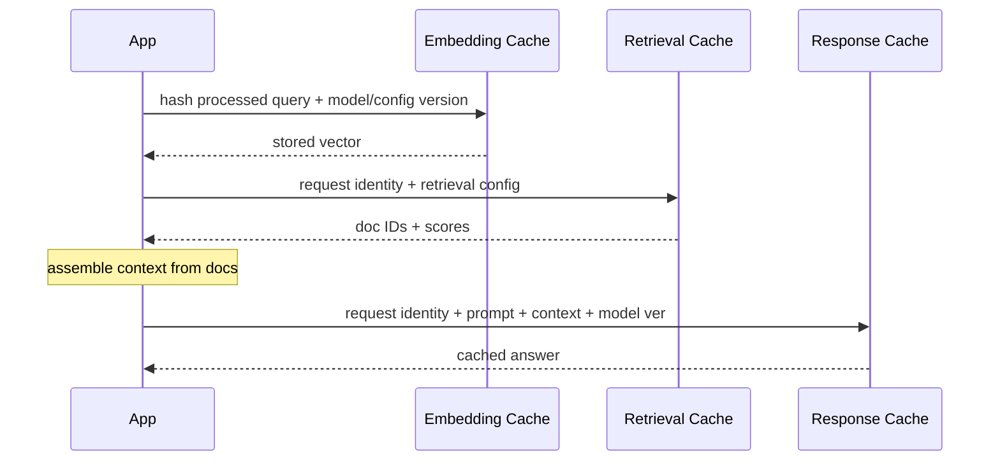
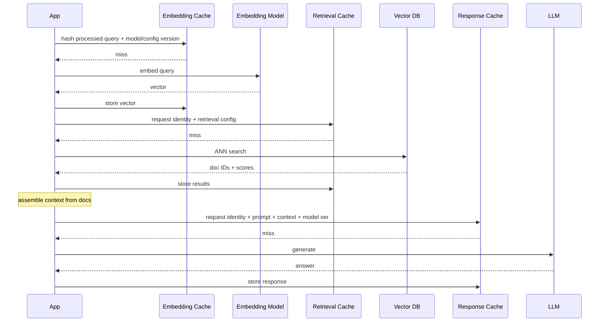

---
topic:
  - AI & ML
subtopic:
  - LLM
summary: "Stores results at each RAG stage to cut latency and cost, scoped by authorization."
level:
  - "2"
priority: High
status: Done
publish: true
---

A RAG request can repeat the same expensive work: embed the query, search the index, and generate an answer. Caches remove that work only when their keys capture every input that affects the result.

That leads to a layered design. Embedding, retrieval, and response caches have different keys and invalidation rules. Treating them as one generic cache hides those differences and usually creates stale or unsafe hits.

For retrieval and response caches, correctness includes authorization. If the key omits permission context, one caller can populate an entry containing evidence that another caller is not allowed to see. Permission scope belongs in every key whose value depends on protected content.

A versioned request identity across those protected layers covers canonical or translated query text plus its transformation version, tenant and authorization-context hash, embedding model and index versions, filters and top-k, and retriever/reranker configuration. A response key extends that identity with the prompt template, selected evidence, generation model, and conversation state when it changes meaning.

# Flow

## Cache Hit Diagram

## Cache Miss Diagram

# Embedding Cache

An embedding cache reuses a vector for the same text and pinned embedding configuration.

- Maps text to its vector representation so a cache hit avoids another embedding call. At ingestion time, it reuses vectors for unchanged chunks; at query time, it reuses vectors for repeated queries. Eviction, expiry, or concurrent misses can still cause repeated calls.
- The key combines a hash of the processed text with the model version and relevant configuration, including output dimensions, task mode, and preprocessing version. The value is the vector. Reuse requires a compatible embedding space and input transformation.
- Long TTLs can work when text and configuration are stable. Changed text produces a new hash; model or configuration changes require a new cache namespace. Sensitive text and vectors still need an appropriate access, retention, and deletion policy.

It pays off in two places:

- High-volume ingestion pipelines where documents are re-processed frequently (nightly syncs, incremental updates). Without an embedding cache, every re-run re-embeds unchanged chunks at full cost.
- Query-heavy workloads with repeated identical or deterministically canonicalized queries. An exact hash does not match merely similar wording; semantic reuse is a separate cache with a different correctness risk.

The main failure mode is version drift.

- **Model version mismatch.** Without the model version in the key, an upgrade can return old vectors from a different embedding space. Similarity scores then lose meaning. A model or configuration change uses a new namespace so old vectors cannot be reused accidentally.

# Retrieval Cache

A retrieval cache stores the ranked candidate list, not the source documents.

- Stores the candidate document IDs and their relevance scores for a given query, so the vector search and any reranking are skipped on cache hit. The cache sits between query embedding and context assembly.
- The key must cover the processed query and transformation version, embedding model and index versions, top-k, filters, tenant and authorization context, and retriever/reranker configuration. An omitted field can change the correct candidate list without changing the cache key.
- The value stays small: a list of `(document_id, score)` pairs. Full content remains in the document store.

This cache works best when queries repeat and the index changes slowly.

- Workloads with high query repetition and stable indexes. Customer support systems, internal knowledge bases, and documentation assistants often see the same questions repeatedly. If the index is rebuilt infrequently (daily or weekly), retrieval cache hit rates can be high.
- Systems where vector search latency or cost is the bottleneck. A cache hit skips search and reranking, but lookup latency still depends on cache placement, network traffic, and serialization. Measured request latency determines the benefit.

Two failures matter more than hit rate.

- **Stale results after index update.** Without an index version in the key, added or removed documents remain invisible to cached queries. Every rebuild or incremental update changes the version used for new lookups.
- **Cross-tenant leakage.** If tenant ID or authorization context is missing from the key, a query from one tenant can populate the cache with results that a different tenant's query later receives. This is a data breach, not a staleness bug.

# Response Caching in RAG

A RAG response cache reuses a final answer only while its retrieval and generation inputs remain valid. [[Home/AI & ML/LLM/LLM Caching#Response Caching|LLM response caching]] covers exact and semantic matching, false-hit risks, and the distinction from provider prompt caching.

The response key extends the protected request identity with the full generation input: system instructions, selected evidence and its versions, user query, generation model and settings, and relevant conversation history. An exact hit skips generation. Semantic matching can find paraphrases, but it must stay within the same authorization and evidence constraints; similar queries can still require different documents or answers.

The diagrams place the response lookup after retrieval and context assembly so the key can include the actual evidence. A lookup before retrieval can avoid more work, but a query match alone cannot establish that the old evidence is current. Such a design needs corpus or dependency versions and permission checks that invalidate answers when their supporting sources or access rights change.

Fast-changing evidence may justify caching embeddings and retrieval results without caching final answers. A response TTL limits staleness, while source and permission changes that invalidate an answer require invalidation before that TTL expires.

# Pitfalls

- **Cross-tenant leakage from missing authorization fields.** Without tenant ID and authorization-context hash, one caller's cached result can be served to someone without permission. Both belong in keys that depend on protected content, and reads must recheck the caller's current access.
- **Silent staleness when index version is not part of key.** Documents are added, updated, or deleted, but the retrieval cache keeps serving old candidate lists because the key does not change. Users see outdated or missing information with no error signal. An `index_version` in retrieval cache keys changes on each rebuild or incremental update, preventing reuse across those versions.
- **Over-caching LLM responses while source freshness changes quickly.** If the corpus updates frequently but the response-cache TTL is long, callers receive answers grounded in old evidence. The TTL follows source freshness requirements; known invalidating changes take effect before expiry. Fast-changing data may justify caching embeddings and retrieval results without caching final answers.

# Questions

> [!QUESTION]- Why should retrieval cache keys be based on processed query text instead of raw embeddings?
> Processed query text and its transformation version are readable, deterministic inputs. Raw embedding bytes change with the model and hide why two entries differ. A translation-version change should produce a new key, and the embedding model version still belongs in the retrieval key because it affects ranking.

# References

- [Caching embeddings (LangChain integrations)](https://docs.langchain.com/oss/python/integrations/embeddings)
- [RAGOps: Operating and Managing RAG Pipelines](https://arxiv.org/abs/2506.03401)
