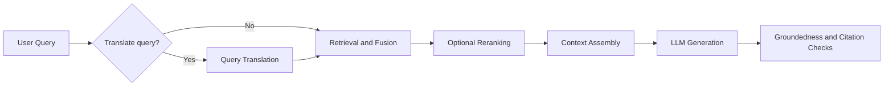

---
topic:
  - AI & ML
subtopic:
  - LLM
summary: "Retrieves evidence from a corpus, then generates an answer grounded in it, no retraining needed."
tags: [FolderNote]
priority: High
level:
  - "2"
publish: true
status: Done
---

Retrieval-Augmented Generation (RAG) retrieves evidence from a corpus and gives it to the model for generation. Knowledge can then change without retraining the model, and the answer can point back to the source that supported it.

A useful RAG system is a pipeline. Query processing determines what search sees. Retrieval decides which evidence survives. Context assembly decides what the model receives. Evaluation and production controls keep those stages honest.

For a support question such as “What changed in API v2 rate limits?”, the system retrieves release notes and policy documents first. The model answers from those sections and cites them instead of relying on an old fact stored in its weights.

```datacorejsx
const { FolderStructureMap } = await dc.require("Assets/components/devbook-folder-map.jsx");
return FolderStructureMap;
```

# Core Flow



Each stage limits the next. When translation is used, retrieval cannot repair a rewrite that changed the intent, and reranking cannot promote evidence that search never returned. A baseline can send the original query directly to retrieval. Treating RAG as one large prompt hides these boundaries.

# Operational Baselines

- Put each added pattern behind a feature flag. Compare [[Monitoring#Retrieval Quality Metrics|retrieval precision]] and [[Monitoring#LLM-as-Judge Metrics|generation faithfulness]] with latency p95 and cost per query.
- Cap iterative and agentic retrieval. A retry budget bounds latency. Unsupported output should fail closed instead of looping until it sounds plausible.
- Watch query drift between retrieval rounds. Semantic similarity to the original query makes gradual topic changes visible.
- Cache expensive stable work such as query rewrites, multi-query results, contextual chunk enrichment, and read-only tool results scoped to the caller's authorization. Mutating tool calls need [[Home/Software Architecture/Distributed Systems/Idempotency|idempotency]], not response caching. [[Home/AI & ML/LLM/Context Engineering/RAG/Caching|Caching]] covers keys and invalidation.
- Route simple questions through the cheapest path. Multi-hop retrieval is wasted work on a single-hop lookup.

# RAG Vs Fine-Tuning

RAG and [[Fine-tuning]] change different parts of the system. RAG supplies knowledge at request time. Fine-tuning changes behavior in the model weights. Retrieval is the safer place for facts that change.

A weekly policy change can enter RAG through reindexing. Fine-tuning would bake in another snapshot and still give weak source traceability.

| Axis | RAG | Fine-tuning |
|---|---|---|
| Knowledge freshness | Changes when the corpus is reindexed | Changes when the model is trained again |
| Source traceability | Direct when citations are retained | Weak unless supplied separately |
| Behavioral consistency | Depends on prompt and model behavior | Can improve through training examples |
| Time to first value | Usually faster | Usually slower |
| Operational complexity | Retrieval and index operations | Training, evaluation, and model release operations |

1. Start with RAG when facts change often or answers need citations.
2. Add fine-tuning when format or policy behavior stays unstable after prompt work.
3. Keep mutable facts in the corpus and learned behavior in the weights.

The two techniques can work together. Fine-tuning can stabilize format or refusal behavior, while RAG supplies current facts. But the boundary should stay visible: reindex knowledge, retrain behavior.

# Questions

> [!QUESTION]- Why should advanced RAG patterns be introduced incrementally instead of all at once?
> Every added stage creates another place for quality, latency, or cost to regress. Introduce one pattern against a measured baseline, then keep it only if it fixes a frequent failure. Shipping several together makes attribution difficult and often leaves expensive machinery with no proven benefit.

> [!QUESTION]- How can retrieval and generation failures be separated when a RAG answer is wrong?
> The first check is the context that reached the model. If the relevant evidence is missing, the problem is in retrieval, such as chunking, filtering, or ranking. If the evidence is present but the answer ignores or contradicts it, the problem is in generation and faithfulness. These stages need separate metrics because their fixes are different, while one end-to-end score only shows that the final answer failed.

# References

- [Retrieval-Augmented Generation for Knowledge-Intensive NLP Tasks](https://arxiv.org/abs/2005.11401)
- [Retrieval-Augmented Generation for Large Language Models: A Survey (Gao et al., 2024)](https://arxiv.org/abs/2312.10997)
