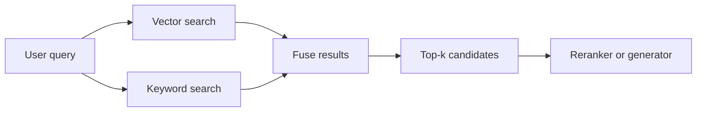

---
topic:
  - AI & ML
subtopic:
  - LLM
summary: "Decides what evidence enters the prompt, balancing recall, precision, and latency across search methods."
level:
  - "2"
priority: High
status: Done
publish: true
---

Retrieval decides which evidence reaches the prompt. Missing evidence caps what a grounded answer can claim, even though prompts and generation models can still improve how fixed evidence is used. The practical problem is to recover enough relevant material without filling the context window with noise or spending the entire latency budget on search.

A query can become a vector for semantic search, weighted terms for keyword search, or both. Vector search compares it with pre-indexed chunk embeddings. BM25 searches a lexical index. The resulting candidates are fused into one ranked list and passed to [[Re-ranking|reranking]] or directly to the generator.

But no single search path handles every query shape well.

Consider the query "rate limit error 429 behavior in partner tier." Vector search recognizes the meaning around rate limiting, yet may lose the exact token `429`. Keyword search catches `429` and `partner tier`, while missing related passages that use different wording. Running both paths covers those two failure modes. Hybrid search is a sensible default, though the added path can introduce noise on some corpora.

# Retrieval Modes

## Dense Retrieval — Vector Search

The index-time and query-time work split cleanly:

- An embedding model maps each document chunk and the query into the same fixed-size vector space. Document vectors are computed once during indexing. Each request only needs a query vector.
- The [[Vector Databases|vector database]] searches an approximate index, commonly HNSW or IVF, for nearby chunk vectors. Approximation gives up some recall to avoid scanning millions of vectors one by one.
- Model choice shapes the result set. Dimensionality and training data differ, and a model that leads a general MTEB benchmark may fail on a specialized corpus or another language. Domain queries are the real test.

Dense retrieval fits:

- Semantic paraphrases and natural-language questions where user wording differs from source text.
- Multilingual corpora where the embedding model captures meaning across languages.

The main risk is specific:

- **Misses exact identifiers.** Embedding models capture meaning better than literal tokens. Error codes, API paths, and version strings can disappear inside the vector representation. Returned chunks may look topically correct while describing the wrong operation, which is harder to catch than an obviously unrelated keyword result.

## Sparse Retrieval — Keyword Search (BM25)

BM25 is the default ranking model in search engines such as Elasticsearch. PostgreSQL's native full-text search uses `to_tsvector`/`to_tsquery` for lexeme matching and `ts_rank` or `ts_rank_cd` for ranking. It does not provide BM25 as its built-in ranker. Both behave like ranked `grep` at a high level, but their scoring functions differ. A search for `NullReferenceException` in a .NET codebase hits files containing that string. A focused source file can rank above a 10,000-line log that mentions it once.

How it works:

- BM25 gives rare matching terms more weight. If only three documents contain `E4392`, they score strongly for that query. Common words contribute little.
- Repetition has diminishing returns, and a length penalty stops large documents from winning through word count alone.
- A standard keyword index is enough. No embedding model, GPU, or vector database is involved.

Where it fits:

- Queries with exact keyword constraints: error codes, product names, version numbers, configuration keys.
- Domains with specialized terminology where exact matches carry high signal.

Main risk:

- **Weak on paraphrases.** BM25 cannot connect "authentication failure" with "credential validation errors" when the words do not overlap. Stemming and synonym expansion help at the edges, but semantic variation remains its blind spot.

## Hybrid Retrieval — Vector + Keyword

Hybrid retrieval runs full-text search, such as `WHERE body @@ to_tsquery('error & 429')`, beside vector similarity search and then merges the results. RRF works from rank positions. If document A is #2 in vector search and #5 in keyword search, while document B is #1 in keyword search but #200 in vector search, the agreement around A raises it in the fused list. Linear combination instead assigns an explicit weight to each score, closer to a weighted `UNION ALL`.

How it works:

- Run vector search and keyword search in parallel against the same query. Fuse the two ranked lists into a single candidate set.
- **[[Re-ranking|Reciprocal Rank Fusion (RRF)]]** sums `1 / (k + rank)` for each document across the input lists, with k=60 in the original method. Because it uses positions instead of scores, BM25 and vector similarity do not need a shared scale. Agreement across retrievers is rewarded.
- **Linear combination** normalizes scores and computes `alpha * vector_score + (1 - alpha) * keyword_score`. It exposes more control, but alpha must be tuned for the domain. Identifier-heavy corpora may need more keyword weight. Conversational queries often favor the vector path.

Where it fits:

- Production systems with mixed query patterns. This is a safe default for many RAG systems.

Main risk:

- **Can lose to one search mode.** A homogeneous corpus may strongly favor one retriever, leaving the other to inject noise. In one production benchmark on scientific documents, vector-only reached a 69.2% hit rate while hybrid reached 63.5%. The extra keyword path hurt. Hybrid must be tested against both single-mode baselines on the actual corpus.
- **Large top-k values collect noise.** Fusing two long result lists pulls weak candidates into the tail. Without [[Re-ranking|reranking]] or deduplication, those candidates dilute the context sent to generation.

# Indexing and Filtering

The vector index sets the latency-recall curve:

- **HNSW** builds a layered graph between nearby vectors and searches from coarse connections down to local neighbors. Raising `ef_search` explores more of that graph, buying recall with latency. A value that works on a small collection may miss more neighbors after the corpus grows.
- **IVF-PQ** clusters and compresses vectors, in some configurations using far less memory than HNSW. Aggressive compression loses recall more quickly. It suits collections around 10M+ vectors when an in-memory HNSW graph is too expensive.

Filtering decides which vectors are eligible:

- **Pre-filtering** narrows the search space by metadata before vector search. Tenant IDs and ACLs belong here because semantic similarity cannot enforce authorization.
- **Post-filtering** removes candidates after ANN search. It is easier to bolt on, but selective filters may discard most of top-k and leave too little evidence.
- Keep index versioning explicit. Collection aliases enable instant rollback during index rebuilds.

# Pitfalls

## ANN Operating-Point Regression

Corpus growth or distribution change can make an earlier HNSW `ef_search` setting miss more exact neighbors. The outcome depends on graph construction, filters, data distribution, implementation, and workload; latency can also move. Nothing in ordinary error-rate monitoring establishes that recall stayed stable.

Detection: maintain representative queries, compare ANN results with exact search, and run [[Monitoring#Retrieval Quality Metrics|Recall@k]] checks on a schedule. Tune `ef_search`, rebuild, or change index parameters from the measured recall-versus-latency curve rather than assuming one response always restores the old operating point.

## Embedding Model Migration Debt

Embedding models produce incompatible vector spaces. An upgrade therefore requires re-embedding the corpus. New query vectors cannot be compared with an old index. At scale, the migration needs parallel storage and a controlled cutover, and benchmark gains do not guarantee better domain retrieval. Provider deprecations can compress that schedule.

Mitigation: treat embedding model selection as a long-term infrastructure decision. Store the model version alongside each vector. Set upgrade thresholds based on domain-specific metrics, not MTEB deltas. Use collection aliases and shadow traffic to validate before cutover.

## Aggregate Metrics Hiding Segment Failures

An overall recall of 70% can coexist with 5% recall on a small but valuable query segment. Multi-hop or date-filtered requests may be failing while the aggregate looks acceptable. Segmentation also separates missing inventory from a retriever that cannot surface material already present.

Detection: segment retrieval metrics by query type, tenant, locale, and domain. Alert on per-segment degradation, not just aggregate.

## Vector Search Failing Silently on Identifiers

For identifier-heavy queries, vector search can return chunks that are topically related and operationally wrong. The evidence looks plausible enough for the model to assemble a confident answer from the wrong material.

Mitigation: use hybrid retrieval for identifier-heavy corpora and include identifier queries in evaluation. If the vector path causes most failures, inspect the fusion weights. These domains often need more keyword influence.

# Tradeoffs

| Mode | Recall profile | Latency | Operational complexity | Best for |
| --- | --- | --- | --- | --- |
| Vector only | Strong on semantic paraphrases -- weak on exact identifiers | Low -- single index lookup | Moderate -- embedding model and vector database required | Homogeneous semantic corpora with natural-language queries |
| Keyword only -- BM25 | Strong on exact terms -- weak on paraphrases | Lowest -- keyword index lookup | Low -- no embedding model or vector database | Identifier-heavy domains with stable vocabulary |
| Hybrid -- RRF | Broad -- covers semantic and lexical queries | Moderate -- two parallel searches plus fusion | Higher -- two indexes and fusion logic | Mixed query patterns -- default for most production systems |
| Hybrid -- linear combination | Tunable -- weight toward dominant search mode | Moderate -- same as RRF | Highest -- requires alpha tuning per domain | When one search mode is consistently stronger and deserves explicit weighting |

Start with hybrid retrieval using RRF and a conservative top-k, often 5–20. Then compare it with both single-mode baselines on real corpus queries. Hybrid is a good starting point, not a guaranteed winner. Add [[Re-ranking|reranking]] after first-stage retrieval is stable and the remaining failures come from poor ordering near the top.

# Questions

> [!QUESTION]- Why can vector-only retrieval underperform on technical support workloads?
> Technical support queries often contain literal identifiers such as error codes or API paths. Embeddings capture meaning better than exact tokens, so "error E4392 in v2.3" may retrieve general error-handling material instead of the matching code. Those chunks look plausible, which makes the miss dangerous. BM25 gives the rare identifier a high weight and can pull the exact document into a hybrid candidate set.

> [!QUESTION]- When does hybrid retrieval perform worse than single-mode retrieval?
> It loses when the weaker path adds more noise than useful evidence. A homogeneous scientific corpus may already suit vector search, while keyword results pull marginal matches into the fused list. The extra system earns its cost only if it beats both single-mode baselines on real queries.

> [!QUESTION]- Why can ordinary latency and error dashboards miss an HNSW recall regression after the corpus changes?
> HNSW returns approximate neighbors without an error when it misses an exact neighbor. Corpus or distribution changes can invalidate an earlier `ef_search` operating point, but recall and latency depend on the graph, filters, implementation, and workload. Only an explicit [[Monitoring#Retrieval Quality Metrics|Recall@k]] comparison against exact-search ground truth measures the loss.

# References

- [RAG techniques — retrieval and ranking overview (Azure AI Search)](https://learn.microsoft.com/en-us/azure/search/retrieval-augmented-generation-overview)
- [Reciprocal Rank Fusion outperforms Condorcet and individual rank learning methods (SIGIR 2009)](https://plg.uwaterloo.ca/~gvcormac/cormacksigir09-rrf.pdf) — defines RRF as reciprocal-rank score summation over multiple result lists.
- [Introducing Contextual Retrieval — hybrid retrieval gains measured (Anthropic Engineering)](https://anthropic.com/engineering/contextual-retrieval)
- [HNSW at scale — why recall degrades as the vector database grows (Towards Data Science)](https://towardsdatascience.com/hnsw-at-scale-why-your-rag-system-gets-worse-as-the-vector-database-grows/)
- [When good models go bad — embedding model migration and MTEB limitations (Weaviate)](https://weaviate.io/blog/when-good-models-go-bad)
- [BM25 vs dense retrieval — what actually breaks in production (Ranjan Kumar)](https://ranjankumar.in/bm25-vs-dense-retrieval-for-rag-engineers)
- [Evaluate your own RAG — why best practices failed on scientific documents (Hugging Face)](https://huggingface.co/blog/charles-azam/rag)
- [How to systematically improve RAG — segmentation and failure taxonomy (Jason Liu)](https://jxnl.co/writing/2025/01/24/systematically-improving-rag-applications/)
- [Deconstructing RAG — retrieval patterns and evaluation (LangChain Engineering)](https://blog.langchain.com/deconstructing-rag/)
- [MTEB leaderboard — retrieval task benchmarks (Hugging Face)](https://huggingface.co/spaces/mteb/leaderboard)
