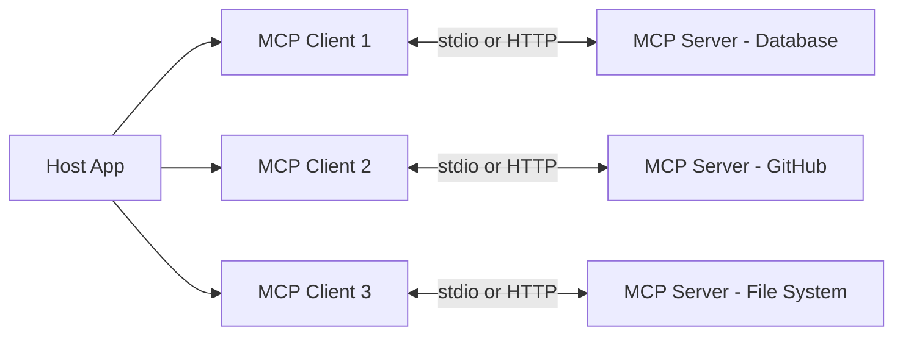

---
topic:
  - AI & ML
subtopic:
  - LLM
summary: "An open protocol standardizing how LLM apps connect to external tools and data."
level:
  - "3"
priority: Low
status: Done

publish: true
---

Model Context Protocol (MCP) gives LLM applications a common way to connect to tools and external data. Without a shared protocol, every client-service pairing needs its own adapter. In the ideal case, that produces N×M integrations for N clients and M services. MCP moves the integration boundary: clients implement the protocol once, while each service exposes an MCP server. The rough shape becomes N+M, provided both sides implement compatible versions and capabilities.

A **host** application, such as an IDE or agent, creates one **client** for each server connection. That client maintains a stateful 1:1 session with an **MCP server** wrapping some capability, perhaps a database or a SaaS API. Servers publish **tools** for actions, **resources** for contextual data, and **prompts** for reusable interaction templates. The host chooses what reaches the model. That mediation point is where approval rules and access policy belong.

Suppose a desktop host connects to PostgreSQL and GitHub servers. A request to find open issues and inspect tables referencing the customers schema may lead the host to invoke `github.list_issues` and `postgres.query` through separate clients. Neither server needs to know that the other exists. A Slack server can be added without changing those two integrations, although the host still needs to configure and trust the new server.

# Architecture

## Three Server Primitives

| Primitive | Controlled by | Purpose | Example |
| --- | --- | --- | --- |
| **Tools** | Model decides when to call | Actions with side effects or computation | `run_query`, `create_issue`, `send_message` |
| **Resources** | Application decides when to fetch | Read-only data exposure — like GET endpoints | `file://config.yaml`, `db://schema/tables` |
| **Prompts** | User selects explicitly | Reusable prompt templates with parameters | "Summarize this PR", "Review code for security" |

The control boundary differs by primitive. A model may request a tool call, the application decides when to fetch a resource, and a user can select a prompt. None of this removes the host's responsibility to authorize the resulting operation. Model choice is a proposal, not permission.

Client and server negotiate **capabilities** when they connect. These declarations cover supported primitives and optional features such as resource subscriptions or logging.

## Transports

MCP commonly uses two transports:

- **stdio.** The host starts the server as a child process and exchanges JSON-RPC messages over standard input and output. This fits local file, database, or CLI integrations. It needs no MCP network listener. The child process can still inherit operating-system permissions and make outbound network calls unless a separate sandbox prevents them.
- **Streamable HTTP.** The server runs behind an HTTP endpoint and may serve multiple clients. Responses may be streamed with Server-Sent Events. Remote deployments need transport security and authentication. The MCP authorization specification defines an OAuth-based flow for protected servers.

Use stdio for a local process owned by one host. Use Streamable HTTP when the capability is remote or shared across clients.

## Client Primitives

Clients can expose capabilities back to a server:

- **Sampling** lets the server ask the client for an LLM completion. The host remains in the path and can apply policy or request approval.
- **Roots** describe file-system or URI boundaries relevant to the server. They provide context, not an operating-system sandbox or access-control mechanism.
- **Elicitation** lets the server request additional information through the client. The client presents the request to the user, who controls whether and what to disclose. A server request is not consent, and sensitive data should not be collected through an opaque or auto-approved flow.

# When to Use MCP Vs Function Calling

Function calling is the model-facing mechanism for requesting a structured operation. MCP packages capabilities behind a reusable client-server protocol. An application may use both: it discovers a tool through MCP, then presents that tool to the model through function calling.

| | Function Calling | MCP |
| --- | --- | --- |
| Best for | App-specific business logic used by one agent | Shared integrations used across multiple clients |
| Tool definitions live in | Application code | Standalone MCP server |
| Reusability | One app only | Any MCP-compatible client |
| Discovery | Static — defined at dev time | Dynamic — server advertises capabilities at runtime |
| Infrastructure | None extra — part of the application's LLM API call | Server process per integration |

A useful first question is whether the integration must work across clients. Shared integrations are a good MCP fit. App-specific business logic is usually simpler as an in-process function tool. The security boundary matters too: moving a function into an MCP server adds process or network communication and a separately managed trust relationship.

# SDK Ecosystem

The MCP project groups SDKs by support tier. Tier assignment can change, so the current SDK page is the authority for language coverage and maintenance status. In .NET, the `ModelContextProtocol` packages provide client and server APIs, including ASP.NET Core integration.

# Pitfalls

## Tool Poisoning and Injection

Tool descriptions are untrusted text supplied by the server, yet clients often place that text in the model's context. A malicious description can try to redirect the model or induce calls to another connected server. Invariant Labs demonstrated this tool-poisoning pattern against clients that exposed powerful tools without adequate review or approval.

Treat each server like a third-party dependency. Review its source and published tool descriptions before granting sensitive access. High-impact calls need explicit policy checks or human approval. A blanket auto-approval setting turns a model mistake into an executed action.

## Token Inflation

Some clients place every connected tool schema in each model request. MCPGauge observed input-token overhead as high as 236× in its benchmark and an average 9.5% accuracy drop when tool context was present. The exact cost depends on the client and workload, but the direction is clear: irrelevant schemas consume context and complicate selection.

Keep the active tool set small. Client-side filtering or on-demand discovery can load only the definitions relevant to the current task.

## Security Model Gaps

MCP transport authorization does not, by itself, enforce per-tool permissions or validate tool inputs. Those controls remain server responsibilities. Reported server flaws have included injection, path traversal, and tenant-isolation failures. CVE-2025-49596 in MCP Inspector showed that even development tooling can become a remote-code-execution boundary.

Run servers with the smallest useful set of credentials and file permissions. Validate every argument at the server boundary, and isolate local processes where practical. The client schema improves model behavior. It is not a substitute for server-side validation.

# Tradeoffs

| Approach | Reusability | Setup Cost | Security Surface | Best for |
| --- | --- | --- | --- | --- |
| Direct function calling | One app only | Lowest — inline with application code | Smallest — controlled by the application | App-specific tools and business logic |
| MCP with stdio transport | Any local MCP client | Moderate — write or install a server | Local transport — no MCP network listener | Local tools shared across editors and agents |
| MCP with HTTP transport | Any MCP client anywhere | Highest — server infra plus auth | Largest — network exposed with OAuth | Remote services and multi-user deployments |
| REST API wrapper without MCP | Any HTTP client | Moderate — standard API design | Standard web security model | When consumers are not LLM clients |

MCP earns its overhead when several clients need the same integration or when capabilities must be discovered at runtime. One application calling one internal API usually needs only function calling.

# Questions

> [!QUESTION]- When would you choose function calling over MCP even for a shared tool?
> Keep the tool in process when it depends on private application state, belongs to one client, or does not justify another deployment boundary. This is often easier to debug because schema and implementation live together. A shared tool may still stay in process when exposing it as a server would widen access to sensitive business logic.

> [!QUESTION]- What makes MCP servers harder to secure than traditional REST APIs?
> An MCP server combines an API boundary with model-controlled selection and untrusted descriptions. It may also hold broad database or file access. Transport authorization confirms who connected, but per-tool authorization and input validation still have to be implemented by the server. Traditional API controls such as rate limits, tenant isolation, and audit logging remain necessary.

# References

- [MCP Architecture — host, client, server model and capability negotiation (Official)](https://modelcontextprotocol.io/docs/learn/architecture)
- [MCPGauge — benchmarking token overhead and accuracy impact of MCP tool schemas (arXiv 2508.12566)](https://arxiv.org/abs/2508.12566)
- [Invariant Labs — MCP security analysis and tool poisoning attack surface](https://invariantlabs.ai/blog/mcp-security-notification-tool-poisoning-attacks)
- [Using MCP tools with an agent — Microsoft Agent Framework (Microsoft Learn)](https://learn.microsoft.com/en-us/agent-framework/agents/tools/local-mcp-tools)
