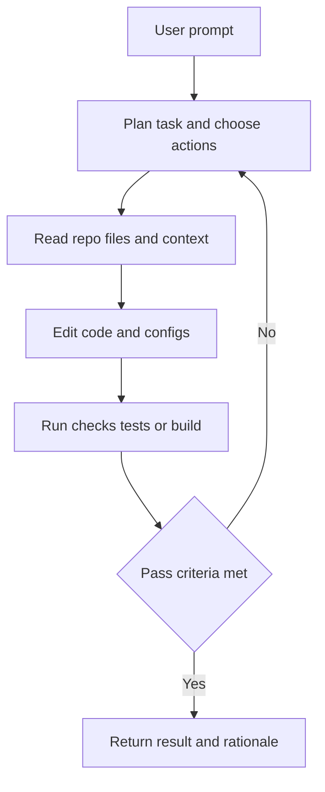

---
topic:
  - AI & ML
subtopic:
  - LLM
summary: "An LLM running in an action loop to complete engineering tasks end to end."
publish: true
status: Done
level:
  - "2"
priority: Medium
---

Coding agents put a language model inside a tool loop. The model reads repository state, chooses an action, observes the result, and decides what to do next. That turns code generation into an execution process rather than a one-shot answer.

The distinction matters. Autocomplete predicts local text. Chat explains or proposes a change. An agent can edit several files, run `dotnet test`, read the failure, repair the implementation, and run the check again. It still has no independent definition of correctness. Repository instructions, bounded permissions, and fresh validation supply that boundary.

# How the Agent Loop Works

Observed output closes the loop. A failing test can change the next action. A permission denial can force a safer plan. Execution logs and approval gates make that process inspectable before a bad assumption spreads across the repository.

Iteration is not progress by itself. An agent that keeps rewriting code without reducing a known failure is stuck. Step limits, explicit acceptance criteria, and a rule to stop on repeated evidence keep the loop useful.

# Major Tools

## Claude Code (Anthropic)

Claude Code is a terminal-first agent that also runs in IDE, desktop, and web surfaces. Its extension model separates concerns: `CLAUDE.md` and rules provide persistent context, skills hold reusable procedures, MCP adds external tools, and hooks run at lifecycle events.

## Cursor

Cursor combines completion, chat, and an agent inside a VS Code-derived editor. Its agent can inspect the workspace, edit files, and use terminal tools. Repository behavior belongs in `.cursor/rules/`. `.cursorrules` remains a legacy format.

## GitHub Copilot

GitHub Copilot spans editor, CLI, code-review, and cloud-agent workflows. The supported instruction surface depends on the client. Repository-wide instructions use `.github/copilot-instructions.md`. Supported agent workflows can also read `AGENTS.md` and path-specific instruction files.

## Cline

Cline is an open-source VS Code extension with visible, approval-oriented tool execution. It supports several model providers and stores project guidance under `.clinerules/`.

## Aider

Aider is a terminal coding assistant built around git-aware edits. It works with multiple model providers and can keep defaults in `.aider.conf.yml`.

## Windsurf (Codeium)

Windsurf is an IDE-centered agent workflow built around Cascade. Current workspace guidance lives under `.windsurf/rules/`. `.windsurfrules` is the older single-file convention.

## Opencode

OpenCode is an open-source agent for terminal and application workflows. It supports multiple providers, MCP servers, on-demand skills, and `AGENTS.md` project instructions.

## Amazon Q Developer

Amazon Q Developer provides IDE and CLI assistance with AWS-oriented development and transformation workflows. Its fit is strongest when repository work is coupled to AWS services or modernization tasks.

# Pitfalls

- **Plausible diffs:** a change can pass tests and still violate an architectural boundary the suite does not encode. Keep tasks narrow enough to review and make hidden boundaries explicit in repository instructions.
- **Stale context:** long sessions make old reads dangerous. Re-read a file before editing it when another tool, hook, or agent may have changed it.
- **Cost drift:** autonomous retry loops can trigger 50+ model calls during a debugging spiral. Cost grows with cumulative input, output, tool calls, and retries rather than wall-clock time alone. Bound steps and stop when the same failure repeats without new evidence.
- **Invented APIs:** weak context produces convincing methods and configuration keys that do not exist. Search the installed SDK or official docs first, then let the compiler and targeted tests settle the claim.

# Tradeoffs

| Decision | Option A | Option B | Practical tradeoff |
|---|---|---|---|
| Interaction model | Terminal agents | IDE agents | Terminal gives scriptability and explicit command logs. IDE keeps navigation and diffs close to the editor |
| Product model | Open-source tools | Commercial tools | Open-source exposes implementation and provider choice. Commercial tools usually reduce setup and support burden |
| Model strategy | Single-model stack | Multi-model stack | One model reduces routing choices. Several models can fit tasks and budgets better but make behavior less uniform |

# Questions

> [!QUESTION]- What controls reduce production risk when adopting coding agents?
> Start by limiting the task, the tools the agent can call, and the number of iterations it can run. Destructive or external actions need code-enforced approval before execution, while hooks and CI should run deterministic checks. Repository instructions capture architectural rules that tests cannot enforce. Before merge, the diff still needs review and the claimed behavior needs fresh test or build evidence, regardless of which model produced the change.

# References

- [Claude Code overview (Anthropic Docs)](https://docs.anthropic.com/en/docs/agents-and-tools/claude-code/overview)
- [Cursor Documentation](https://docs.cursor.com/)
- [GitHub Copilot documentation](https://docs.github.com/en/copilot)
