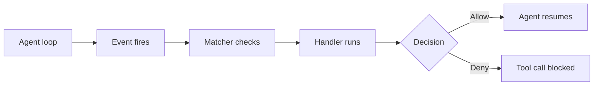

---
topic:
  - AI & ML
subtopic:
  - LLM
summary: "Lifecycle callbacks that run custom logic at defined agent execution points."
publish: true
status: Done
level:
  - "2"
priority: Medium
---

Hooks run configured logic at named points in an agent session. They turn a written policy into an event-bound check: inspect a tool call before it runs, format a file after an edit, or record which instructions were loaded.

The runtime fires an event and passes structured context to a matching handler. Depending on the event, the handler can add context, return a decision, or perform a side effect. This is close to Git hooks, except the boundary is an agent turn or tool call rather than a commit.



For reusable instruction bundles that shape agent behavior, see [[Skills]]. For MCP tool extensions, see [[Plugins]].

# How Hooks Work

The model has three parts. **Events** say when to run, **matchers** narrow the event, and **handlers** do the work.

**Events** are lifecycle moments grouped by purpose:

| Category | Examples | Purpose |
| --- | --- | --- |
| Tool events | `PreToolUse`, `PostToolUse`, `PostToolUseFailure` | Decide before execution or inspect its result |
| Session events | `SessionStart`, `Stop`, `SessionEnd` | Prepare, check completion, or clean up |
| Context events | `UserPromptSubmit`, `InstructionsLoaded`, `PreCompact` | Validate input or observe context changes |
| Agent events | `SubagentStart`, `SubagentStop`, `TaskCompleted` | Observe delegated work and task state |
| Operational events | `Notification`, `ConfigChange`, `FileChanged` | Connect the session to local automation |

**Matchers** filter events before a handler starts. Tool-event matchers commonly target tool names, so `Edit|Write` selects file edits and `mcp__.*` selects MCP tools. Matcher syntax and availability depend on the event.

Claude Code currently documents several handler types:

- **Command:** a process receives JSON on stdin and returns an exit code or JSON result.
- **HTTP:** the runtime posts the event payload to an endpoint.
- **Prompt:** a model evaluates a bounded condition.
- **Agent:** a subagent investigates before returning a decision.
- **MCP tool:** a configured MCP capability handles the event.

For command hooks, exit code `0` means the process completed and any decision comes from its JSON output. Exit code `2` is a blocking signal on supported events. The exact effect depends on the event. Other non-zero codes report hook failure. A post-execution hook cannot undo an external side effect that already happened.

# Hooks Across Tools

Claude Code has a broad hook lifecycle across sessions, prompts, tools, subagents, configuration, and worktrees. Its settings can be personal, project-owned, managed, or packaged with extensions. The event list is versioned product behavior, so configuration should target the installed runtime rather than a remembered event count.

Cursor also exposes agent lifecycle hooks through `.cursor/hooks.json`, but names and decision semantics are its own contract. Similar labels across products do not guarantee compatible payloads.

Git hooks remain the portable fallback at the repository boundary. `pre-commit` and `commit-msg` can stop bad history regardless of which agent edited the files. They cannot govern a database call or shell command that happened earlier in the session.

# Concrete Example

A two-stage Claude Code policy can block protected writes before execution and format accepted writes afterward:

```json
{
  "hooks": {
    "PreToolUse": [
      {
        "matcher": "Edit|Write",
        "hooks": [
          {
            "type": "command",
            "command": "path=$(jq -er '.tool_input.file_path') && check-protected-files.sh \"$path\""
          }
        ]
      }
    ],
    "PostToolUse": [
      {
        "matcher": "Edit|Write",
        "hooks": [
          {
            "type": "command",
            "command": "path=$(jq -er '.tool_input.file_path') && npx prettier --write \"$path\""
          }
        ]
      }
    ]
  }
}
```

The shell returns the exit status of the final command, so a `2` from `check-protected-files.sh` remains a blocking signal instead of being remapped by a pipeline helper. `jq -e` makes a missing path a hook failure rather than passing an empty argument. The example shows the control points, not a portable schema. Another runtime may use different event names, input fields, and decision output.

# Pitfalls

## Slow Hooks Stall the Loop

A full test suite after every edit makes even a correct agent unusable. Match the narrowest event and run the cheapest check that can reject the operation. Move broad validation to a commit, pull-request, or asynchronous boundary when blocking the current tool call adds no safety.

## Silent Failure Opens the Gate

A hook that prints an error but exits successfully may allow the operation. Test both an accepted and a known-bad payload, then assert the decision channel the runtime actually reads. Critical repository checks still belong in CI because local hooks can be disabled or misconfigured.

## Post-Hooks Create Concurrent Edits

A formatter can rewrite a file between the agent's write and its next read. Keep post-hooks deterministic, avoid semantic rewrites, and make the agent re-read files that a hook may have touched.

# Tradeoffs

| Choice | Option A | Option B | Decision criteria |
| --- | --- | --- | --- |
| Validation posture | Block before execution | Observe after execution | Block side effects that cannot be repaired cheaply. Use post-hooks for formatting, evidence, and advisory feedback. |
| Hook scope | Broad matcher | Targeted matcher | Broad coverage is easier to state but expensive to run. Target the tool or path that carries the risk. |
| Handler type | Deterministic command | Prompt or agent evaluation | Scripts fit rules with stable inputs. Model-based handlers fit judgment calls but add cost and variable decisions. |

# References

- [Automate workflows with hooks -- quickstart guide with practical examples (Claude Code Docs)](https://docs.anthropic.com/en/docs/claude-code/hooks-guide)
