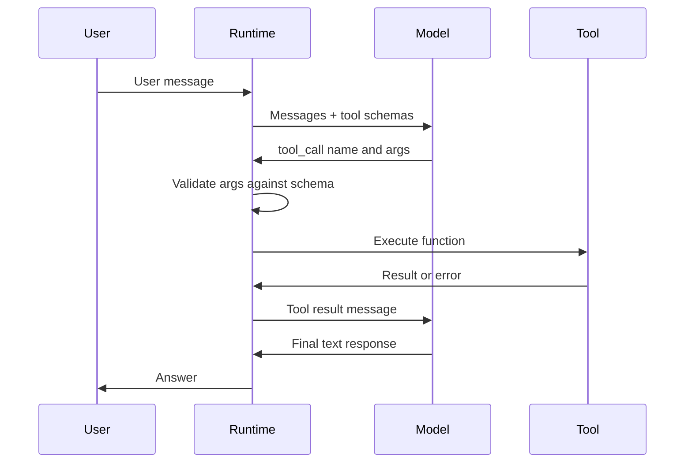

---
topic:
  - AI & ML
subtopic:
  - LLM
summary: "Designing callable operations that models can select, execute, and recover from reliably."
level:
  - "3"
priority: Low
status: Done

publish: true
---

Tool design turns model output into reliable operations. A tool lets an agent read current data, run a calculation, or request a side effect that text generation cannot perform on its own. A capable model still fails when its callable interfaces are ambiguous or brittle. Anthropic's SWE-bench agent work found a small interface detail with a large effect: switching one tool from relative to absolute file paths removed a recurring failure mode.

Function calling is the usual mechanism. The runtime sends the model JSON schemas describing the available tools. The model may return a structured call containing a tool name and arguments. After validating the request, the runtime executes the function and appends its result to the conversation. The [[Agent Loop]] repeats until the model answers or the runtime stops it.



The model requests an operation. It does not execute the function. Execution authority stays in the runtime, which must validate arguments and enforce permissions before crossing a side-effect boundary. A schema guides generation, but it does not provide security on its own.

[[Model Context Protocol]] standardizes how clients discover external capabilities. [[Agent Loop]] covers repeated selection, execution, and observation inside one run.

# Tool Design Principles

Tool design is API design for a probabilistic caller that sees only the supplied schema and conversation. It cannot inspect an implementation while choosing arguments. Ambiguity that a developer would resolve by reading code becomes another model guess.

**Naming.** The name should identify the operation and its domain. `search_company_directory` carries more selection signal than `search`. `get_weather_forecast` is clearer than `get_data`. Generic names make unrelated tools look interchangeable.

**Descriptions.** State the operation, its output, and the boundary where another tool is appropriate. For example: "Search employees by name or department. Contractor records are in `search_contractor_database`." The negative boundary matters when two tools have overlapping vocabulary.

**Parameters.** Prefer a small, flat schema. Use an enum such as `{"type": "string", "enum": ["celsius", "fahrenheit"]}` when the implementation accepts a closed set. Required fields and formats need explicit descriptions. Deeply nested inputs and overlapping optional fields create more ways to produce a syntactically valid but meaningless call.

**Return values.** Send the fields needed for the next decision, not an entire database record by default. Stable result shapes reduce parsing work across tools. Keep identifiers that a later call may need, even if they are not part of the final answer.

**Errors.** Return a machine-readable code plus enough detail to recover. `{"error": "invalid_date_format", "message": "Expected YYYY-MM-DD, got '12/25/2024'", "hint": "Reformat as 2024-12-25"}` gives the next [[Agent Loop|loop iteration]] a concrete repair. Internal details and secrets stay in server logs. The model receives a safe explanation.

In the Microsoft Agent Framework (.NET), a well-designed tool looks like this:

```csharp
// Any C# method becomes a tool via AIFunctionFactory.Create — the descriptions
// on the method and each parameter become the schema the model reads.
[Description(
    "Get current weather for a city. Returns temperature, conditions, " +
    "and humidity. Use when the user asks about weather or outdoor plans. " +
    "Do not use for historical weather data.")]
static Task<WeatherResult> GetCurrentWeather(
    [Description("City name, e.g. 'Seattle' or 'London'")] string city,
    [Description("Temperature unit")] TemperatureUnit unit = TemperatureUnit.Celsius)
{
    throw new NotImplementedException(
        "Validate input, call the weather API, and return a compact result.");
}

record WeatherResult(double Temperature, string Conditions, int HumidityPercent);
enum TemperatureUnit { Celsius, Fahrenheit }

// Register the tool on the agent via ChatOptions.Tools
AIAgent agent = new ChatClientAgent(chatClient, new ChatClientAgentOptions
{
    Name = "WeatherAssistant",
    ChatOptions = new ChatOptions
    {
        Instructions = "You answer weather questions.",
        Tools = [AIFunctionFactory.Create(GetCurrentWeather)],
    },
});
```

The `Description` attributes feed the schema used for tool selection and argument generation. A precise contract fixes failures at the shared boundary instead of compensating for them in every prompt.

# Versatility

Model-generated arguments will vary. A tool can normalize harmless representation differences before validation. Normalization changes representation, not trust: every caller still passes syntax checks, authorization, and business invariants before execution.

Useful patterns include:

- **Canonical parsing.** Accept equivalent unambiguous formats, then convert them to one internal representation. Relative dates such as "tomorrow" require an explicit time zone and reference clock. Otherwise they should be rejected or resolved by the host first.
- **Defaults.** An optional search `limit` can default to 10. Defaults should be visible in the schema and safe for cost or side effects.
- **Boundary responses.** A request for page 999 of a 10-page result set can return an empty page with the valid range instead of an opaque exception.

Normalization should remove representational friction without guessing intent. Validation then rejects malformed, unsafe, or unauthorized requests regardless of whether the input was normalized. Recovery guidance belongs in the error so a correct retry does not depend on guesswork.

# Fault Tolerance

Tool failures become model input and can redirect the rest of a run. Failure must be explicit, bounded, and safe to reason about.

**Structured errors.** The runtime must translate exceptions into a stable result because the model sees only serialized messages. Include the failed operation and whether retrying can help. Avoid stack traces or sensitive backend details.

**Retry safety.** A timeout leaves the caller unsure whether a side effect happened. State-changing tools should accept an idempotency key or use another deduplication mechanism so a retry cannot create a second record, email, or charge.

**Timeouts.** Every external call needs a deadline. Partial results are valid only when the contract labels them clearly, for example `{"status": "partial", "results": [...], "message": "Query timed out after 5s, returning first 50 results"}`. For writes, an unknown outcome is different from failure and must be reported as such.

**Validation before execution.** Check syntax, authorization, and business invariants before performing a side effect. A valid email address is not enough. The caller may also need permission to contact that recipient.

# Caching

Caching applies at two different boundaries: tool results and model-input prefixes.

**Tool results.** A read-only call may be cached by function name, normalized arguments, caller scope, and any other input that affects visibility. The TTL follows the source's freshness requirement. In the [[Agent Loop]], caching can avoid repeated I/O, but loop detection should still stop a model that keeps making the same call without progress.

**Prompt prefixes.** Stable system instructions and tool definitions are good candidates for provider prompt caching. This can reduce billed input and latency on repeated prefixes, though the exact savings depend on provider rules and cache hits. Tool order and schema text need to remain stable for the prefix to match.

Do not cache a mutation as if it were a read. A repeated `create_ticket` call needs idempotent execution semantics, not a cached success message. For reads, the cache key must include tenant and authorization context or it can leak data between callers.

# Pitfalls

## Over-Parameterized Tools

A tool with 15 loosely related parameters is hard to call correctly. Split it when different operations need different descriptions or permission checks. Do not split mechanically: hundreds of tiny tools create a selection problem of their own.

## Poor Descriptions That Mislead the Model

Descriptions such as "Processes data" provide no selection signal. A useful description names the operation, expected output, and important exclusion. If two tools sound interchangeable, the model will sometimes choose the wrong one.

## Tools with Hidden Side Effects

A `get_user_profile` tool that also updates "last accessed" is not a read, despite its name. The model may call it while gathering context and trigger an unintended write. Keep query tools free of business side effects. The separation mirrors [[CQRS]].

## Context Degradation from Large Toolsets

Large tool sets consume context and make selection harder. MCPGauge (Song et al., 2025) tested six commercial models across 30 MCP tool suites and reported an average **9.5% accuracy drop** with tool context present. Code generation saw the largest drop at 17%. Input-token overhead ranged from 3.25× to 236.5× in the benchmark. These are workload-specific measurements, not universal constants, but they make indiscriminate schema injection hard to justify.

Several mechanisms contribute:

- **Context competition.** Schema tokens occupy space and attention that could carry task evidence. "Lost in the Middle" shows that models do not use every position in a long context equally well.
- **Conflicting descriptions.** Similar names and overlapping instructions make the correct tool harder to distinguish.
- **Passive selection.** Preloading every schema forces the model to choose from options unrelated to the current step.

**Mitigations:**

| Technique | How it works | Best for |
|---|---|---|
| **On-demand tool search** | Register tools for deferred loading, then retrieve a relevant subset per request. Anthropic reports an 85% reduction in one published example, not a general guarantee. | Evaluate when the catalog reaches roughly 10 tools, schema definitions exceed about 10K tokens, or selection errors appear. Measure retrieval recall and added latency. |
| **RAG over tool descriptions** | Embed descriptions and retrieve top-k by semantic similarity. | Large or changing catalogs where retrieval quality can be evaluated against labeled tool-selection cases. |
| **Middleware filtering** | Inject tools from conversation state, user role, or workflow stage. | Deterministic policy boundaries. Measure false exclusions and rule-maintenance cost. |
| **Tool consolidation** | Group closely related operations under one tool with an `action` enum (e.g., `github_pr` with `create\|review\|merge`). | Operations that share context and permissions without creating a wide optional-parameter schema. |
| **Two-stage routing** | Classify the request into a tool category, then expose only that category. | Separable domains where router recall and routing latency clear the task gate. |
| **Code generation** | Replace N tool schemas with a single `execute_code` tool + API docs. The model writes code that calls the available APIs. | Open-ended data/code tasks |
| **Structured output routing** | Model returns a structured action JSON. Application code dispatches it. No tool schemas needed. | Fixed action types |

# Tradeoffs

| Design choice | Option A | Option B | Decision criteria |
|---|---|---|---|
| **Tool granularity** | Few broad tools with many parameters | Many narrow tools with focused purpose | Narrow tools are more reliable per-call (fewer hallucinated args) but increase selection confusion as count grows. Split when use cases need genuinely different descriptions. Keep together when they share context. |
| **Representation normalization** | Accept only a canonical form | Accept safe, unambiguous variants and convert them | Choose based on ambiguity and maintenance cost. Every caller still passes syntax, authorization, and business-invariant validation before execution. |
| **Caching strategy** | Aggressive — cache all tool results with TTL | Conservative — execute every call fresh | Aggressive caching cuts latency and cost but risks stale data. Cache read-only tools with short TTLs. Never cache state-mutating tools. |
| **Return verbosity** | Full result payload | Minimal fields needed for next step | Minimal returns save context tokens and reduce attention dilution. Full returns are only justified when the model needs to branch on fields that are hard to predict upfront. |

# Questions

> [!QUESTION]- Why is tool design often more impactful than prompt engineering in agentic systems?
> A tool contract is reused at every call site and every loop iteration. Ambiguous selection, malformed arguments, or an opaque error can redirect all later steps. Fixing the interface removes that failure mode across prompts, while a prompt workaround depends on the model remembering an exception each time.

> [!QUESTION]- How to decide between one broad tool and many narrow tools?
> Split operations that need different descriptions, schemas, or permissions. Keep closely related actions together when one contract expresses them without a bag of optional parameters. Then control the active set with routing or filtering. Narrow tools help argument generation only while the model can still select the right one.

# References

- [Function calling guide — OpenAI](https://platform.openai.com/docs/guides/function-calling)
- [Using function tools with an agent — Microsoft Agent Framework (Microsoft Learn)](https://learn.microsoft.com/en-us/agent-framework/agents/tools/function-tools)
- [Tool search tool — deferred loading for large toolsets (Anthropic)](https://docs.anthropic.com/en/docs/agents-and-tools/tool-use/tool-search-tool)
- [MCP-Zero: Active Tool Discovery — 98% token reduction via on-demand retrieval (arXiv 2506.01056)](https://arxiv.org/abs/2506.01056)
