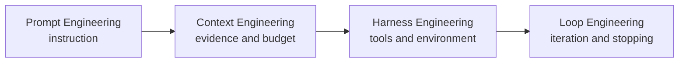

---
topic:
  - AI & ML
subtopic:
  - LLM
summary: "A routing hub for model foundations, generation, adaptation, prompting, context, evaluation, and agent runtimes."
tags:
  - FolderNote
publish: true
level:
  - '3'
priority: High
status: Creation
---

# Intro

A large language model (LLM) is a neural language model with enough capacity and training data to support broad language tasks. Modern LLM systems are usually built on transformers, but “LLM” does not identify one architecture or objective: decoder-only models generate causally, encoder-decoder models generate from an encoded input, and encoder-only models produce contextual representations rather than autoregressive text. [[LLM Foundations and Training]] carries those architecture and training boundaries.

For system design, model output is probabilistic and untrusted. Prompts condition behavior; context supplies current evidence; the harness exposes tools; the loop decides how to iterate and stop; evaluation measures whether the assembled system works. Treat fluent output as a candidate result that still needs grounding, validation, and release evidence.

```datacorejsx
const { FolderStructureMap } = await dc.require("Assets/components/devbook-folder-map.jsx");
return FolderStructureMap;
```

## Engineering routes

Four inference-time disciplines wrap one another:



| Route | Unit of design | Question |
| --- | --- | --- |
| [[Home/AI & ML/LLM/Prompt Engineering/Prompt Engineering\|Prompt Engineering]] | One instruction | How should this task be specified and demonstrated? |
| [[Context Engineering]] | The whole context window | Which evidence enters the window, in what order, and at what cost? |
| [[Harness Engineering]] | Tools and execution boundary | What can the model do, and through which constrained interface? |
| [[Loop Engineering]] | Runtime across turns | How does work iterate, verify, recover, and stop? |

[[Home/AI & ML/LLM/Evaluation/Evaluation|Evaluation]] and [[Home/AI & ML/LLM/Safety/Safety|Safety]] span every route. Model-level choices sit underneath them: [[Generation]] controls decoding, [[Embeddings]] represent inputs for retrieval, [[Fine-tuning]] adapts behavior, and [[Model Selection and Routing]] chooses which model serves a request.

## Minimal vocabulary

- **Token** — the integer-id unit produced by a specific tokenizer. Tokenizer choice affects sequence length and must match the checkpoint.
- **Context window** — the token budget visible to one model invocation, including instructions, history, evidence, tool results, and output allowance.
- **Inference** — executing a trained model to produce representations or generated tokens; [[Generation]] covers sampling controls for generative models.
- **Embedding** — a vector representation used for similarity or downstream prediction; covered in [[Embeddings]].

## Questions

> [!QUESTION]- Why does architecture matter when someone says “LLM”?
> Encoder-only, encoder-decoder, and decoder-only transformers expose different inputs, objectives, and output paths. A BERT checkpoint is not a causal text generator, while T5 generates through an autoregressive decoder conditioned on encoder output.

> [!QUESTION]- How do you choose between prompting, RAG, and fine-tuning?
> Start with prompting. Add RAG when the gap is current, private, or attributable knowledge. Fine-tune when a measured behavior gap remains—format, policy, style, or a narrow task that prompting cannot stabilize.

## References

- [Attention Is All You Need](https://arxiv.org/abs/1706.03762) — the primary transformer architecture paper; [[LLM Foundations and Training]] follows the later encoder-only, encoder-decoder, and decoder-only families.
- [NIST AI Risk Management Framework](https://www.nist.gov/itl/ai-risk-management-framework) — the primary voluntary framework behind treating model output, evaluation, and monitoring as lifecycle concerns rather than model-only properties.
