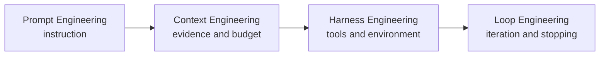

---
topic:
  - AI & ML
subtopic:
  - LLM
summary: "A routing hub for model foundations, generation, adaptation, prompting, context, evaluation, and agent runtimes."
tags:
  - FolderNote
publish: true
level:
  - '3'
priority: High
status: Creation
---

# Intro

A large language model (LLM) is a neural language model with enough capacity and training data to support broad language tasks. Modern LLM systems are usually built on transformers, but “LLM” does not identify one architecture or objective: decoder-only models generate causally, encoder-decoder models generate from an encoded input, and encoder-only models produce contextual representations rather than autoregressive text.

For system design, model output is probabilistic and untrusted. Prompts condition behavior; context supplies current evidence; the harness exposes tools; the loop decides how to iterate and stop; evaluation measures whether the assembled system works. Treat fluent output as a candidate result that still needs grounding, validation, and release evidence.

```datacorejsx
const { FolderStructureMap } = await dc.require("Assets/components/devbook-folder-map.jsx");
return FolderStructureMap;
```

## Engineering routes

Four inference-time disciplines wrap one another:



| Route | Unit of design | Question |
| --- | --- | --- |
| [[Home/AI & ML/LLM/Prompt Engineering/Prompt Engineering\|Prompt Engineering]] | One instruction | How should this task be specified and demonstrated? |
| [[Home/AI & ML/LLM/Context Engineering/Context Engineering|Context Engineering]] | The whole context window | Which evidence enters the window, in what order, and at what cost? |
| [[Home/AI & ML/LLM/Agent/Harness Engineering|Harness Engineering]] | Tools and execution boundary | What can the model do, and through which constrained interface? |
| [[Home/AI & ML/LLM/Agent/Loop Engineering|Loop Engineering]] | Runtime across turns | How does work iterate, verify, recover, and stop? |

[[Home/AI & ML/LLM/Evaluation/Evaluation|Evaluation]] and [[Home/AI & ML/LLM/Safety/Safety|Safety]] span every route. Model-level choices sit underneath them: [[Home/AI & ML/LLM/Generation|generation]] controls decoding, [[Home/AI & ML/LLM/Embeddings|embeddings]] represent inputs for retrieval, [[Home/AI & ML/LLM/Fine-tuning|fine-tuning]] adapts behavior, and [[Home/AI & ML/LLM/Model Selection and Routing|model selection and routing]] chooses which model serves a request.

## Transformer foundations and training

An LLM checkpoint is the output of a particular architecture, tokenizer, objective, and training pipeline. The weights are not a self-describing program that any inference runtime can load. To reproduce the model, the runtime must build the compatible computation graph, interpret every tensor correctly, tokenize text with the matching vocabulary and special-token rules, and implement the operators used by that architecture and quantization scheme.

### Transformer families

| Family | Training and attention boundary | Output path | Typical use |
| --- | --- | --- | --- |
| Encoder-only | Bidirectional contextual encoding; BERT pretrains with masked-token prediction and sentence-level objectives | One contextual vector per input token or a pooled representation | Classification, extraction, reranking, embeddings |
| Encoder-decoder | Encoder reads the source bidirectionally; decoder generates target tokens autoregressively while attending to encoder output | Generated target sequence | Translation, summarization, text-to-text tasks |
| Decoder-only | Causal attention exposes only earlier tokens during next-token prediction | Generated continuation | Chat, code, completion, tool-call generation |

**BERT** is encoder-only. It predicts masked tokens during pretraining and exposes contextual representations to a task head; it has no autoregressive decoder for open-ended generation.

**T5** is a generative encoder-decoder. It pretrains with a span-corruption text-to-text objective: the encoder consumes corrupted input, and the decoder autoregressively generates missing target spans.

**GPT-style models** are decoder-only. A causal mask makes each position predict from earlier positions, so the same stack can continue a prompt one token at a time.

### Checkpoint is more than weights

Loading succeeds only when these contracts agree:

- **Architecture and configuration** — layer count, hidden size, attention heads, positional encoding, normalization, activation, vocabulary size, and expert layout.
- **Tensor contract** — parameter names, shapes, axis layout, serialization format, numerical type, sharding, and fused or transposed representations.
- **Tokenizer contract** — vocabulary, normalization, pre-tokenization, merge rules, byte fallback, and identifiers for beginning, end, padding, unknown, and chat-control tokens.
- **Adaptation and quantization metadata** — adapter targets, ranks, scaling, quantization groups, scales, zero points, and calibration assumptions.
- **Runtime operators** — compatible attention, position logic, expert routing, normalization, quantized matrix operations, and cache layout on the target hardware.

A `.safetensors` file defines a safe tensor container; it does not identify the model class or tokenizer. Loading Llama-shaped tensors into a GPT-2 graph fails on names and shapes. Using the wrong tokenizer can preserve tensor dimensions while mapping the same text to different IDs and silently corrupt behavior.

Portable graph formats such as ONNX make operators and tensor interfaces explicit, but the runtime must still support the graph’s operator versions, data types, custom operators, and hardware kernels. A successful file parse is weaker evidence than a known-answer inference test against the source runtime.

### Training pipeline

```text
base checkpoint = architecture + tokenizer + pretrained tensors + configuration
instruction model = compatible base checkpoint + SFT + optional preference/reward stage
deployable artifact = model bundle + runtime + release evaluation
```

![[11 AI & ML/11 AI & ML-LLM-20260705173634102.png]]

1. **Pretraining** fits the architecture’s language objective over a large corpus. The output is a base checkpoint, not automatically a conversational assistant.
2. **Supervised fine-tuning (SFT)** trains on instruction-response or task examples. [[Home/AI & ML/LLM/Fine-tuning|Fine-tuning]] covers full and parameter-efficient updates, data contracts, preference alignment, GRPO, and evaluation.
3. **Preference or reward optimization** uses comparisons or verifiable rewards to favor some outputs over others. It remains a separate training stage even when documented in the same canonical note as fine-tuning.

Training provenance matters at deployment. Record the base revision, data version, tokenizer files, configuration, adapters, quantization recipe, runtime version, and evaluation result. A model name without those versions is not enough to reproduce output or investigate a regression.

### Failure modes

- **Architecture mismatch** — tensor names or shapes fail during load, or a permissive loader leaves expected parameters uninitialized.
- **Tokenizer mismatch** — loading appears successful, but prompts use different token IDs, special markers, or normalization and quality collapses.
- **Runtime mismatch** — unsupported operators, cache layout, precision, or quantization kernels cause load failure, numerical drift, or a slow fallback path.
- **Training-stage ambiguity** — benchmark results for a base checkpoint are compared with an instruction or preference-aligned variant as though they were the same model.

## Mixture-of-experts

A sparse mixture-of-experts (MoE) model replaces some dense feed-forward layers with several expert networks and a learned router. For each token, the router activates only a small subset of experts and combines their outputs. This increases total parameter capacity without evaluating every expert for every token. It is internal model architecture, not the application-level decision to send a request to one model or another in [[Home/AI & ML/LLM/Model Selection and Routing|model selection and routing]].

### Token routing

```text
token hidden state
    → router scores experts
    → select top-k experts
    → dispatch token
    → combine weighted expert outputs
```

If many tokens choose the same expert, that device becomes a bottleneck while other experts sit idle. Implementations use capacity limits, load-balancing objectives or biases, token dropping or rerouting policies, and careful expert placement.

### What sparse activation saves

Sparse activation reduces feed-forward arithmetic relative to evaluating every expert. It does not remove the rest of the transformer, and it does not make total parameters disappear from deployment.

Distinguish three measurements:

- **Total parameters** affect checkpoint storage and expert placement across device memory.
- **Active parameters per token** approximate part of the arithmetic executed for a token.
- **Measured throughput and latency** include router work, token dispatch, all-to-all communication, batching, precision, kernels, and load imbalance.

A dense model can outperform a sparse model with a similar advertised active count when expert traffic is communication-bound. A well-placed MoE can deliver more learned capacity at manageable per-token compute. Neither conclusion follows from parameter counts alone.

### Capacity and communication

An expert capacity factor reserves room for more than the average token share. Too little capacity can drop or reroute tokens; too much wastes memory and compute. During distributed training or serving, tokens cross device boundaries to reach experts, making interconnect topology and expert placement part of model latency.

Batch shape matters. A large batch can distribute tokens more efficiently across experts, while low-latency small batches expose imbalance and communication overhead. Measure the exact serving regime rather than extrapolating from training throughput.

### DeepSeek architecture boundary

The DeepSeek-V3 report describes routed experts, shared experts, and an auxiliary-loss-free load-balancing strategy. DeepSeek-R1 uses that base architecture, while [[Home/AI & ML/LLM/Fine-tuning#GRPO|GRPO]] belongs to post-training. Token routing and policy optimization solve different problems.

Use the primary technical report for architecture claims. Undated prices, hardware totals, and benchmark tables from secondary comparisons mix hardware, precision, prompts, and model versions and do not establish an MoE design tradeoff.

## Minimal vocabulary

- **Token** — the integer-id unit produced by a specific tokenizer. Tokenizer choice affects sequence length and must match the checkpoint.
- **Context window** — the token budget visible to one model invocation, including instructions, history, evidence, tool results, and output allowance.
- **Inference** — executing a trained model to produce representations or generated tokens; [[Home/AI & ML/LLM/Generation|generation]] covers sampling controls for generative models.
- **Embedding** — a vector representation used for similarity or downstream prediction; covered in [[Home/AI & ML/LLM/Embeddings|embeddings]].

## Questions

> [!QUESTION]- Why does architecture matter when someone says “LLM”?
> Encoder-only, encoder-decoder, and decoder-only transformers expose different inputs, objectives, and output paths. A BERT checkpoint is not a causal text generator, while T5 generates through an autoregressive decoder conditioned on encoder output.

> [!QUESTION]- What must match besides checkpoint tensor bytes?
> The architecture and configuration, tensor names and layouts, tokenizer and special-token IDs, adaptation or quantization metadata, and runtime operator implementations must agree. Verify the bundle with known-answer inference, not only a successful file parse.

> [!QUESTION]- Why is active parameter count not an inference-cost measurement?
> It omits dense layers, memory traffic, token dispatch, interconnect communication, batching, and expert imbalance. Measure throughput and latency on the target serving stack.

> [!QUESTION]- How do you choose between prompting, RAG, and fine-tuning?
> Start with prompting. Add RAG when the gap is current, private, or attributable knowledge. Fine-tune when a measured behavior gap remains—format, policy, style, or a narrow task that prompting cannot stabilize.

## References

- [Attention Is All You Need](https://arxiv.org/abs/1706.03762) — the primary transformer architecture paper and attention mechanism.
- [BERT](https://arxiv.org/abs/1810.04805) — the primary encoder-only masked-language-model pretraining paper.
- [Exploring the Limits of Transfer Learning with a Unified Text-to-Text Transformer](https://arxiv.org/abs/1910.10683) — the primary encoder-decoder architecture and span-corruption text-to-text objective.
- [Language Models are Few-Shot Learners](https://arxiv.org/abs/2005.14165) — the primary GPT-style causal-language-model report.
- [Training language models to follow instructions with human feedback](https://arxiv.org/abs/2203.02155) — the primary SFT, reward model, and RLHF pipeline context.
- [Switch Transformers](https://jmlr.org/papers/v23/21-0998.html) — sparse-expert routing and load-balancing tradeoffs.
- [GShard](https://arxiv.org/abs/2006.16668) — primary MoE distributed scaling architecture.
- [DeepSeek-V3 Technical Report](https://arxiv.org/abs/2412.19437) — primary report for routed and shared experts and its load-balancing design.
- [ONNX concepts](https://onnx.ai/onnx/intro/concepts.html) — the normative model format and operator model.
- [ByteByteGo source snapshot: DeepSeek one-pager](https://github.com/ByteByteGoHq/system-design-101/blob/b28380a4710c5ec9638ec037d4168e288f334cba/data/guides/deepseek-1-pager.md) — the pinned secondary summary reconciled here by separating sparse architecture from GRPO and excluding incomparable product claims.
