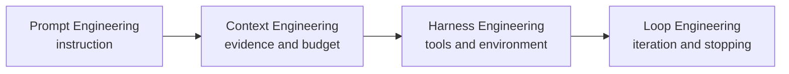

---
topic:
  - AI & ML
subtopic:
  - LLM
summary: "A routing hub for model foundations, generation, adaptation, prompting, context, evaluation, and agent runtimes."
tags: [FolderNote]
publish: true
level:
  - "3"
priority: High
status: Creation
---

A large language model (LLM) is a neural language model trained at enough scale to handle a broad range of language tasks. The name says little about the exact architecture. Decoder-only models continue text causally, encoder-decoder models generate from an encoded source, and encoder-only models produce contextual representations instead of open-ended text.

Model output is probabilistic and untrusted from a system-design perspective. A prompt conditions behavior, context supplies current evidence, and the harness exposes actions. The loop controls iteration and stopping. Evaluation then measures whether those pieces work together. Fluent output remains a candidate result until grounding and validation support it.

```datacorejsx
const { FolderStructureMap } = await dc.require("Assets/components/devbook-folder-map.jsx");
return FolderStructureMap;
```

# Engineering Routes

Four inference-time disciplines form the runtime around a model call:


```mermaid
flowchart LR
    P[Prompt Engineering<br>instruction] --> C[Context Engineering<br>evidence and budget]
    C --> H[Harness Engineering<br>tools and environment]
    H --> L[Loop Engineering<br>iteration and stopping]
```

| Route | Unit of design | Question |
| --- | --- | --- |
| [[Home/AI & ML/LLM/Prompt Engineering/Prompt Engineering\|Prompt Engineering]] | One instruction | How should this task be specified and demonstrated? |
| [[Home/AI & ML/LLM/Context Engineering/Context Engineering|Context Engineering]] | The whole context window | Which evidence enters the window, in what order, and at what cost? |
| [[Home/AI & ML/LLM/Harness Engineering/Harness Engineering|Harness Engineering]] | Tools and execution boundary | What can the model do, and through which constrained interface? |
| [[Home/AI & ML/LLM/Loop Engineering/Loop Engineering|Loop Engineering]] | Runtime across turns | How does work iterate, verify, recover, and stop? |

[[Home/AI & ML/LLM/Evaluation/Evaluation|Evaluation]] and [[Home/AI & ML/LLM/Safety/Safety|Safety]] span every route. Model-level choices sit underneath them: [[Home/AI & ML/LLM/Generation|generation]] controls decoding, [[Home/AI & ML/LLM/Embeddings|embeddings]] represent inputs for retrieval, [[Home/AI & ML/LLM/Fine-tuning|fine-tuning]] adapts behavior, and [[Home/AI & ML/LLM/Model Selection and Routing|model selection and routing]] chooses which model serves a request.

# Transformer Foundations and Training

An LLM checkpoint comes from one architecture, tokenizer, objective, and training pipeline. Its weights are not a self-describing program. A compatible runtime must rebuild the expected computation graph, interpret the stored tensors correctly, apply the matching tokenization rules, and provide every operator required by the architecture and quantization scheme.

## Transformer Families

| Family | Training and attention boundary | Output path | Typical use |
| --- | --- | --- | --- |
| Encoder-only | Bidirectional contextual encoding. BERT pretrains with masked-token prediction and sentence-level objectives | One contextual vector per input token or a pooled representation | Classification, extraction, reranking, embeddings |
| Encoder-decoder | Encoder reads the source bidirectionally. Decoder generates target tokens autoregressively while attending to encoder output | Generated target sequence | Translation, summarization, text-to-text tasks |
| Decoder-only | Causal attention exposes only earlier tokens during next-token prediction | Generated continuation | Chat, code, completion, tool-call generation |

**BERT** is encoder-only. It predicts masked tokens during pretraining and exposes contextual representations to a task head. It has no autoregressive decoder for open-ended generation.

**T5** is a generative encoder-decoder. It pretrains with a span-corruption text-to-text objective: the encoder consumes corrupted input, and the decoder autoregressively generates missing target spans.

**GPT-style models** are decoder-only. A causal mask makes each position predict from earlier positions, so the same stack can continue a prompt one token at a time.

## Checkpoint is More than Weights

Loading is trustworthy only when several contracts agree:

- **Architecture and configuration** define the layer count, hidden size, attention layout, positional encoding, normalization, activation, vocabulary size, and expert topology.
- **Tensor contract** covers parameter names, shapes, axis layout, serialization, numerical type, sharding, and any fused or transposed representation.
- **Tokenizer contract** includes the vocabulary, normalization, splitting and merge rules, byte fallback, and special-token identifiers.
- **Adaptation and quantization metadata** record adapter targets and scaling alongside quantization groups, scales, zero points, and calibration assumptions.
- **Runtime operators** must implement compatible attention, position logic, expert routing, normalization, quantized matrix work, and cache layout on the target hardware.

A `.safetensors` file provides a safe tensor container, not a model class or tokenizer. Llama-shaped tensors do not fit a GPT-2 graph. A wrong tokenizer is harder to spot: tensor dimensions still match while the same text maps to different IDs, silently changing behavior.

Portable graph formats such as ONNX make operators and tensor interfaces explicit. The target runtime still needs the graph's operator versions, data types, custom operators, and hardware kernels. Parsing the file proves less than a known-answer inference test against the source runtime.

## Training Pipeline

```text
base checkpoint = architecture + tokenizer + pretrained tensors + configuration
instruction model = compatible base checkpoint + SFT + optional preference/reward stage
deployable artifact = model bundle + runtime + release evaluation
```

![[AI & ML/AI & ML-LLM-18120000.png|theme-aware]]

1. **Pretraining** fits the architecture’s language objective over a large corpus. The output is a base checkpoint, not automatically a conversational assistant.
2. **Supervised fine-tuning (SFT)** trains on instruction-response or task examples. [[Home/AI & ML/LLM/Fine-tuning|Fine-tuning]] covers full and parameter-efficient updates, data contracts, preference alignment, GRPO, and evaluation.
3. **Preference or reward optimization** uses comparisons or verifiable rewards to favor some outputs over others. It remains a separate training stage even when documented in the same canonical note as fine-tuning.

Deployment depends on training provenance. The release record needs the base revision, data version, tokenizer files, configuration, adapters, quantization recipe, runtime version, and evaluation result. A model name alone cannot reproduce an output or explain a regression.

## Failure Modes

- **Architecture mismatch** — tensor names or shapes fail during load, or a permissive loader leaves expected parameters uninitialized.
- **Tokenizer mismatch** — loading appears successful, but prompts use different token IDs, special markers, or normalization and quality collapses.
- **Runtime mismatch** — unsupported operators, cache layout, precision, or quantization kernels cause load failure, numerical drift, or a slow fallback path.
- **Training-stage ambiguity** — benchmark results for a base checkpoint are compared with an instruction or preference-aligned variant as though they were the same model.

# Mixture-of-experts

A sparse mixture-of-experts (MoE) model replaces some dense feed-forward layers with expert networks and a learned router. The router activates only a small subset for each token, then combines their outputs. This adds total parameter capacity without evaluating every expert on every token. It is an internal architecture choice, separate from application-level [[Home/AI & ML/LLM/Model Selection and Routing|model selection and routing]].

## Token Routing

```text
token hidden state
    → router scores experts
    → select top-k experts
    → dispatch token
    → combine weighted expert outputs
```

When too many tokens choose one expert, its device becomes a bottleneck while others sit idle. Implementations counter this with capacity limits, balancing objectives or biases, token rerouting, and deliberate expert placement.

## What Sparse Activation Saves

Sparse activation saves feed-forward arithmetic compared with evaluating every expert. The rest of the transformer still runs, and the full parameter set still affects deployment.

Distinguish three measurements:

- **Total parameters** affect checkpoint storage and expert placement across device memory.
- **Active parameters per token** approximate part of the arithmetic executed for a token.
- **Measured throughput and latency** include router work, token dispatch, all-to-all communication, batching, precision, kernels, and load imbalance.

A dense model can beat a sparse model with a similar advertised active count when expert traffic is communication-bound. Careful expert placement can give an MoE more learned capacity at manageable per-token compute. Parameter counts alone cannot predict either result.

## Capacity and Communication

An expert capacity factor reserves headroom above the average token share. Too little capacity drops or reroutes tokens. Too much wastes memory and compute. In distributed training or serving, tokens cross device boundaries to reach experts, so interconnect topology and placement become part of model latency.

Batch shape changes that tradeoff. Large batches can spread tokens across experts efficiently, while small low-latency batches expose imbalance and communication overhead. Training throughput is not a substitute for measurement on the intended serving workload.

## Routed and Shared Experts in DeepSeek-V3

The DeepSeek-V3 report describes routed experts, shared experts, and an auxiliary-loss-free load-balancing strategy. DeepSeek-R1 uses that base architecture, while [[Home/AI & ML/LLM/Fine-tuning#GRPO|GRPO]] belongs to post-training. Token routing and policy optimization solve different problems. Price, hardware, and benchmark comparisons are meaningful only when hardware, precision, prompts, and model versions match.

# Minimal Vocabulary

- **Token** — the integer-id unit produced by a specific tokenizer. Tokenizer choice affects sequence length and must match the checkpoint.
- **Context window** — the token budget visible to one model invocation, including instructions, history, evidence, tool results, and output allowance.
- **Inference** — executing a trained model to produce representations or generated tokens. [[Home/AI & ML/LLM/Generation|generation]] covers sampling controls for generative models.
- **Embedding** — a vector representation used for similarity or downstream prediction. Covered in [[Home/AI & ML/LLM/Embeddings|embeddings]].

# Questions

> [!QUESTION]- How should prompting, RAG, and fine-tuning be chosen for an LLM system?
> The choice starts with the type of gap shown by evaluation. Prompting is the simplest option when clearer instructions or examples can stabilize the task. RAG fits gaps in current or private knowledge and cases where answers need source evidence. Fine-tuning fits a stable behavior gap, such as format, policy, style, or a narrow task, after prompting has been tested and is still inconsistent. The techniques can be combined: fine-tuning can shape behavior while RAG supplies facts that change.

# References

- [Attention Is All You Need](https://arxiv.org/abs/1706.03762)
- [BERT](https://arxiv.org/abs/1810.04805)
- [Exploring the Limits of Transfer Learning with a Unified Text-to-Text Transformer](https://arxiv.org/abs/1910.10683)
- [Language Models are Few-Shot Learners](https://arxiv.org/abs/2005.14165)
- [Training language models to follow instructions with human feedback](https://arxiv.org/abs/2203.02155)
- [Switch Transformers](https://jmlr.org/papers/v23/21-0998.html)
- [DeepSeek-V3 Technical Report](https://arxiv.org/abs/2412.19437)
