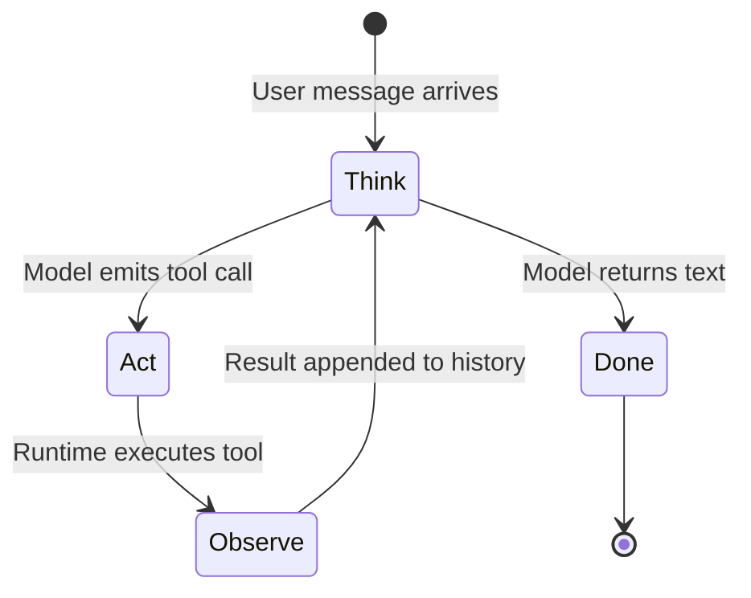

---
topic:
  - AI & ML
subtopic:
  - LLM
summary: "The execution cycle, ReAct's think-act-observe, that turns an LLM into an autonomous tool-using problem solver."
level:
  - "3"
priority: Medium
status: Done
publish: true
---

An agent loop gives an LLM another move. The model can inspect the current state, call a tool, read the result, and decide whether the task is finished. That repeated decision is what separates a tool-using agent from a single model call.

ReAct (Reasoning + Acting), introduced by Yao et al., is the familiar form of this loop. Frameworks package it differently, but the runtime still alternates model decisions with external actions and observations.

The loop works in four steps:

1. **Think.** The model receives the conversation history, including earlier tool results, and decides what is missing.
2. **Act.** It emits a structured tool call: a function name and arguments chosen from the available [[Tool Design|tools]].
3. **Observe.** The runtime executes the tool and appends its result as a tool message.
4. **Repeat or stop.** The updated history returns to the model. Another tool call continues the loop. A final response ends it.



ReAct joins two capabilities that are weak in isolation. Reasoning can choose the next useful action, while tool results give that reasoning evidence outside the model's parameters. In the paper's ALFWorld evaluation, ReAct improved the absolute success rate by 34 percentage points over the cited imitation- and reinforcement-learning baselines.

The fixed [[Home/AI & ML/LLM/Agents/Agents|workflow patterns]] are still the better fit when every step is known in advance. The loop earns its cost when the next step depends on what the previous action discovered.

# How It Works in Practice

The loop follows the chat API contract closely.

**Think.** The runtime sends the conversation history and the JSON schemas for available tools. The model returns either text or one or more tool calls.

**Act.** For each tool call, the runtime extracts the function name and arguments. The model has requested data or a side effect. It has not performed the action itself.

**Observe.** The runtime validates and invokes the function, serializes the result, and appends it as a `tool` message. The model only sees that serialized result.

**Repeat.** A response with more tool calls starts another iteration. Plain text with no tool calls normally terminates the run.

In Microsoft Agent Framework for .NET, `AIAgent.RunAsync` drives this cycle:

```csharp
// A tool the agent can call — any method, described for the model
[Description("Get the weather forecast for a city.")]
static string GetWeather([Description("City name, e.g. 'Seattle'")] string city)
    => $"{city}: light rain, 12°C, 80% chance of showers today.";

// Build a chat client over Azure OpenAI, then wrap it in an agent
IChatClient chatClient = new AzureOpenAIClient(new Uri(endpoint), new ApiKeyCredential(apiKey))
    .GetChatClient(deploymentName)
    .AsIChatClient();

AIAgent agent = new ChatClientAgent(chatClient, new ChatClientAgentOptions
{
    Name = "WeatherAssistant",
    ChatOptions = new ChatOptions
    {
        Instructions = "You help users plan around the weather.",
        Tools = [AIFunctionFactory.Create(GetWeather)],
    },
});

// This single call runs the full Think-Act-Observe-Repeat loop internally
var response = await agent.RunAsync("Should I bring an umbrella to Seattle today?");
```

Behind `RunAsync`, `FunctionInvokingChatClient` exposes each `AIFunction` as a tool schema, invokes requested functions, appends their results, and keeps going until the model answers or the iteration limit is reached.

The equivalent raw loop without framework abstraction:

```python
messages = [{"role": "user", "content": "Should I bring an umbrella to Seattle today?"}]
max_iterations = 12

for _ in range(max_iterations):
    response = client.chat.completions.create(
        model="gpt-4.1", messages=messages, tools=tools
    )
    choice = response.choices[0]

    if choice.finish_reason == "stop":
        print(choice.message.content)  # Final answer — loop ends
        break

    tool_calls = choice.message.tool_calls or []
    if not tool_calls:
        raise RuntimeError(f"Agent stopped without an answer or tool call: {choice.finish_reason}")

    messages.append(choice.message)
    for tool_call in tool_calls:
        name, arguments = validate_tool_call(tool_call)  # allowlist, schema, authorization
        result = execute_tool(name, arguments)
        messages.append({
            "role": "tool",
            "tool_call_id": tool_call.id,
            "content": json.dumps(result),
        })
else:
    raise RuntimeError("Agent exceeded its iteration limit")
```

Both examples implement the same cycle. The framework owns the bookkeeping. The raw version exposes the iteration limit, terminal-state handling, and validation required before a side-effecting tool executes.

# Pitfalls

## Infinite Loops and Tool Spam

An agent can spend heavily without getting closer to a complete result. In a production case documented by Hugo Nogueira, one run made 369 tool calls, consumed 9.7 million tokens, and produced 30 structured documents. It hit the context limit twice, recovered from a corrupted checkpoint, and nearly published an incomplete analysis before a guardrail caught it.

The model has no reliable sense of diminishing returns. As tool results accumulate, earlier attempts also become easier to miss.

The runtime needs a hard iteration cap. Agent Framework's `FunctionInvokingChatClient` exposes `MaximumIterationsPerRequest`. Outer workflow agents use their own loop controls, such as `LoopAgentOptions.MaxIterations`. LangGraph exposes `recursion_limit`. Repeated calls with identical arguments can trigger an earlier stop, and per-run tool counts make unusual behavior visible.

## Token Explosion

Every iteration makes the conversation larger. Full API payloads and long search results are especially expensive because most of their fields rarely affect the next decision. Eventually useful history is displaced or the request exceeds the context window.

The common cause is simple: tool adapters return whatever the underlying API returned instead of the small projection the model needs.

Compact tool results at the boundary. Long runs also need token accounting and a deliberate compaction policy so that old evidence is summarized before the platform truncates it.

## Hallucinated Tool Calls

A model may request a missing function, produce schema-invalid arguments, or invent a parameter value. Ambiguous tool names and deeply nested schemas make these failures more likely.

Tool schemas are model input, not an enforcement mechanism. Names such as `process` or `handle` provide little help when several tools look alike.

Validate the function name and arguments before execution, then return a precise error that the next iteration can act on. Clear names, narrow parameters, and shallow schemas reduce recovery work. For tools with side effects, validation belongs in code rather than in the prompt.

# Questions

> [!QUESTION]- Why does the ReAct pattern outperform chain-of-thought reasoning alone for tasks requiring external knowledge?
> Reasoning alone must rely on parametric memory. ReAct can retrieve or compute an intermediate fact before continuing, so later steps can use observed evidence. The price is another model round trip and a larger context for every action.

> [!QUESTION]- Which safeguards must be enforced outside the model, and what failure does each contain?
> A per-request iteration cap contains non-terminating behavior. Token and cost budgets stop context growth before it becomes an outage or an unexpected bill. Tool validation blocks unknown functions and malformed arguments before they reach a side-effecting boundary. Prompt instructions can help, but none of these controls can depend on the model obeying them.

# References

- [ReAct: Synergizing Reasoning and Acting in Language Models — Yao et al. ICLR 2023](https://arxiv.org/abs/2210.03629)
- [The 100th Tool Call Problem — production failure analysis (Hugo Nogueira)](https://www.hugo.im/posts/100th-tool-call-problem)
- [ReAct agent from scratch — LangGraph](https://langchain-ai.github.io/langgraph/how-tos/react-agent-from-scratch-functional/)
