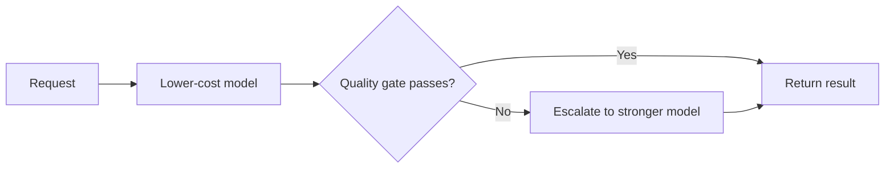

---
topic:
  - AI & ML
subtopic:
  - LLM
summary: "Selecting and routing models from measured task quality, latency, reliability, and cost."
level:
  - "2"
priority: Medium
status: Ready to Repeat
publish: true
---

Model selection decides which models are allowed to serve a workload. Routing makes the per-request choice among them. Frontier models often handle difficult tasks well. Smaller models are usually cheaper and faster. Neither tendency is a contract. A specialized model can win on a narrow task, while a frontier model can miss a latency SLA or regress after a provider update. Production selection is empirical: the least expensive candidate that clears the workload's quality, safety, reliability, and latency gates wins.

Application-level routing chooses between complete model deployments for each request. [[Home/AI & ML/LLM/LLM#Mixture-of-experts|Mixture-of-experts routing]] happens inside one sparse model and selects internal expert parameters token by token. The two mechanisms solve different cost and capacity problems.

# Selection Criteria

Every candidate needs the same versioned workload and constraints:

- **Task quality** — correctness, groundedness, tool-call success, and failure slices on the labeled set.
- **Latency** — p50 and p95 under the expected prompt size, output length, concurrency, and region.
- **Cost** — input, cached input, output, tool calls, and retry or escalation cost per successful task.
- **Capabilities** — required context, structured outputs, tools, modalities, and language coverage.
- **Safety and policy** — refusal behavior, data handling, residency, and provider terms.
- **Operations** — rate limits, uptime, version pinning, observability, and fallback behavior.

Public leaderboards are useful for shortlisting. Release evidence still comes from [[Home/AI & ML/LLM/Evaluation/Evaluation|evaluation]] on the distribution and rubric that define the product.

# Routing Patterns

## Deterministic Task Mapping

Known task classes can map to models in configuration: extraction goes to one candidate, complex synthesis to another, and image work to a multimodal model. Explicit task boundaries keep the policy auditable.

## Classifier Routing

A cheap classifier predicts task type or difficulty before generation, avoiding the cost of a failed first attempt. But a false “easy” decision can silently lower quality. Router evaluation therefore needs overall classification accuracy plus per-route recall for hard and safety-sensitive cases.

## Cascade

A cascade starts with a lower-cost model and escalates when an observable gate fails, such as schema validation, a groundedness check, calibrated confidence, or an explicit unsupported result.

A cascade saves money only when the first attempt plus its escalations cost less than sending every request to the stronger model. Escalated traffic also pays extra latency. End-to-end p95 matters more than either model's isolated number.

# Router Evaluation

A labeled routing set starts with real traffic. Each request records which candidates pass the task rubric along with latency and full cost. That supports comparison against an oracle that always selects the cheapest passing model.

Track:

- End-to-end task success together with classifier accuracy.
- Hard-query miss rate and safety-sensitive miss rate.
- Escalation frequency and the cost of duplicate generation.
- p95 latency by route and after fallback.
- Drift when traffic, prompts, provider versions, or prices change.

Shadow evaluation runs alternative candidates without serving their answers. It provides fresh routing evidence before user-visible assignments change.

# Operations

One gateway boundary should own provider calls. Model identifiers, fallbacks, timeouts, and routing policy then stay in configuration instead of leaking into scattered conditionals. Operational records need the route decision, candidate version, gate result, latency, and safe token or cost metadata. Sensitive prompts and responses stay out by default.

Versions should be pinned where the provider allows it. A model change behind an alias invalidates earlier evidence and triggers evaluation again. Fallbacks carry the same capability and policy requirements. Availability alone does not make a model safe if it cannot honor the output contract.

# Pitfalls

**Frontier by default:** this hides missing task thresholds and can spend the most on traffic a smaller candidate already passes.

**Small by assumption:** low advertised cost means little when retries or human escalation raise the cost per successful task.

**Router accuracy as the goal:** a class label is only a proxy. The real objective is end-to-end task success within cost and latency constraints.

**Unmeasured cascade tails:** escalated requests pay for two generations and can dominate p95 latency.

**Provider aliases without regression gates:** silent model changes invalidate earlier routing evidence.

# Tradeoffs

| Strategy | Main benefit | Main cost | Good fit |
| --- | --- | --- | --- |
| One approved model | Simple operations | Pays one model’s tradeoffs for all traffic | Uniform workload or early product |
| Deterministic mapping | Auditable decisions | Rules drift as traffic changes | Clear task categories |
| Classifier router | One generation per request | Misrouting risk and calibration work | Predictable difficulty signals |
| Cascade | Observable second chance | Duplicate cost and tail latency | Cheap reliable failure gate |
| Fine-tuned specialist | Low serving cost on one task | Training and model lifecycle | Stable, high-volume narrow task |

# Questions

> [!QUESTION]- Why are “frontier is best” and “small is cheap” insufficient selection rules?
> They describe common tendencies rather than results for a particular task and serving stack. Selection needs measured quality, safety, latency, and cost per successful task on the same workload.

> [!QUESTION]- What determines whether a classifier or cascade is the better router?
> A classifier fits tasks whose difficulty can be predicted before generation and where duplicate latency is expensive. A cascade fits tasks whose first result exposes a cheap, reliable failure signal. Both require end-to-end evaluation because classifier misses and cascade retries fail differently.

# References

- [LiteLLM](https://docs.litellm.ai/) — practical gateway reference for provider abstraction, fallback, and routing configuration.
