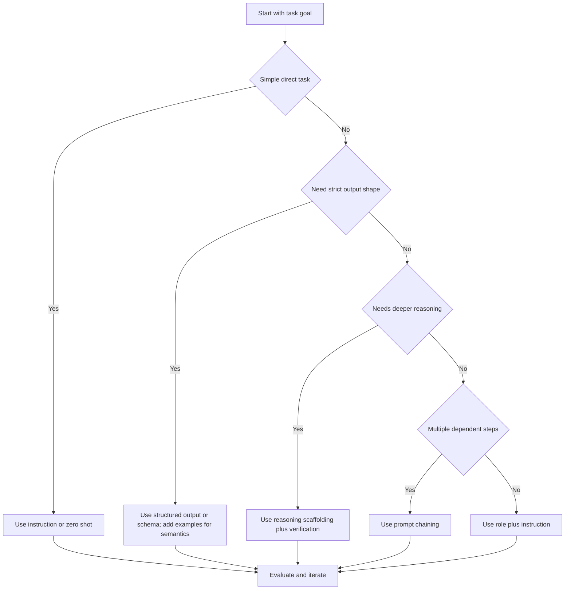

---
topic:
  - AI & ML
subtopic:
  - LLM
summary: "Turning vague intentions into precise, testable model tasks: anatomy, settings, and role prompting."
level:
  - "3"
status: Done
tags: [FolderNote]
publish: true
priority: Medium
---

Prompt engineering turns an intention into a task the model can execute and the system can test. Small changes in wording or generation settings can shift output quality because an LLM samples from a probability distribution rather than following a fixed program.

In production, the prompt is part of the system interface. It needs explicit behavior, version control, and evaluation like any other executable contract. This hub covers the basic mechanics. Its child notes handle in-context learning, reasoning, prompt composition, and automated optimization in more depth.

```datacorejsx
const { FolderStructureMap } = await dc.require("Assets/components/devbook-folder-map.jsx");
return FolderStructureMap;
```

# Prompt Anatomy

Four elements cover most prompt contracts:

- **Instruction** names the exact task.
- **Context** supplies domain facts or constraints.
- **Input data** contains the material to process now.
- **Output indicator** defines the required answer shape.

The following prompt uses all four:

```text
Instruction: Extract security risks from the incident note.
Context: You are helping a SOC analyst. Keep findings actionable and concise.
Input data: "API keys were stored in plain text logs for 3 days in staging."
Output indicator: Return JSON with fields risk, impact, mitigation.
```

Each element removes a different ambiguity. The instruction narrows behavior, context guides interpretation, input anchors the current case, and the output indicator constrains the result.

# LLM Settings

Prompt text describes the task. Generation settings control sampling and output limits.

- **Temperature** raises or lowers sampling randomness.
- **Top-p** restricts candidate tokens to a cumulative probability mass. Lower values narrow the set.
- **Max tokens** caps generated length and therefore limits part of the cost and latency.
- **Stop sequences** terminate output when the model emits a specified string.

These starting ranges are heuristics. Production values need task-specific evaluation on the chosen model.

| Task type | Temperature | Top-p | Max tokens | Stop sequences |
|---|---:|---:|---:|---|
| Creative writing | 0.8-1.0 | 0.9-1.0 | 600-1200 | Optional section markers |
| Classification | 0.0-0.2 | 0.1-0.4 | 20-80 | Label boundary, newline |
| Code generation | 0.1-0.3 | 0.8-1.0 | 200-800 | ``` or custom delimiter |

A simple starting policy is to tune `temperature` first and leave `top-p` near its default until an evaluation shows that both need adjustment.

# Instruction Prompting

Instruction prompting states the task and result format directly. It works when the requested behavior is specific enough to observe and test.

A useful instruction usually contains:

- A task verb such as classify, extract, summarize, or transform.
- An explicit format such as a JSON schema, table columns, or a fixed label set.
- Relevant constraints on length, forbidden content, confidence, or tone.

Example 1 (name normalization):

```text
Convert the person name to this format: <Last name>, <First name>.
If suffix exists, keep it after first name.
Input: "Nikita Reshetnik"
Output:
```

Example 2 (PII redaction):

```text
Redact all personal data from the email.
Replace names with [NAME], phones with [PHONE], and emails with [EMAIL].
Return only redacted text.
Input: "Hi John, call me at 410-805-2345."
```

When outputs drift, tightening the output indicator is usually cheaper than adding another prompting technique.

# Role Prompting

Role prompting supplies a perspective that changes style, depth, or framing. The role modifies task execution. It does not replace the task.

- It fits tasks where voice or audience matters.
- Accuracy boundaries still need to be explicit.
- Concrete roles work better than vague personas.

Illustrative contrast:

```text
Standard: Write a review of this pizza place.
Role-based: You are a food critic writing for a city newspaper. Write a review of this pizza place in 120-150 words, focusing on crust texture, sauce balance, and service.
```

The second version gives the model a concrete perspective and observable review criteria. The role alone would not provide those constraints.

# Choosing a Technique

This flow is a useful first pass:



Strict output shape needs structured output or schema validation. Examples can clarify semantics that the schema cannot express. A task that cannot fit one instruction may need [[Prompt Composition]]. In both cases, representative evaluation matters more than eliciting hidden reasoning traces; meta prompting is only one way to generate candidate instructions.

# Pitfalls

- **Indirect prompt injection from retrieved content.** A document, web page, or tool result may contain malicious instructions that the model mistakes for trusted guidance. Keep trusted instructions separate from untrusted data, restrict tools by policy, and validate outputs.
- **Correct shape, wrong content.** JSON can pass schema validation while carrying invented values. Add semantic checks for ranges, required relationships, and source-grounded claims.
- **Token budget collapse.** Long context and verbose generations can crowd out critical instructions or examples. Control the input and output budgets together, then monitor truncation rather than assuming the model saw everything.

# Questions

> [!QUESTION]- Why must prompt structure and model settings be designed together?
> The prompt defines the task, context, constraints, and expected output, while model settings control sampling and output limits. Clear instructions can still produce unstable results when sampling is too random for the task. Conservative settings cannot repair an ambiguous instruction or a missing output contract. Both parts should be tested together on the same task-specific evaluation set because changing either one can change quality, consistency, latency, and cost.

> [!QUESTION]- When is few-shot prompting a better fit than pure instruction prompting?
> Few-shot prompting is useful when the expected meaning, label boundary, or output convention is easier to demonstrate than to describe. A small set of representative examples can show how close cases should be handled and make repeated outputs more consistent. Examples do not replace a schema when the shape must be strict. Start with the smallest set that improves held-out results, then add edge cases only when evaluation shows a real gap because every example consumes context.

> [!QUESTION]- How can an accurate but verbose and expensive prompt be tightened?
> First identify whether the cost comes from repeated instructions, unnecessary examples, oversized context, or a verbose output contract. Remove duplicated input and state the required length and shape directly. `max_tokens` is a safety cap rather than the main way to request a concise answer because a low cap can truncate a valid response; stop sequences help only when the output has a reliable delimiter. Compare token usage, task quality, and truncation or failure rates after each change so a cheaper prompt does not quietly become less accurate.

# References

- [Prompt Engineering Guide](https://www.promptingguide.ai/)
- [OpenAI Prompt Engineering Guide](https://platform.openai.com/docs/guides/prompt-engineering)
- [Anthropic Prompt Engineering Overview](https://docs.anthropic.com/en/docs/build-with-claude/prompt-engineering/overview)
