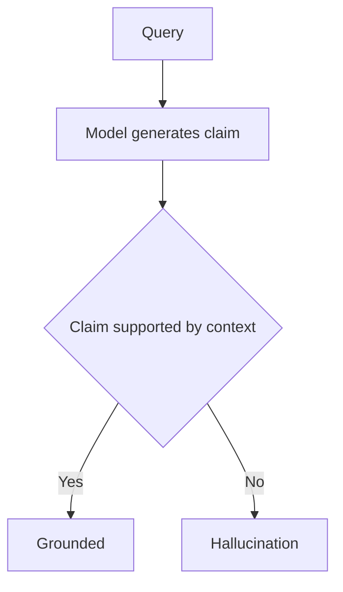

---
topic:
  - AI & ML
subtopic:
  - LLM
summary: "An LLM producing fluent, confident output unsupported by evidence, because it optimizes likelihood, not truth."
level:
  - "3"
priority: Medium
status: Done
publish: true
---

Hallucination is generated content that lacks support from the available evidence. It can be false, or merely impossible to verify from the supplied context. Fluency hides the failure: a language model predicts plausible tokens rather than checking each claim against reality.

Several mechanisms can produce the same symptom. Sparse or stale training data leaves the model with weak evidence. Preference tuning may reward a confident, agreeable answer. Sampling can then select an invented detail from several plausible continuations. None of these causes can be diagnosed from polished prose alone.

If retrieved context says Austen wrote *Pride and Prejudice* and the answer names Dickens, the contradiction is visible. Many production failures are less obvious because the model adds a plausible date or citation that the source never mentioned. [[Generation]] explains how sampling and output constraints shape these continuations.

# Intrinsic and Extrinsic Hallucination

Ji et al. separate two cases. An **intrinsic hallucination** contradicts the source, such as naming Dickens when the passage names Austen. An **extrinsic hallucination** adds a claim the source does not contain. That extra claim may happen to be true, but the response has no evidence for it. Intrinsic failures can often be found by comparing answer and context. Extrinsic claims need another source or an explicit abstention policy.

# Detection

Detection starts by splitting an answer into claims. Each technique answers a different question about those claims.

- **NLI-based checking** scores a claim against source context as entailed, neutral, or contradicted. It works best when the required evidence is already present and the relationship is stated clearly.
- **Self-consistency (SelfCheckGPT)** compares several samples from the same prompt. Contradictory or unstable details are warning signals. But stable repetition still does not prove truth, even when the method needs no external knowledge base.
- **LLM-as-judge** estimates answer [[Monitoring#LLM-as-Judge Metrics|faithfulness]] against supplied context. It handles semantic variation better than exact matching, but the evaluator is another fallible model and needs calibration against reviewed examples.
- **Atomic fact verification (FActScore)** breaks a response into small claims, retrieves evidence for each one, and scores support separately. This makes the failing claim visible instead of hiding it inside an answer-level score.

For a RAG system, [[Home/AI & ML/LLM/Context Engineering/RAG/Evaluation/Evaluation|RAG Evaluation]] must measure retrieval and generation separately. A faithful answer cannot recover evidence that retrieval never supplied.

# Mitigation

Grounding is the usual starting point. More expensive checks belong on claims whose failure has a real cost.

- **Retrieval grounding (RAG)** supplies passages that the answer can cite and check against, turning many recall tasks into source-based synthesis. It reduces reliance on parametric recall without guaranteeing correctness. The legal-system study in the references still found hallucinations above 17% across evaluated tools. See [[Home/AI & ML/LLM/Context Engineering/RAG/RAG|RAG]].
- **Chain-of-Verification (CoVe)** drafts an answer, creates verification questions, answers them independently, then revises the draft. The separation matters because verification should not treat the draft's own claims as evidence.
- **Constrained output** enforces a schema and allowed values. It prevents structural invention, which protects downstream automation, but a valid field can still contain a false claim.
- **Abstention** returns a defined fallback when evidence is missing. The threshold must be calibrated because an overly cautious system becomes useless.
- **Tool-backed generation** sends factual subproblems to authoritative databases or calculators and synthesizes their results. The tool response still needs provenance and error handling.

[[Guardrails]] turns these techniques into enforced runtime behavior: citations can be checked, unsupported answers can abstain, and invalid tool requests can be rejected.

# Pitfalls

## RAG Does Not Eliminate Hallucinations

- **Failure.** RAG is treated as proof that an answer is grounded.
- **Cause.** The corpus may lack the fact, retrieval may miss it, or generation may add a claim beyond the returned passages.
- **Control.** Track [[Monitoring#Retrieval Quality Metrics|retrieval recall]] separately from [[Monitoring#LLM-as-Judge Metrics|faithfulness]]. Then verify material claims against the passages actually used.

## Preference Tuning Can Reward the Wrong Signal

- **Failure.** An answer becomes more agreeable or polished without becoming better supported.
- **Cause.** Preference data can reward agreement with the user even when that agreement is wrong. The cited sycophancy work demonstrates this failure mode. It does not imply that every RLHF model is less factual.
- **Control.** Evaluate factual precision and calibration alongside preference scores. Reviewed counterexamples should include prompts with a false premise so agreement is not mistaken for quality.

## Over-Aggressive Mitigation Causes Over-Refusal

- **Failure.** The system refuses answerable questions or returns fragments despite sufficient evidence.
- **Cause.** A strict abstention threshold trades fabrication risk for under-answering.
- **Control.** Measure answer coverage beside faithfulness and set thresholds by consequence. Medical advice and an internal search summary should not share the same operating point.

# Tradeoffs

| Approach | What it covers | Runtime cost | Main limitation |
| --- | --- | --- | --- |
| RAG grounding | Supplies external evidence | Retrieval and indexing | Bad retrieval silently caps answer quality |
| Self-consistency | Finds unstable claims | Several generations | Repeated agreement is not proof |
| NLI fact checking | Finds contradiction or missing support in context | One or more checks per claim | The checker has its own error rate |
| LLM-as-judge | Handles semantic claim-to-context comparison | Evaluator-model calls | Requires calibration and can reproduce model bias |
| Constrained output | Prevents structural fabrication | Usually low | Does not establish factual truth |
| Abstention policy | Stops unsupported answers | Low at runtime | Poor calibration causes over-refusal |

For evidence-backed answers, start with retrieval and claim-to-context checks. Self-consistency is worth its extra calls when an unstable answer would be costly. An LLM judge is usually easier to calibrate offline before it is trusted as a live gate.

# Questions

> [!QUESTION]- Why can RAG-grounded systems still hallucinate significantly?
  > RAG only supplies context. The corpus can be incomplete, retrieval can return the wrong passages, and generation can still add unsupported details. Diagnose those stages separately before changing the model.

> [!QUESTION]- How can preference tuning improve perceived quality while weakening factual behavior?
  > The reward may favor agreement, confidence, or style without checking evidence. A model can therefore become more satisfying to read while accepting a false premise. Factual evaluation and calibration tests must remain separate from preference scores.

> [!QUESTION]- How do you separate retrieval failure from generation hallucination in a RAG pipeline?
  > Check whether the corpus contains the evidence, whether retrieval returned it, and whether each answer claim follows from the returned passages. Missing evidence in the result set is a retrieval problem. Evidence present but ignored, contradicted, or embellished points to generation or verification.

# References

- [Survey of hallucination in natural language generation: intrinsic and extrinsic taxonomy (Ji et al., ACM Computing Surveys 2022)](https://arxiv.org/abs/2202.03629) - The survey used here for the source-relative taxonomy and the limits of common detectors.
- [FActScore: atomic evaluation of factual precision (Min et al., EMNLP 2023)](https://arxiv.org/abs/2305.14251) - Introduces claim-level factual precision instead of one score for an entire answer.
- [SelfCheckGPT: black-box hallucination detection (Manakul et al., EMNLP 2023)](https://aclanthology.org/2023.emnlp-main.557/) - Primary paper for detecting unstable claims through repeated sampling without an external database.
- [Towards understanding sycophancy in language models (Sharma et al., Anthropic, ICLR 2024)](https://www.anthropic.com/news/towards-understanding-sycophancy-in-language-models) - Evidence that preference signals can reward agreement with a user's stated view.
- [Groundedness detection (Azure AI Content Safety)](https://learn.microsoft.com/azure/ai-services/content-safety/concepts/groundedness) - Official description of Microsoft's claim-to-source groundedness service.
- [Reduce hallucinations (Anthropic Docs)](https://docs.anthropic.com/en/docs/test-and-evaluate/strengthen-guardrails/reduce-hallucinations) - Vendor guidance for quotations, citations, and evidence-aware abstention.
- [Chain-of-Verification reduces hallucination in LLMs (Dhuliawala et al., Meta AI 2023)](https://arxiv.org/abs/2309.11495) - Primary paper for separating draft generation from verification questions and revision.
- [Hallucination in RAG-based legal AI tools (Magesh et al., JELS 2025)](https://law.stanford.edu/wp-content/uploads/2024/05/Legal_RAG_Hallucinations.pdf) - Domain study showing that retrieval grounding reduced neither tool to zero hallucinations.
- [Extrinsic hallucinations in LLMs (Lilian Weng, July 2024)](https://lilianweng.github.io/posts/2024-07-07-hallucination/) - Practitioner synthesis of causes, evaluation methods, and mitigation research.
