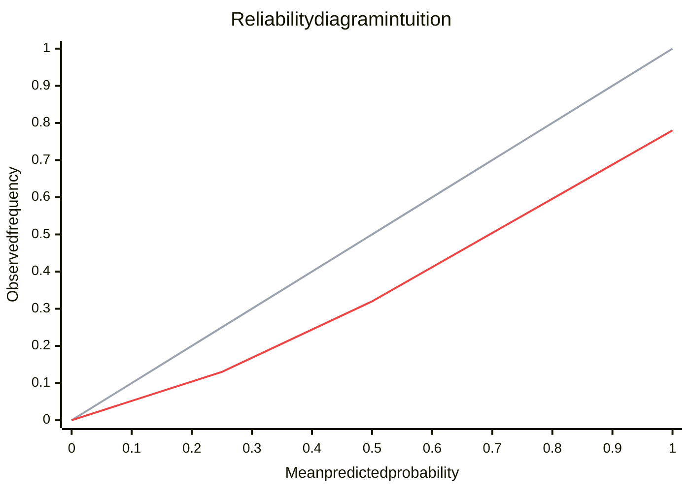

---
topic:
  - AI & ML
subtopic:
  - Machine Learning
summary: "Whether predicted probabilities match reality: 0.7 predictions should be right about 70% of the time."
level:
  - "2"
priority: Medium
status: Done
publish: true
---

Calibration measures whether a model's predicted probabilities match observed reality: among all predictions of 0.7, a calibrated model is correct about 70% of the time. This is a different property from discrimination — the ability to rank positives above negatives that [[ROC-AUC and PR-AUC|ROC-AUC]] measures. A model can rank perfectly (AUC 1.0) while being badly miscalibrated, because AUC depends only on the order of scores, not their magnitude. Conversely a model can be well-calibrated but discriminate poorly.

Calibration matters whenever downstream logic consumes the probability itself rather than just the predicted label: expected-value thresholds ("act if `p × value > cost`"), cost-sensitive decisions, abstention policies, risk scores shown to humans, and probability averaging in ensembles. Feed a miscalibrated 0.9 into an expected-value calculation and the decision is wrong even though the ranking was fine. Modern neural networks are a notorious case — they tend to be **overconfident**, reporting 0.99 on predictions that are right far less often (Guo et al., 2017).

The gray diagonal is perfect calibration — predicted probability equals observed frequency. The red curve sits below it: at a predicted 0.75 the model is actually right only ~0.55 of the time, the signature of an overconfident model. A curve above the diagonal means underconfidence.

# Reliability Diagrams

A reliability diagram (calibration curve) is the primary diagnostic. Bin predictions by their predicted probability, then for each bin plot mean predicted probability (x) against the observed positive rate (y). Perfect calibration lands every bin on the diagonal.

- **Below the diagonal** — overconfident: the model claims more certainty than the outcomes justify. Common in deep nets and boosted trees.
- **Above the diagonal** — underconfident: outcomes happen more often than the model predicts. Common in heavily regularized or bagged models.
- **S-shaped curve** — confident at the extremes, miscalibrated in the middle (or vice versa); the shape tells you which post-hoc method will fix it.

Read the diagram alongside a histogram of prediction confidence: a bin near the diagonal is meaningless if almost no predictions fall in it. Sparse bins are why single-number calibration metrics can mislead.

# Calibration Metrics

**Brier score** — the mean squared error between the predicted probability and the actual 0/1 outcome. Range 0 to 1, lower is better. It is a *proper scoring rule*: it is minimized only by reporting the true probabilities, so it cannot be gamed by hedging. The Brier score decomposes into calibration and refinement (sharpness) terms, so it rewards being both calibrated *and* decisive — a model that predicts the base rate for every input is perfectly calibrated but useless, and the Brier score penalizes it on the refinement term.

**Expected Calibration Error (ECE)** — bin predictions into M bins by confidence, take the absolute gap between accuracy and mean confidence in each bin, and average the bins weighted by their size. ECE collapses the reliability diagram into one number. Its weakness is binning sensitivity: the value shifts with the number of bins and with equal-width versus equal-frequency (adaptive) binning. **Maximum Calibration Error (MCE)** reports the single worst bin instead of the average — use it for high-stakes systems where the worst-case region matters more than the average.

**Log loss (negative log-likelihood)** — also a proper scoring rule, but it penalizes confident wrong predictions far more harshly than the Brier score (the penalty grows without bound as a confident prediction approaches certainty and is wrong). Use it when overconfident errors are especially costly. It appears in the [[ROC-AUC and PR-AUC]] tradeoff table for the same reason.

| Metric | What it captures | Watch out for |
| --- | --- | --- |
| Brier score | Calibration + sharpness in one proper score | Less interpretable than a curve; mixes two effects |
| ECE | Average calibration gap across confidence bins | Sensitive to bin count and binning scheme |
| MCE | Worst-bin calibration gap | Dominated by sparse, noisy bins |
| Log loss | Calibration with heavy penalty for confident mistakes | Explodes on a single confident wrong prediction; needs clipping |
| Reliability diagram | Where and how calibration fails | Bins with few samples look misleading |

# Post-hoc Calibration Methods

Calibration is usually fixed *after* training, by fitting a small mapping from raw model scores to calibrated probabilities on a held-out calibration set (never the training or test set).

- **Platt scaling** — fit a logistic regression on the model's scores. One or two parameters, works with little data, but assumes a sigmoid-shaped distortion. The historical default for SVM outputs; in ML.NET it is the default binary calibrator (`mlContext.BinaryClassification.Calibrators.Platt`).
- **Isotonic regression** — fit a non-parametric, monotonically increasing step function. More flexible than Platt and can correct arbitrary monotonic distortions, but needs more data and will overfit on small calibration sets. Available as `Calibrators.Isotonic` in ML.NET and `CalibratedClassifierCV(method="isotonic")` in scikit-learn.
- **Temperature scaling** — divide the logits by a single learned scalar T before the softmax. The standard fix for neural networks (Guo et al., 2017): it rescales confidence without changing the argmax, so accuracy is untouched and only one parameter is fit. It corrects global over/underconfidence but cannot fix per-region miscalibration.

For LLMs, the analogous signal is token-level [[Generation|logprobs]] used as a confidence estimate — those are also often miscalibrated, and the same diagnostics apply before trusting them as a gate.

# Pitfalls

**Trusting AUC as evidence of good probabilities.** AUC is rank-based and invariant to any monotonic transform of the scores, so it says nothing about calibration. A model with AUC 0.92 can still report 0.95 on cases that are right 60% of the time. If downstream logic uses the probability, measure calibration explicitly — AUC will not catch the problem.

**Calibrating on the test set.** Fitting Platt or isotonic parameters on the same data you report metrics on leaks information and reports optimistic calibration. Use a dedicated calibration split (or cross-validated calibration) held out from both training and final evaluation.

**Reading ECE without the histogram.** A low ECE can hide a severe miscalibration in a high-confidence bin that contains few but important predictions. Always pair ECE with the reliability diagram and the confidence histogram, and consider MCE when the worst bin is what matters.

**Assuming calibration survives distribution shift.** Calibration is a property of the model *on a distribution*. When inputs drift (see [[Data Drift]]), a previously calibrated model becomes miscalibrated even if its ranking holds. Re-check calibration on shifted data and recalibrate rather than assuming the original mapping still holds.

# Tradeoffs

| Method | Data needed | Flexibility | Effect on accuracy | Best for |
| --- | --- | --- | --- | --- |
| Platt scaling | Low | Low — assumes sigmoid distortion | Unchanged | Small calibration sets; SVM-style scores |
| Isotonic regression | High | High — any monotonic distortion | Unchanged | Larger sets where the distortion is non-sigmoid |
| Temperature scaling | Low | Low — single global scalar | Unchanged (argmax preserved) | Neural network logits; overconfidence |
| Retrain with a proper scoring loss | Full retrain | Built into training | Can change | When you control training and want calibration end-to-end |

**Decision rule**: start by measuring — plot a reliability diagram and compute Brier score and ECE on a held-out set. If the model only needs to rank (search, recommendation shortlist), calibration may not matter and ROC-AUC is enough. If a downstream decision consumes the probability, calibrate: temperature scaling for neural nets, Platt for small data, isotonic when you have enough data and the distortion is not sigmoidal. Recalibrate after any model update or detected distribution shift.

# Questions

> [!QUESTION]- Why can a model with high ROC-AUC still produce unusable probabilities?
> - ROC-AUC measures ranking — whether positives score above negatives — and is invariant to any monotonic transform of the scores
> - That invariance means the absolute probability values can be arbitrarily distorted (all squashed near 0.9, say) without changing AUC at all
> - Downstream logic that compares `p` to a threshold or computes `p × value` then makes wrong decisions despite the perfect ranking
> - The fix is to measure calibration separately (reliability diagram, Brier, ECE) and apply post-hoc calibration; AUC will never surface the problem

> [!QUESTION]- When does calibration not matter, and when is it essential?
> - It does not matter when only the ranking or the top-k is used: search results, recommendation shortlists, lead prioritization — there a strong ROC-AUC or PR-AUC is sufficient
> - It is essential when the probability feeds a decision: expected-value thresholds, cost-sensitive actions, abstention/escalation gates, risk scores shown to humans, or probability averaging across an ensemble
> - It is also essential when probabilities from different models or time periods are compared, since miscalibration makes them non-comparable
> - Rule of thumb: if a human or a formula reads the number, calibrate it; if only the order is consumed, you may not need to

> [!QUESTION]- Why is temperature scaling the default calibration method for neural networks?
> - Modern deep nets are systematically overconfident, and the miscalibration is largely a global scaling of the logits rather than a per-class distortion
> - Temperature scaling fits a single scalar T that divides the logits before softmax, which is exactly the right shape for that global overconfidence
> - Because it preserves the argmax, accuracy is unchanged — you fix probabilities without touching the model's decisions
> - It needs only a small held-out set and one parameter, so it rarely overfits; the limitation is that it cannot repair calibration that varies by region or class

# References

- [On Calibration of Modern Neural Networks (Guo et al., ICML 2017)](https://arxiv.org/abs/1706.04599) — shows modern deep nets are overconfident and introduces temperature scaling as the standard fix.
- [Predicting Good Probabilities With Supervised Learning (Niculescu-Mizil & Caruana, ICML 2005)](https://www.cs.cornell.edu/~alexn/papers/calibration.icml05.crc.rev3.pdf) — foundational comparison of Platt scaling and isotonic regression across model families.
- [Probability calibration (scikit-learn user guide)](https://scikit-learn.org/stable/modules/calibration.html) — `CalibratedClassifierCV`, `calibration_curve`, and `brier_score_loss` with worked examples.
- [Calibrators in ML.NET (Microsoft Learn)](https://learn.microsoft.com/dotnet/api/microsoft.ml.calibratorscatalog) — Platt, naive, and isotonic calibrators for .NET binary classification pipelines.
- [Verification of Forecasts Expressed in Terms of Probability (Brier, 1950)](https://journals.ametsoc.org/view/journals/mwre/78/1/1520-0493_1950_078_0001_vofeit_2_0_co_2.xml) — the original Brier score.
