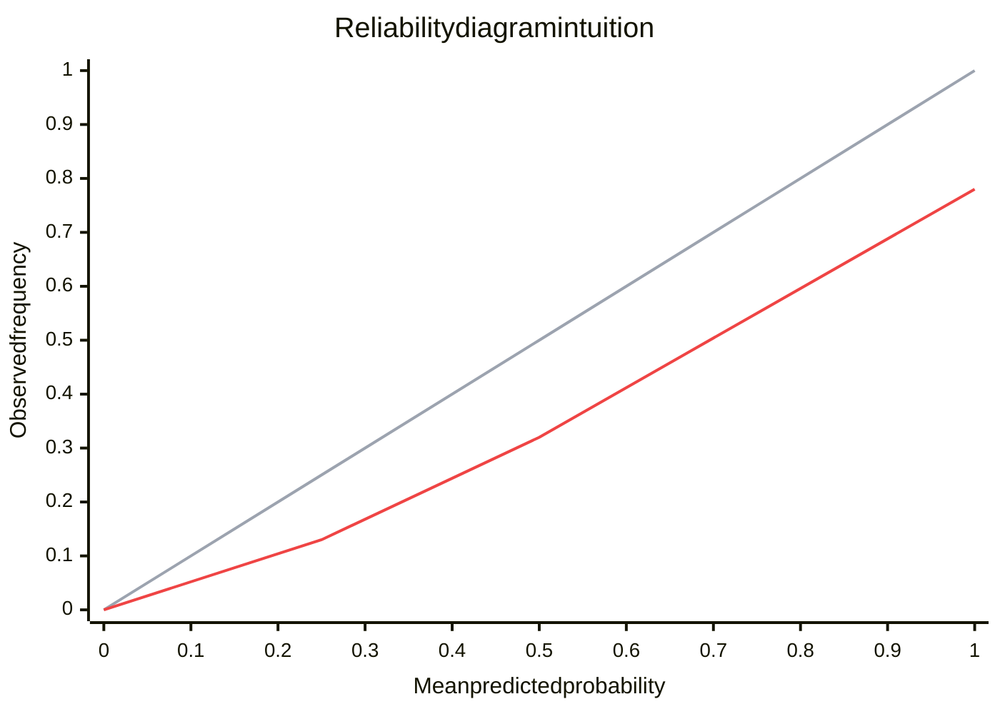

---
topic:
  - AI & ML
subtopic:
  - Machine Learning
summary: "Whether predicted probabilities match reality: 0.7 predictions should be right about 70% of the time."
level:
  - "2"
priority: Medium
status: Done
publish: true
---

Calibration asks whether predicted probabilities keep their promises. Among cases scored near 0.7, roughly 70% should be positive. This is separate from discrimination, the ranking property measured by [[ROC-AUC and PR-AUC|ROC-AUC]]. A monotonic transformation can leave AUC unchanged while turning useful probabilities into nonsense. And a model that predicts the base rate for every case can be calibrated while ranking nothing well.

The distinction becomes operational when code consumes the number. Expected-value rules such as `p × value > cost`, abstention gates, and risk scores all assume that 0.9 means something stable. A miscalibrated score breaks that arithmetic even when the ordering is good. Modern neural networks often lean overconfident, assigning probabilities near 1.0 more often than their observed accuracy supports (Guo et al., 2017).

```mermaid
---
config:
  themeVariables:
    xyChart:
      plotColorPalette: "#9CA3AF, #EF4444"
---
xychart-beta
  title Reliability diagram intuition
  x-axis Mean predicted probability 0 --> 1
  y-axis Observed frequency 0 --> 1
  line [0.0, 0.25, 0.5, 0.75, 1.0]
  line [0.0, 0.13, 0.32, 0.55, 0.78]
```

The gray diagonal marks perfect calibration. The red curve falls below it: predictions near 0.75 are positive only about 0.55 of the time. That model is overconfident. A curve above the diagonal indicates underconfidence.

# Reliability Diagrams

A reliability diagram makes the failure visible. Predictions are grouped into probability bins. Each point compares the bin's mean prediction with its observed positive rate. A calibrated bin lands on the diagonal.

- **Below the diagonal:** the model is overconfident. Observed positives are less common than predicted.
- **Above the diagonal:** the model is underconfident. Positives occur more often than predicted.
- **A bent or S-shaped curve:** the error changes across the score range, which a single global correction may not repair.

Pair the curve with a score histogram. A point near the diagonal carries little evidence when its bin contains only a handful of cases. Sparse bins can also dominate worst-bin metrics.

# Calibration Metrics

**Brier score** is mean squared error between probability and a 0/1 outcome. Lower is better. As a proper scoring rule, its expected value is minimized by reporting the true probability. Its decomposition separates reliability from resolution, which explains why a constant base-rate forecast can be calibrated yet unhelpful.

**Expected Calibration Error (ECE)** averages the absolute gap between mean confidence and observed frequency across bins, weighted by bin size. It is convenient and fragile. Change the number of bins or switch from equal-width to equal-frequency bins and the value changes. **Maximum Calibration Error (MCE)** keeps only the largest bin gap, making it sensitive to sparse bins.

**Log loss (negative log-likelihood)** is another proper scoring rule. It punishes a confident mistake much more sharply than Brier score. The loss grows without bound as the assigned probability approaches the wrong certainty. The same distinction appears in the [[ROC-AUC and PR-AUC]] comparison.

| Metric | What it captures | Watch out for |
| --- | --- | --- |
| Brier score | Calibration + sharpness in one proper score | Less interpretable than a curve. Mixes two effects |
| ECE | Average calibration gap across confidence bins | Sensitive to bin count and binning scheme |
| MCE | Worst-bin calibration gap | Dominated by sparse, noisy bins |
| Log loss | Calibration with heavy penalty for confident mistakes | Explodes on a single confident wrong prediction. Needs clipping |
| Reliability diagram | Where and how calibration fails | Bins with few samples look misleading |

# Post-hoc Calibration Methods

Post-hoc calibration fits a small mapping from model scores to probabilities. That mapping needs data held out from model fitting, while the final test set stays untouched for evaluation.

- **Platt scaling** fits a sigmoid to model scores. It uses few parameters and works with modest calibration sets, but the sigmoid shape limits what it can correct. ML.NET exposes it through `mlContext.BinaryClassification.Calibrators.Platt`.
- **Isotonic regression** learns a monotonic step function. It can follow irregular score distortions, though small calibration sets make the steps noisy and prone to overfitting. It is available as `Calibrators.Isotonic` in ML.NET and `CalibratedClassifierCV(method="isotonic")` in scikit-learn.
- **Temperature scaling** divides logits by one learned scalar before softmax. The argmax stays the same, so class predictions do not change. One scalar handles global overconfidence well, but it cannot fix errors that differ by class or region.

Token-level [[Generation|logprobs]] are sometimes treated as LLM confidence. They need the same empirical check before being used as an escalation gate. A likelihood over the next token is not automatically a calibrated probability that an answer is correct.

# Pitfalls

**Trusting AUC as evidence of good probabilities.** AUC is unchanged by strictly monotonic score transformations. A model can keep an AUC of 0.92 while cases scored at 0.95 are positive only 60% of the time. Probability-driven decisions therefore need a calibration check of their own.

**Calibrating on the test set.** Fitting the mapping on the same cases used for the reported score leaks evaluation data. Use a dedicated calibration split or cross-validated calibration, then evaluate once on a separate test set.

**Reading ECE without the histogram.** A low average can hide a bad high-confidence region with few, expensive cases. Inspect the curve and the number of samples behind each point. MCE can surface the region, though it becomes noisy when the bin is tiny.

**Assuming calibration survives distribution shift.** Calibration belongs to a model-distribution pair. After [[Data Drift]], the old mapping may fail even if ranking quality survives. Measure again on recent labeled data before reusing it.

# Tradeoffs

| Method | Data needed | Flexibility | Effect on accuracy | Best for |
| --- | --- | --- | --- | --- |
| Platt scaling | Low | Low — assumes sigmoid distortion | Ranking stays. Thresholded labels may change | Small calibration sets. SVM-style scores |
| Isotonic regression | High | High — any monotonic distortion | Does not reverse score order, but stepwise ties can change ranking metrics. Thresholded labels may change | Larger sets where the distortion is non-sigmoid |
| Temperature scaling | Low | Low — single global scalar | Unchanged (argmax preserved) | Neural network logits. Overconfidence |
| Retrain with a proper scoring loss | Full retrain | Built into training | Can change | Training is controlled and calibration belongs in the model objective |

Start with the curve and a proper scoring rule on held-out data. Ranking-only systems may not need calibrated probabilities. When a formula or person acts on the number, choose the smallest correction that matches the observed shape: temperature scaling for a global logit error, Platt for a sigmoid-shaped distortion, or isotonic with enough data for a more irregular monotonic mapping. Recheck after model or distribution changes.

# Questions

> [!QUESTION]- Why can a model with high ROC-AUC still produce unusable probabilities?
> ROC-AUC depends on score order, not score magnitude. A monotonic transform can preserve every ranking while pushing most scores toward 0.9. Any expected-value rule using those numbers then makes the wrong tradeoff. A reliability diagram and a proper scoring rule test the probability scale that AUC ignores.

> [!QUESTION]- When does calibration not matter, and when is it essential?
> Calibration can be unnecessary when only the order or top-k results are consumed. It becomes essential when a threshold, expected-value calculation, ensemble, or human decision uses the probability itself. Comparing scores across models or time periods also assumes a common probability scale.

> [!QUESTION]- Why is temperature scaling the default calibration method for neural networks?
> It fits one scalar that rescales logits and leaves the argmax unchanged. That is a cheap, low-variance correction for global overconfidence, which Guo et al. found common in modern neural networks. The limitation follows from the same simplicity: one temperature cannot repair class-specific or region-specific errors.

# References

- [On Calibration of Modern Neural Networks (Guo et al., ICML 2017)](https://arxiv.org/abs/1706.04599) — measures neural-network miscalibration and evaluates temperature scaling as a one-parameter correction.
- [Predicting Good Probabilities With Supervised Learning (Niculescu-Mizil & Caruana, ICML 2005)](https://www.cs.cornell.edu/~alexn/papers/calibration.icml05.crc.rev3.pdf) — compares Platt scaling and isotonic regression across several classifier families.
- [Probability calibration (scikit-learn user guide)](https://scikit-learn.org/stable/modules/calibration.html) — `CalibratedClassifierCV`, `calibration_curve`, and `brier_score_loss` with worked examples.
- [Calibrators in ML.NET (Microsoft Learn)](https://learn.microsoft.com/dotnet/api/microsoft.ml.calibratorscatalog) — Platt, naive, and isotonic calibrators for .NET binary classification pipelines.
- [Verification of Forecasts Expressed in Terms of Probability (Brier, 1950)](https://journals.ametsoc.org/view/journals/mwre/78/1/1520-0493_1950_078_0001_vofeit_2_0_co_2.xml) — the original Brier score.
