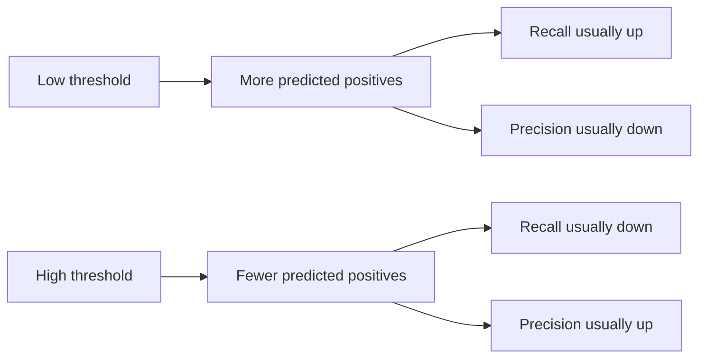

---
topic:
  - AI & ML
subtopic:
  - Machine Learning
summary: "Measuring whether a model assigns the right label: false alarms versus misses at a chosen threshold."
level:
  - "3"
priority: Medium
status: Done
publish: true
---

Classification evaluation turns model errors into operating costs. The confusion matrix shows which mistakes occur. The threshold decides how many of each kind the system accepts. A release decision then compares models at the same constraint, such as maximizing precision while keeping recall above 0.95.

# Binary Classification

## Start with the Confusion Matrix

A binary classifier produces four counts at a chosen threshold:

| | Actual positive | Actual negative |
|---|---:|---:|
| Predicted positive | TP | FP |
| Predicted negative | FN | TN |

- `TP`: predicted positive, actually positive.
- `FP`: predicted positive, actually negative. A false alarm.
- `FN`: predicted negative, actually positive. A miss.
- `TN`: predicted negative, actually negative.

## Precision, Recall, and F1

```text
precision = TP / (TP + FP)
recall    = TP / (TP + FN)
F1        = 2 * (precision * recall) / (precision + recall)
```

- **Precision** answers how many predicted positives were correct. False positives pull it down.
- **Recall** answers how many real positives were found. False negatives pull it down.
- **F1** is their harmonic mean. It is useful as a compact comparison only when false alarms and misses deserve similar weight.

## The Threshold Moves the Cost



Lowering the threshold usually finds more positives and creates more false alarms. Raising it does the reverse. The exact movement depends on the score distribution. The diagram describes the usual direction, not a guarantee for every finite sample.

## Content Moderation and Fraud Detection

In content moderation, a lower threshold catches more unsafe posts but blocks more safe ones. Fraud detection has the same mechanics with different costs: recall protects against missed fraud, while precision keeps legitimate customers out of the review queue.

## Worked Example

For 100 cases, suppose the threshold produces:

```text
TP = 32
FP = 8
TN = 50
FN = 10
```

```text
precision = 32 / (32 + 8)  = 0.80
recall    = 32 / (32 + 10) = 0.76
F1        = 2 * (0.80 * 0.76) / (0.80 + 0.76) = 0.78
```

The same scoring model can report very different metrics at two thresholds:

| Threshold | TP | FP | FN | Precision | Recall |
|---|---:|---:|---:|---:|---:|
| 0.30 | 90 | 60 | 10 | 0.60 | 0.90 |
| 0.80 | 55 | 10 | 45 | 0.85 | 0.55 |

# Multi-class Averaging

Multi-class metrics require a choice about whose errors count most:

| Method | Formula | When to Use |
| --- | --- | --- |
| **Macro** | Average the per-class metric equally | Minority classes must count as much as common classes |
| **Micro** | Aggregate TP/FP/FN globally, then compute | Overall instance-level performance matters. Frequent classes may dominate |
| **Weighted** | Average per-class metrics by support | A per-class view is wanted, but class frequency should determine influence |

Macro averaging exposes weak minority-class performance. Micro averaging emphasizes total decisions and, for single-label multi-class classification, micro precision and recall equal accuracy. Weighted averaging can still hide a bad rare class because support controls its influence. Report the per-class values whenever one class carries disproportionate risk.

# Pitfalls

**F1 hides asymmetric failures.** An F1 near 0.78 can come from high precision with weak recall or the reverse. Those systems have different queues and losses. Keep precision and recall beside F1, and use an explicit cost constraint when one error matters more.

**Comparing arbitrary thresholds.** Precision at 0.3 for one model and at 0.7 for another says little. Compare both under the same policy, for example precision at recall ≥ 0.95. PR-AUC or ROC-AUC can compare ranking across thresholds, but neither chooses the production operating point.

**Optimizing one metric without a constraint.** A spam filter can raise precision by flagging only obvious cases, leaving most spam untouched. Pushing recall alone blocks legitimate mail. The deployable objective includes both the benefit and the limit, such as maximizing recall while keeping the false-positive rate below 1%.

**Class imbalance distorts accuracy.** Always predicting "not fraud" yields 99.9% accuracy when fraud prevalence is 0.1%, with zero useful detections. Precision, recall, PR-AUC, balanced accuracy, and per-class results reveal different parts of that failure.

# References

- [Scikit-learn: Classification metrics](https://scikit-learn.org/stable/modules/model_evaluation.html#classification-metrics)
- [Google ML Crash Course: Accuracy, precision, recall](https://developers.google.com/machine-learning/crash-course/classification/accuracy-precision-recall)
- [Beyond Accuracy: Behavioral Testing of NLP Models (Ribeiro et al., ACL 2020)](https://aclanthology.org/2020.acl-main.442/)
