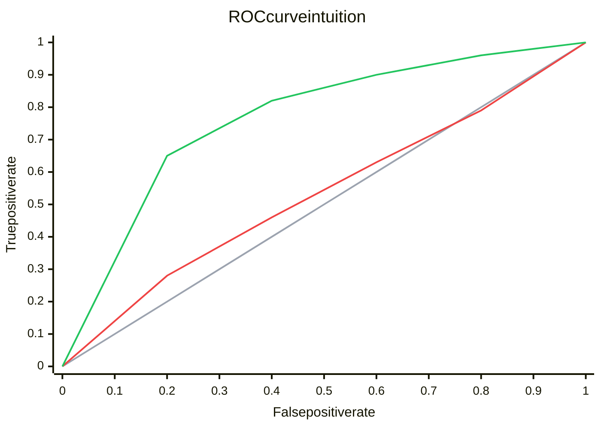
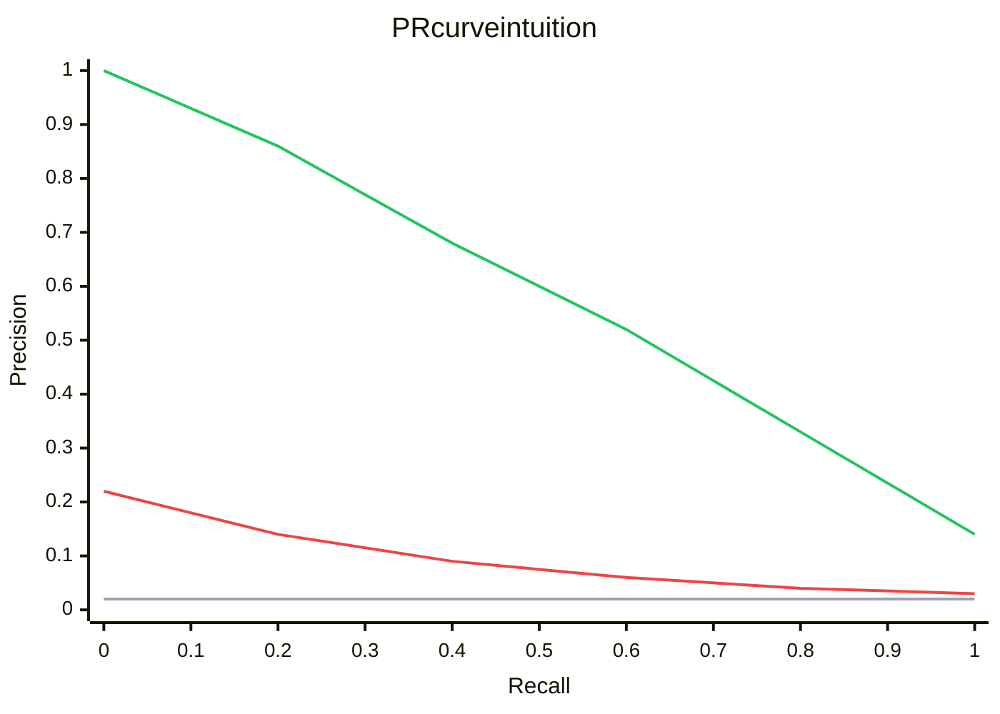

---
topic:
  - AI & ML
subtopic:
  - Machine Learning
summary: "Threshold-free ranking views: ROC-AUC for pairwise class ranking, PR-AUC for positive-alert quality when positives are rare."
level:
  - "2"
priority: Medium
status: Done
publish: true
---

ROC-AUC and PR-AUC summarize how a binary classifier ranks cases while its score threshold sweeps from strict to permissive. ROC plots true-positive rate against false-positive rate. PR plots precision against recall.

ROC-AUC answers a broad ranking question and has a fixed random baseline of 0.5. PR-AUC puts the positive class in the foreground, making false positives visible when positives are rare. Its baseline moves with prevalence, so a PR-AUC value has little meaning without the positive rate.

Both belong in the evaluation stage of [[Home/AI & ML/Machine Learning/Machine Learning|Machine Learning]], especially for binary [[Home/AI & ML/Machine Learning/Types/Types|learning types]] and rare-event detection. Neither picks a production threshold.

# How the Curves Are Built

At each threshold, the confusion matrix changes. Those counts produce one point on each curve.



The gray ROC line is random ranking. The red model gains some true positives as false positives increase. The green model keeps a higher true-positive rate at the same false-positive rate. Curves near the top-left corner rank more useful cases early.



The gray PR line sits at the positive-class prevalence. The red model loses precision quickly as recall rises, so its alert queue fills with false positives. The green model keeps more correct alerts while recovering a larger share of positives.

Area compresses each curve into one number. `ROC AUC` has a useful probabilistic interpretation: it is the chance that a randomly chosen positive receives a higher score than a randomly chosen negative, with a tie counted as half. PR-AUC has no equally simple ranking interpretation, and library implementations may use different interpolation rules.

ML.NET exposes `AreaUnderRocCurve` and `AreaUnderPrecisionRecallCurve` on `BinaryClassificationMetrics` after `mlContext.BinaryClassification.Evaluate`.

## Choosing the Metric

Use `ROC AUC` when the goal is pairwise ranking over both classes and the false-positive rate is meaningful at the expected prevalence. Prefer `PR AUC` when the positive class is rare and the system cares about the quality of positive alerts. For either metric, inspect the part of the curve near the actual capacity or cost constraint. A global area can reward regions that production will never use.

## Example

This ML.NET example prints both areas from the same predictions:

```csharp
using Microsoft.ML;
using Microsoft.ML.Data;

var mlContext = new MLContext(seed: 42);

var data = mlContext.Data.LoadFromTextFile<ModelInput>(
    "transactions.csv", hasHeader: true, separatorChar: ',');

var split = mlContext.Data.TrainTestSplit(data, testFraction: 0.3);

var pipeline = mlContext.Transforms
    .NormalizeMinMax("Features")
    .Append(mlContext.BinaryClassification.Trainers
        .SdcaLogisticRegression(labelColumnName: "Label", featureColumnName: "Features"));

var model = pipeline.Fit(split.TrainSet);
var predictions = model.Transform(split.TestSet);

var metrics = mlContext.BinaryClassification.Evaluate(predictions, labelColumnName: "Label");

Console.WriteLine($"ROC-AUC:  {metrics.AreaUnderRocCurve:F3}");
Console.WriteLine($"PR-AUC:   {metrics.AreaUnderPrecisionRecallCurve:F3}");
Console.WriteLine($"F1:       {metrics.F1Score:F3}");
Console.WriteLine($"Accuracy: {metrics.Accuracy:F3}");

// Input schema
public class ModelInput
{
    [LoadColumn(0)]
    public bool Label { get; set; }

    [LoadColumn(1, 20), VectorType(20)]
    public float[] Features { get; set; } = default!;
}
```

High ROC-AUC with weak PR-AUC can mean the broad ranking is good while the positive queue remains noisy. Accuracy adds little when negatives dominate.

## Baselines and Operating Points

A random ranker has ROC-AUC 0.5. Its expected precision is the prevalence `P / (P + N)`, so the PR baseline changes when the dataset does. A perfect ranker reaches 1.0 on both areas.

Threshold selection needs a constraint rather than a visually appealing knee. A review team may require precision ≥ 0.8 because false alarms consume capacity. A screening system may require recall ≥ 0.9. Sweep thresholds on validation data, choose a point that satisfies the constraint, and evaluate the frozen point on separate test data.

# Pitfalls

- **A strong global area can hide a weak operating region.** Check precision, recall, and queue volume near the threshold that production can afford.
- **PR-AUC changes with prevalence.** Comparing it across datasets with different positive rates mixes model quality with dataset composition.
- **AUC does not choose a threshold.** The operating point still comes from costs, capacity, or a safety constraint.
- **Ranking is not [[Calibration]].** High AUC does not make a score of 0.8 mean an 80% event probability.
- **Leakage raises every offline curve.** Use features available at inference time and a split that matches deployment.

# Tradeoffs

| Metric | Measures | Fits when | Misleads when |
|---|---|---|---|
| ROC-AUC | Pairwise ranking of positives above negatives | General ranker comparison. Both classes matter | Rare positives and the positive queue is the real concern |
| PR-AUC | Precision-recall behavior for the positive class | Rare-event alerts and review queues | Prevalence differs across evaluation sets |
| F1 | Precision-recall balance at one threshold | A threshold is fixed and both errors have similar importance | Costs are asymmetric or the threshold may change |
| Log loss | Probability quality, with a sharp penalty for confident errors | Downstream logic consumes calibrated probabilities | Only ranking matters or labels are very noisy |

# Questions

> [!QUESTION]- What does ROC-AUC measure?
> It measures pairwise ranking quality. ROC-AUC is the probability that a random positive receives a higher score than a random negative, with half credit for a tie. It does not say which threshold to deploy or whether the score is calibrated.

> [!QUESTION]- When is PR-AUC more useful than ROC-AUC?
> PR-AUC is more revealing when positives are rare and the quality of positive predictions drives cost, as in fraud alerts or anomaly review. False positives directly reduce precision. The score must be interpreted against the dataset's prevalence.

# References

- [ML.NET evaluate binary classification model](https://learn.microsoft.com/dotnet/machine-learning/resources/metrics#evaluation-metrics-for-binary-classification)
- [The Relationship Between Precision Recall and ROC Curves](https://dl.acm.org/doi/10.1145/1143844.1143874)
- [Precision Recall Plot is More Informative than the ROC Plot when Evaluating Binary Classifiers on Imbalanced Datasets](https://www.ncbi.nlm.nih.gov/pmc/articles/PMC4349800/)
