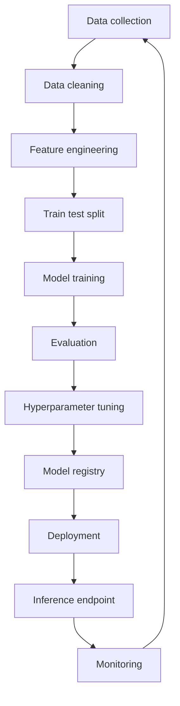

---
topic:
  - AI & ML
subtopic:
  - Machine Learning
summary: "Training models to learn input-output mappings from data; the real work is the pipeline."
tags:
  - FolderNote
publish: true
status: Done
priority: Medium
level:
  - "3"
---

Machine learning is the practice of training models to map inputs to outputs from data rather than encoding the behavior as explicit rules. It matters for a senior engineer because most of the real work is not the algorithm, it is building a reliable pipeline that is testable, deployable, and monitorable. Reach for ML when the decision boundary is fuzzy, the signal is distributed across many weak features, or the rules would be brittle and expensive to maintain. Prefer rules or heuristics when requirements are stable, the logic is auditable, and the error cost is asymmetric and must be tightly controlled; see also [[Spectrum Of Automations]].

```datacorejsx
const { FolderStructureMap } = await dc.require("Assets/components/devbook-folder-map.jsx");
return FolderStructureMap;
```

# Training

## Generic pipeline



## Pipeline Stages

### Data Collection and Labeling
Define the prediction target first, then collect inputs that are available at inference time and representative of production traffic. Labeling is usually the bottleneck: decide who labels, what counts as ground truth, and how you measure label quality and consistency. Common tools include SQL, Spark, event logs, data warehouses, plus labeling tooling like Label Studio or in product human review queues.

### Data Cleaning and Preprocessing
Make the raw data usable: handle missing values, outliers, duplicates, schema drift, and text normalization, while keeping transformations deterministic. Key decisions are what to impute, what to drop, and how to encode time and joins without leaking future information. Typical tooling is pandas, PySpark, Great Expectations, and feature preprocessing via scikit learn transformers.

### Feature Engineering and Selection
Turn raw columns into signals the model can learn, such as aggregates, time windows, text features, or embeddings, depending on the problem type ([[Home/AI & ML/Machine Learning/Types/Types|Types]], [[Natural Language Processing]]). Decide between simple, stable features and complex features that improve accuracy but increase operational risk. For selection, use domain constraints first, then model based importance and ablation tests; consider a feature store if many teams share features.

### Train Test Validation Split
Split data to simulate the future: random splits work for IID data, but time based or group based splits are safer for temporal, user, or session correlated data. Keep a true holdout test set you do not touch until the end to estimate generalization. Tools include scikit learn splitters, plus custom splits for time series and leakage resistant grouping.

### Model Selection and Training
Start with a strong baseline that is easy to debug, then scale up complexity only if it buys material business value. Pick algorithms that match constraints: linear and tree models for tabular data, gradient boosting for strong tabular baselines, deep learning for unstructured signals. Tooling spans scikit learn, XGBoost, LightGBM, PyTorch, TensorFlow, plus distributed training when data or models grow.

### Evaluation Metrics
Choose metrics that match the decision and the cost of mistakes. Accuracy works when classes are balanced and errors are symmetric; precision and recall matter when false positives and false negatives have different costs; F1 is a single number when you need a balance. AUC ROC is useful for ranking quality across thresholds, but can look good even when the operating point is poor; for regression, RMSE penalizes large errors and is appropriate when big misses are costly and errors are roughly Gaussian.

### Hyperparameter Tuning
Treat tuning as budgeted search: define the search space, metric, and stopping rules, and keep the test set untouched. Grid search is simple but expensive, random search is often a better first pass, and Bayesian optimization helps when evaluations are costly and the space is continuous. Common tooling: scikit learn search CV, Optuna, Ray Tune, and Weights and Biases sweeps.

### Model Registry and Versioning
Store models as artifacts with immutable versions, and log the full lineage: code, data snapshot identifiers, features, hyperparameters, and metrics. This is what makes rollbacks, audits, and reproducibility possible. Typical tools are MLflow Model Registry and Weights and Biases artifacts, backed by object storage.

### Deployment
Decide serving mode based on product needs: batch for offline scoring, real time for user facing decisions, and streaming for event driven scoring. Containerize the runtime to make it consistent, and release with canary or A B tests to control risk and measure uplift. Common stacks include Docker, Kubernetes, serverless jobs, and CI CD orchestration for model promotion.

### Inference Endpoint
An endpoint is a production service with an SLO: define a latency budget, throughput target, and availability goals, then size compute and caching accordingly. Keep preprocessing consistent with training by packaging it with the model and versioning the schema. Serving frameworks include FastAPI, BentoML, KServe, Seldon, TorchServe, and TensorFlow Serving.

### Monitoring and Retraining
Monitor both system health and model health: latency, error rate, and saturation, plus data quality, drift, and performance over time. Plan for feedback loops and delayed labels, and set retraining triggers that are measurable and cost aware; see [[Data Drift]] for drift concepts. A good pipeline makes retraining boring: automated, repeatable, and gated by evaluation.


# Questions

> [!QUESTION]- How should an ML pipeline be designed to ship weekly batch churn scoring now while preserving a path to real-time scoring later?
> - Start with batch to ship value, but define a stable feature contract and a single preprocessing implementation shared by batch and online
> - Store features and predictions with versioned schema so you can backtest and replay later
> - Use a model registry with stage promotion and rollback, and keep training code runnable in CI
> - Plan the online boundary now: which features are available at request time and which require async enrichment
> - Add monitoring from day one so you have drift and label delay visibility before moving to real time

> [!QUESTION]- What should be checked first when a binary classifier shows 98 percent accuracy but support tickets rise, and which metric should be optimized next?
> - Check class balance and the confusion matrix; high accuracy can hide poor recall on the minority class
> - Inspect label quality and leakage sources, especially time based joins and post event signals
> - Pick metrics based on cost: optimize precision if false positives are expensive, recall if misses are expensive, or use PR AUC for heavy imbalance
> - Tune the decision threshold using a cost curve or expected value, not the default 0.5
> - Run slice based evaluation to find the segments where the model fails and decide whether to collect more data or add features

> [!QUESTION]- What tradeoffs and rollout plan are appropriate when the best model exceeds a strict API latency budget?
> - Measure end to end latency budget including preprocessing, network, and tail latencies, then decide if you can meet SLO with scaling or caching
> - Consider a smaller model, distillation, quantization, or a two stage setup where a cheap model gates the expensive one
> - Use canary or A B rollout with guardrails on latency and key business metrics, plus automated rollback
> - Keep a safe fallback decision path, such as a baseline model or rules, for overload and error conditions
> - Align evaluation with production: test on representative traffic and monitor training serving skew after launch

# References

- [Machine Learning Crash Course (Google for Developers)](https://developers.google.com/machine-learning/crash-course)
- [Machine Learning for Beginners (Microsoft)](https://microsoft.github.io/ML-For-Beginners/#/)
- [Rules of Machine Learning (Google for Developers)](https://developers.google.com/machine-learning/guides/rules-of-ml)
- [scikit-learn user guide](https://scikit-learn.org/stable/user_guide.html)
- [Hidden Technical Debt in Machine Learning Systems (NeurIPS 2015)](https://papers.nips.cc/paper_files/paper/2015/hash/86df7dcfd896fcaf2674f757a2463eba-Abstract.html)
