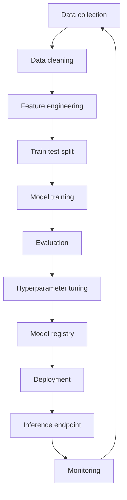

---
topic:
  - AI & ML
subtopic:
  - Machine Learning
summary: "Training models to learn input-output mappings from data. The real work is the pipeline."
tags: [FolderNote]
publish: true
status: Done
priority: Medium
level:
  - "3"
---

Machine learning fits problems where useful behavior can be learned from examples more cheaply than it can be expressed as rules. The model is only one part of the system. Data collection, evaluation, serving, and monitoring usually carry more operational risk than the training algorithm itself.

ML earns its cost when the decision boundary is hard to write down or the signal is spread across many weak features. Rules remain the better tool when the logic is stable, must be audited exactly, or needs predictable behavior around expensive errors. [[Spectrum Of Automations]] places those choices on the same continuum.

```datacorejsx
const { FolderStructureMap } = await dc.require("Assets/components/devbook-folder-map.jsx");
return FolderStructureMap;
```

# Training

## Generic Pipeline


```mermaid
flowchart TD
  A[Data collection] --> B[Data cleaning]
  B --> C[Feature engineering]
  C --> D[Train test split]
  D --> E[Model training]
  E --> F[Evaluation]
  F --> G[Hyperparameter tuning]
  G --> H[Model registry]
  H --> I[Deployment]
  I --> J[Inference endpoint]
  J --> K[Monitoring]
  K --> A
```

## Pipeline Stages

### Data Collection and Labeling
Define the prediction target before collecting features. Every input must be available at inference time and should resemble production traffic. Labeling often becomes the bottleneck because ground truth needs an owner, a written definition, and a way to measure disagreement. Collection may start with SQL or event logs and grow into distributed processing only when the volume requires it.

### Data Cleaning and Preprocessing
Preprocessing turns raw records into deterministic model inputs. Missing values, duplicates, outliers, and schema changes need explicit handling. Time and join logic deserve extra scrutiny: a feature built with future information can make every offline result look convincing while guaranteeing a production failure. The same transformations must run during training and inference.

### Feature Engineering and Selection
Feature engineering turns raw columns into signals the model can use: aggregates, time windows, text representations, or embeddings, depending on the problem described in [[Home/AI & ML/Machine Learning/Types/Types|Types]] and [[Natural Language Processing]]. Simple features are easier to reproduce and diagnose. A more expensive feature needs enough measurable gain to pay for its serving and maintenance cost. Domain constraints and ablation tests are stronger evidence than feature importance alone.

### Train Test Validation Split
The split should simulate the model's next real prediction. Random splits work for independent, identically distributed records. Time-based or group-based splits are safer when rows share a user, session, or time window. Keep one holdout set outside model and threshold tuning. Repeated inspection quietly turns a test set into another validation set.

### Model Selection and Training
Start with a baseline that is easy to explain and reproduce. Linear models and trees cover many tabular problems. Gradient boosting is often the next serious baseline. Deep learning is justified by unstructured inputs or a measured advantage large enough to cover its extra cost. Distributed training solves a scale problem, not a modeling problem.

### Evaluation Metrics
Metrics must match the decision and the cost of a mistake. Accuracy is useful only when class balance and error costs make it meaningful. Precision and recall expose different failure modes. A ranking metric can compare models before an operating threshold is fixed. For regression, RMSE makes large misses dominate the score. No metric repairs a test set that does not represent production.

### Hyperparameter Tuning
Treat tuning as a budgeted experiment. Fix the search space, target metric, and stopping rule before running it. Random search is a sensible first pass because only a few parameters usually matter. Bayesian optimization becomes useful when each training run is expensive. The holdout set stays untouched throughout.

### Model Registry and Versioning
Store each model as an immutable artifact with enough lineage to rebuild it: code revision, data snapshot, feature definition, parameters, and evaluation results. Promotion changes the stage of an existing version rather than overwriting the artifact. That makes rollback and audit work mechanical instead of forensic.

### Deployment
Serving mode follows the product's time budget. Batch scoring covers decisions that can wait. Request-time inference pays for low latency. Streaming reacts as events arrive. Release the model behind a canary or controlled experiment, with a fallback for overload and model errors. Packaging must keep the runtime and preprocessing consistent with training.

### Inference Endpoint
An inference endpoint is a production service with an SLO. Its latency budget includes feature lookup and preprocessing, not just the model call. Capacity planning should use tail latency and expected concurrency. Version the request schema and model together so an otherwise valid deployment cannot receive inputs shaped for another version.

### Monitoring and Retraining
Monitoring has two clocks. Service health appears immediately through latency, errors, and saturation. Model quality may arrive days later when labels become available. Track input quality and [[Data Drift]] while waiting, but do not confuse drift with proof that predictions became worse. Retraining should follow a measurable trigger and pass the same evaluation gate as the original model.

# References

- [Machine Learning Crash Course (Google for Developers)](https://developers.google.com/machine-learning/crash-course)
- [Machine Learning for Beginners (Microsoft)](https://microsoft.github.io/ML-For-Beginners/#/)
- [Rules of Machine Learning (Google for Developers)](https://developers.google.com/machine-learning/guides/rules-of-ml)
- [scikit-learn user guide](https://scikit-learn.org/stable/user_guide.html)
- [Hidden Technical Debt in Machine Learning Systems (NeurIPS 2015)](https://papers.nips.cc/paper_files/paper/2015/hash/86df7dcfd896fcaf2674f757a2463eba-Abstract.html)
