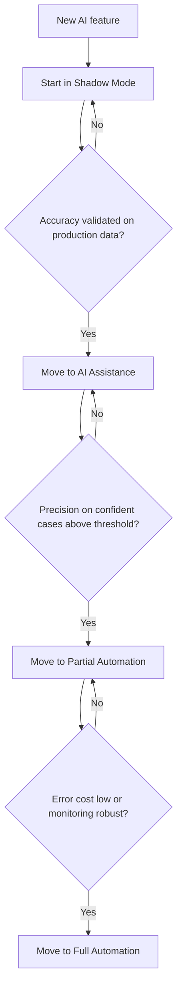

---
topic:
  - AI & ML
subtopic:
  - Machine Learning
summary: "Five levels of AI involvement, from fully human-driven to fully autonomous."
level:
  - "1"
priority: Low
status: Done
publish: true
---

The automation spectrum is a deployment model for deciding how much authority an AI system receives. It runs from human-only work through observation and assistance to autonomous action. Each step changes the blast radius of a bad prediction.

It is not a maturity ladder that every feature must climb. One workflow may automate low-value routing while requiring approval for refunds, account locks, or legal decisions. The level belongs to an action and its risk, not to the model as a whole.

# The Five Levels

## 1. Human Only

The task runs without model output. This is the baseline for effort, quality, and handling time.

**Example:** a support agent reads and answers every ticket.

## 2. Shadow Mode

The model sees production-shaped inputs and records what it would have done. Its output does not change the customer-facing decision.

Shadow mode tests the full data and inference path while preserving the current decision path. It can reveal production skew, latency, and missing fields. It still carries compute, privacy, and operational risk, so "no automated action" does not mean "no risk."

**Example:** a fraud model scores transactions in parallel with the existing process. Once outcomes arrive, its scores are compared with those outcomes and with the current policy.

## 3. AI Assistance

The model proposes a result, and a person approves or changes it before any action. The interface must make rejection easy. A nominal approval step becomes automation bias when reviewers simply accept the default.

**Example:** suspicious transactions enter an analyst queue with the model score and relevant evidence. The analyst decides whether to block them.

## 4. Partial Automation

The system acts automatically inside a defined policy and routes the rest to people. Confidence alone is not enough. The policy also needs action-specific costs, calibrated scores, and explicit exclusions for cases the model has not earned authority over.

**Example:** high-confidence low-value refunds are approved automatically, while large amounts and unfamiliar account patterns always go to review.

## 5. Full Automation

The system acts across its whole declared scope without per-case approval. Humans own monitoring, incident response, and policy changes. A deterministic fallback or kill switch is still part of the design.

**Example:** a low-stakes document router assigns every incoming file automatically, while the team monitors corrections and queue backlogs.

# Decision Framework

| Level | When to use | Risk |
|---|---|---|
| Shadow Mode | New behavior needs production evidence | No decision impact. Compute and data-handling risk remain |
| AI Assistance | Errors need case-by-case human judgment | Reviewers can miss or rubber-stamp bad suggestions |
| Partial Automation | A bounded slice has measured, recoverable errors | Automated mistakes occur inside that slice |
| Full Automation | The declared scope is low risk or tightly controlled | Mistakes can propagate across the whole scope |



The diagram shows a conservative path for consequential features or cases where production distribution is uncertain. It is not a required sequence for every feature. A reversible, low-risk action can begin with a bounded canary. "Accuracy" is also shorthand. The release gate should use the metric tied to the action's cost, such as precision at a required recall, and check it across the cohorts included in the automated scope.

# Implementation Shape

The authority boundary should be visible in code and configuration. These examples show the two points where systems often start.

**Shadow mode:** run the model, record the result, and leave the current decision path untouched.

```python
def process_transaction_shadow(tx: Transaction) -> None:
    prediction = fraud_model.predict(tx)  # model runs
    logger.info("shadow_prediction", tx_id=tx.id, score=prediction.score,
                predicted_fraud=prediction.is_fraud)  # logged only
    # No action taken — human team reviews logs to measure accuracy
```

**Partial automation:** apply a reviewed policy to one score range and escalate the rest.

```python
def process_transaction_partial(tx: Transaction) -> Action:
    prediction = fraud_model.predict(tx)
    fraud_probability = prediction.fraud_probability
    if fraud_probability >= 0.95:         # high risk: block
        return Action.BLOCK
    if fraud_probability <= 0.05:         # low risk: allow
        return Action.ALLOW
    return Action.QUEUE_FOR_REVIEW         # uncertain: human review
```

The two-sided risk bands distinguish a confident negative from an uncertain prediction. Their values are illustrative: production thresholds come from calibrated probabilities and the relative costs of false blocks and missed fraud. The policy also checks whether the action is reversible, whether the case matches validated cohorts, and whether an explicit exclusion requires review.

# What Goes Wrong When Automation Advances Too Fast

## Skipping Production-Shaped Observation

Offline evaluation can miss schema differences, delayed labels, and cohorts absent from the test set. Going straight to automated action makes those mismatches customer-visible.

Shadow mode is one way to gather production evidence, but it is not always required. A reversible, low-volume canary may be cheaper for a low-risk feature. The evidence window should cover the important traffic cycles and enough labeled outcomes, not an arbitrary number of weeks.

## Moving to Full Automation Too Early

Automation without a baseline can fail quietly. If label quality arrives late and no proxy or correction signal is tracked, errors accumulate until a person notices the downstream damage.

The release gate needs measurable quality by important cohort, an owner for alerts, and a tested rollback or fallback. System health belongs beside model metrics because a good prediction delivered too late is still a failed action.

# Tradeoffs

| Approach | Human effort | Error risk | When to use |
|---|---|---|---|
| Human Only | High | Existing human-process risk | Baseline or judgment-heavy work |
| Shadow Mode | High | No model-driven decisions | Measuring production behavior |
| AI Assistance | Medium | Human review plus automation bias | High-cost decisions that need case review |
| Partial Automation | Lower | Bounded automated blast radius | Recoverable cases with proven policy constraints |
| Full Automation | Monitoring and incident response | Broadest blast radius | Narrow, well-controlled, low-cost actions |

More authority can reduce queue work while increasing how far one bad policy or drift event spreads. Error cost, reversibility, production evidence, and operational ownership decide the level. Team confidence is not evidence.

# Questions

> [!QUESTION]- When is Shadow Mode the right starting point?
> Shadow mode can test production inputs and the inference path without changing decisions. It is especially useful when offline data may not represent live traffic. It is not mandatory for every low-risk feature, and it still needs privacy and capacity controls. The real requirement is production-shaped evidence before authority expands.

> [!QUESTION]- What signals indicate it is safe to move from Partial to Full Automation?
> The automated slice must meet its error-cost constraint across important cohorts and traffic cycles. Cases outside the training distribution need an explicit policy. Monitoring, ownership, and a tested rollback must already work. Full automation is justified only when the remaining mistakes are recoverable across the entire declared scope.

# References

- [ML deployment strategies (Chip Huyen, Designing Machine Learning Systems)](https://www.oreilly.com/library/view/designing-machine-learning/9781098107956/) — Chapter 9 compares shadow, canary, and experiment-based model deployment patterns.
- [Human-in-the-loop ML (Hugging Face)](https://huggingface.co/blog/human-in-the-loop) — practical discussion of when and how to keep humans in the loop for AI-assisted workflows.
- [Shadow mode deployment (Martin Fowler)](https://martinfowler.com/bliki/ShadowDeployment.html) — defines shadow deployment as processing production traffic without letting the new path affect the response.
