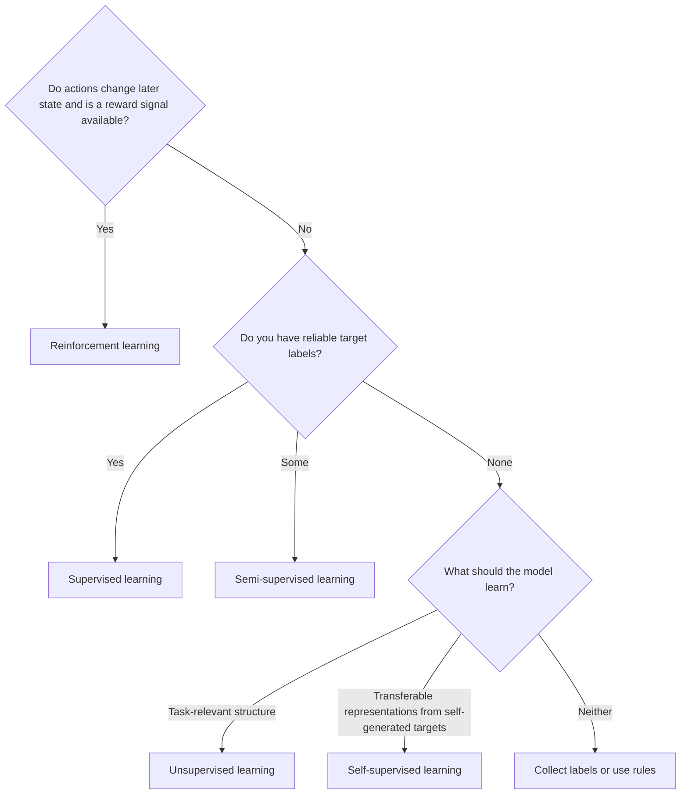

---
topic:
  - AI & ML
subtopic:
  - Machine Learning
summary: "How a model learns from data and feedback. The choice drives data, training, and evaluation."
tags: [FolderNote]
publish: true
status: Done
priority: Low
level:
  - "1"
---

The useful way to classify machine learning is by its learning signal. Labels, proxy targets, rewards, or the absence of a target determine what the training loop can optimize and how its result can be evaluated. Model architecture comes later.

That boundary matters. A classifier trained from labeled tickets and an agent learning from delayed rewards may use similar neural-network components, but they solve different problems and fail in different ways.

```datacorejsx
const { FolderStructureMap } = await dc.require("Assets/components/devbook-folder-map.jsx");
return FolderStructureMap;
```

# Supervised learning

Supervised learning fits a function from inputs to known targets. A training example might pair a support ticket with its owning team, an image with a class, or a house with its sale price. The learning algorithm reduces error on those pairs. Backpropagation is one way to do that for differentiable models, while trees use different fitting procedures.

The held-out set must represent the production decisions that matter. Overall accuracy can look healthy while recall for a rare fraud class collapses. Labels can also encode old policy or annotation mistakes, and distribution shift makes yesterday's validation score a poor description of today's traffic.

This is usually the first choice for classification, regression, or ranking when the target is explicit and trustworthy. It has the cleanest evaluation story because predictions can be compared with answers the model did not see during training.

# Unsupervised learning

Unsupervised learning has inputs but no target variable. Its objective imposes a notion of structure: k-means minimizes distance to cluster centers, PCA preserves directions of high variance, and an isolation forest treats easily isolated observations as unusual.

The objective is only a proxy for usefulness. Two merchant clusters can be mathematically well separated and still mean nothing to a risk policy. Results therefore need an external check, such as whether the segments explain different behavior or improve a downstream decision. Random initialization, scaling, and feature choice can change the grouping substantially.

It fits exploratory analysis, representation reduction, and anomaly detection when labeled outcomes do not exist. But a cluster ID is not a discovered truth. It is the output of a chosen objective and feature space.

# Self-supervised learning

Self-supervised learning derives targets from the data itself. A language model predicts hidden or subsequent tokens. A vision model may learn that two transformed views came from the same image. No human annotator supplies those targets.

The usual payoff is a representation that can support several downstream tasks. It may be fine-tuned with labels, used to create embeddings, or prompted directly. Transfer is strongest when the pretraining data and proxy task expose the distinctions needed later. Lower pretraining loss alone does not prove that retrieval, classification, or generation improved.

Pretraining can consume far more data and compute than a task-specific supervised model. It earns that cost when reusable representations or scarce labels matter, especially for language and vision.

# Semi-supervised learning

Semi-supervised learning uses labeled and unlabeled examples for the same target task. A common loop trains a supervised baseline, assigns pseudo-labels to confident unlabeled examples, and retrains with the enlarged set. Consistency regularization takes another route by penalizing predictions that change under harmless input transformations.

The unlabeled pool helps only when it resembles the production distribution and the starting model is good enough to supply useful signal. Otherwise pseudo-labeling feeds early mistakes back into training. Majority classes tend to receive more confident pseudo-labels, so per-class validation and calibration matter more than the headline metric.

This approach is worth considering when labels are expensive, unlabeled data is plentiful, and a supervised baseline already establishes what success means.

# Reinforcement learning

Reinforcement learning learns a policy for choosing actions in an environment. The environment returns observations and rewards, possibly long after the action that caused them. Training seeks a policy with high expected cumulative reward rather than the best isolated prediction.

Sequential interaction and credit assignment justify RL. A routing policy, for example, may trade an immediate handling cost against the later chance of resolution. Delayed reward makes credit assignment harder, but reward can also arrive immediately. The same machinery is needless for a one-step ticket classifier with known labels.

Reward design sets the real objective. An incomplete proxy invites specification gaming, while exploration can be unsafe or expensive on a live system. Offline simulation helps, but the simulator can teach behavior that exploits its own blind spots. Production use needs stronger guardrails and evaluation than a conventional prediction service.

# How the Learning Signals Differ

| Type | Learning signal | Evaluation question | Common failure |
|---|---|---|---|
| Supervised | Human- or system-provided target | Does it predict held-out targets on important slices? | Label errors or production drift |
| Unsupervised | Structure imposed by an objective | Does the discovered structure help a real decision? | Mathematically tidy but useless groups |
| Self-supervised | Targets derived from raw data | Does the representation transfer to the downstream task? | Proxy loss improves without useful transfer |
| Semi-supervised | A few labels plus unlabeled examples | Does unlabeled data beat the supervised baseline safely? | Confirmation bias from wrong pseudo-labels |
| Reinforcement | Reward from interaction | Does the policy improve long-term return under constraints? | Reward gaming or unsafe exploration |

# Choosing the Learning Signal



Reliable labels and a clear target point to supervised learning. With no labels, the choice depends on the desired output: unsupervised methods look for task-relevant structure, while self-supervised methods learn reusable representations from proxy targets. A small labeled set can anchor a semi-supervised approach.

Reinforcement learning is the narrow branch. It needs an environment or simulator, actions that change later state, and a reward signal for their consequences; per-example target labels are not its defining input. If the problem can be reduced to independent labeled examples, a supervised formulation is easier to test and operate.

# Questions

> [!QUESTION]- What learning signal distinguishes supervised, self-supervised, and reinforcement learning even when all three use a neural network?
> Supervised learning receives an external target for each example. Self-supervised learning derives a proxy target from the input itself, such as a hidden or next token. Reinforcement learning receives rewards from actions in an environment and optimizes return across a trajectory. The architecture does not determine which learning problem is being solved.

> [!QUESTION]- A clustering run produces stable, well-separated groups. What evidence is still needed before those groups should affect a business rule?
> The groups need an external validation tied to the decision: different outcomes, costs, or responses to an intervention on held-out data. Stability only shows that the algorithm repeatedly finds the same geometry. It does not show that the geometry represents a useful business distinction.

> [!QUESTION]- When can pseudo-labeling make a semi-supervised model worse than its supervised baseline, and which validation slices would reveal the damage?
> A weak or miscalibrated baseline can assign confident wrong labels, then reinforce them during retraining. Majority classes usually contribute more pseudo-labels, so overall accuracy may rise while minority recall falls. Compare the semi-supervised model with the supervised baseline by class, confidence band, cohort, and source of labeled versus pseudo-labeled data.

> [!QUESTION]- A team proposes reinforcement learning for a one-step routing decision with historical outcome labels. Which property of the problem should decide whether RL is justified?
> RL is justified only when actions change later state and the objective depends on consequences across several steps. If each routing decision has an independent historical target, supervised learning provides a simpler and more directly testable formulation.

> [!QUESTION]- Why can a falling self-supervised pretraining loss fail to improve the downstream task?
> The proxy objective may reward distinctions that the downstream task does not use. More next-token accuracy, for example, does not guarantee a better fraud or retrieval representation. Transfer must be measured on the downstream task with held-out data. Pretraining loss is evidence only about the proxy objective.

# References

- [Google ML Intro — What is ML?](https://developers.google.com/machine-learning/intro-to-ml/what-is-ml) — Defines supervised, unsupervised, and reinforcement learning through the data and feedback each one receives.
- [scikit-learn — Supervised learning](https://scikit-learn.org/stable/supervised_learning.html) — Documents the estimators and fitting assumptions behind practical supervised learning.
- [Hugging Face — Self-supervised learning](https://huggingface.co/blog/self-supervised-learning) — Explains how proxy targets create training signal from unlabeled language or image data.
- [OpenAI Spinning Up in Deep RL](https://spinningup.openai.com/en/latest/spinningup/rl_intro.html) — Introduces policies, trajectories, return, and the delayed-reward formulation used in reinforcement learning.
- [Rules of ML](https://developers.google.com/machine-learning/guides/rules-of-ml) — Grounds model choice in measurable product objectives, data pipelines, and simple baselines.
