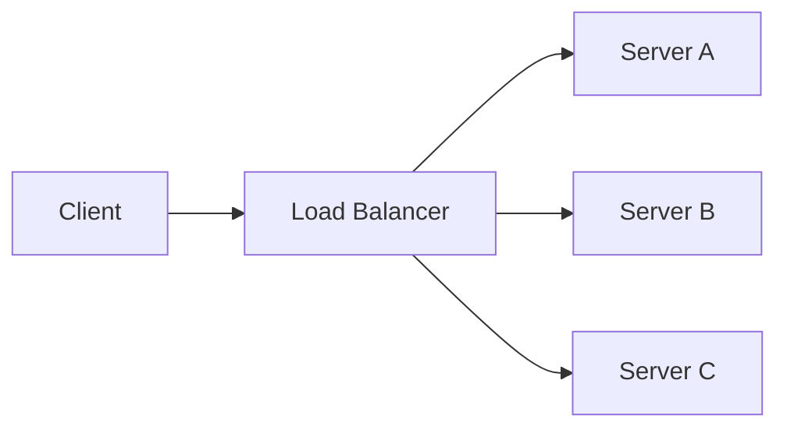

---
topic:
  - Architecture
subtopic:
  - Distributed Systems
summary: "Distributing incoming traffic across multiple service instances so no single instance becomes a bottleneck or point of failure."
level:
  - "2"
priority: High
status: Ready to Repeat
publish: true
---

# Intro

Load balancing distributes incoming traffic across multiple service instances so one instance does not become a bottleneck or a single point of failure. In system design interviews, this is usually the first infrastructure building block because it enables [[Home/Architecture/Distributed Systems/Scalability Patterns/Horizontal Scaling|horizontal scale]] without changing client behavior. It matters for availability, failure isolation, and predictable latency under burst traffic. Reach for it as soon as a service runs on more than one instance, especially for AI APIs where request cost varies by prompt size and model path.

## Mechanism

Load balancers can operate at different layers, and that layer choice drives what routing decisions are possible.

- **L4 transport layer**
  - Routes using connection metadata such as source and destination IP, port, and protocol.
  - Works for TCP and UDP.
  - Fast and lightweight because it does not parse application payloads.
  - Cannot route by HTTP path, header, host, or cookie.
- **L7 application layer**
  - Understands HTTP and can route by host, path, method, header, or cookie.
  - Supports advanced traffic policies such as canary, A/B, and auth edge checks.
  - Adds processing overhead versus L4.



Practical interview rule: pick L4 for high-throughput generic transport routing, pick L7 when business routing logic depends on request content.

## Algorithms

No single algorithm is best; choose based on workload shape and fairness goals.

Algorithm | How it routes | Prefer when | Main risk
--- | --- | --- | ---
Round robin | Cycles requests evenly across instances. | Backend instances are similar and request cost is roughly uniform. | Slow instances still get equal share and can queue up.
Weighted round robin | Round robin with per-instance weight multipliers. | Instance sizes differ, such as mixed VM sizes or mixed CPU generations. | Static weights drift from real capacity after noisy-neighbor effects or throttling.
Least connections | Picks the instance with the fewest active connections. | Connection duration varies, such as streaming or long-running AI completions. | Connection count may not reflect CPU or memory cost for short but expensive requests.
IP hash | Deterministically maps client IP to backend. | You need simple affinity without external session storage. | NAT gateways can collapse many users to one IP and create hotspots.
Consistent hashing | Maps keys to a hash ring with minimal remapping when nodes change. | Cache locality, shard affinity, and gradual scale changes matter. | Too few virtual nodes or poor weights can skew ring ownership, and hot keys can still create hotspots even with a balanced ring.

For AI inference endpoints, request duration and compute cost vary heavily, so pick the algorithm by measuring p95 and p99 latency, error rate, and backend saturation under representative load instead of assuming one default winner.

## Health Checks

Health checks decide whether an instance should stay in the active pool.

- **Active health checks**
  - The load balancer probes endpoints such as `/health/live` and `/health/ready` on a fixed interval.
  - It uses threshold logic, for example three consecutive failures means out of rotation.
  - It can use timeout budgets to detect hung instances.
- **Passive health checks**
  - The load balancer watches real request failures like timeouts and TCP resets, and L7 proxies or gateways can also track elevated HTTP 5xx rates when configured.
  - Useful when synthetic probes pass but real traffic fails.

Typical state transition:

1. Instance fails probes or exceeds passive error thresholds.
2. LB marks it unhealthy and removes it from new request routing.
3. Existing requests are drained, failed, or retried according to policy.
4. Instance must pass recovery criteria before re-entry.

![[Load Balancing Health Checks.excalidraw]]

Important implementation point: a readiness endpoint must verify critical dependencies, not just return process-alive.

## .NET Context

ASP.NET Core services with Kestrel are commonly deployed behind a reverse proxy or managed load balancer.

- **Kestrel behind reverse proxy**
  - Common options are NGINX, YARP, ingress controllers, or cloud-managed LBs.
  - Proxy handles ingress concerns such as TLS termination, route matching, and header forwarding.
- **Azure service choices**
  - **Azure Load Balancer** is L4 and optimized for high-performance TCP or UDP distribution.
  - **Azure Application Gateway** is L7 and supports HTTP routing, TLS policy controls, and WAF features.

Minimal readiness and liveness setup in ASP.NET Core.
The `AddSqlServer` and `AddRedis` probes below come from the community Xabaril health checks packages (`AspNetCore.HealthChecks.SqlServer` and `AspNetCore.HealthChecks.Redis`).
If your team prefers only Microsoft-maintained dependencies, use custom `AddCheck` implementations for dependency readiness.

```bash
dotnet add package AspNetCore.HealthChecks.SqlServer
dotnet add package AspNetCore.HealthChecks.Redis
```

```csharp
using Microsoft.AspNetCore.Diagnostics.HealthChecks;

var builder = WebApplication.CreateBuilder(args);

builder.Services
    .AddHealthChecks()
    .AddSqlServer(builder.Configuration.GetConnectionString("MainDb")!)
    .AddRedis(builder.Configuration.GetConnectionString("Redis")!);

var app = builder.Build();

app.MapHealthChecks("/health/live", new HealthCheckOptions
{
    Predicate = _ => false
});

app.MapHealthChecks("/health/ready", new HealthCheckOptions
{
    Predicate = _ => true
});

app.MapGet("/", () => Results.Ok("service-ready"));

app.Run();
```

Session affinity in .NET systems:

- It helps as a short-term bridge when legacy in-memory session state exists.
- It hurts elasticity and failure recovery because clients are pinned to specific instances.
- Preferred senior design is stateless APIs plus shared state in Redis or another durable store.

## Pitfalls

### Sticky sessions can defeat balancing goals

- **What goes wrong**: load concentrates on a subset of instances while others stay underused.
- **Why**: affinity preserves client-to-instance mapping even as traffic patterns change.
- **Mitigation**: externalize session state, shorten affinity TTL, and apply affinity only when strictly required.

### Health endpoint does not validate dependencies

- **What goes wrong**: failing instances remain in rotation because `/health` always returns 200.
- **Why**: liveness is implemented, readiness is not.
- **Mitigation**: split liveness and readiness, include DB cache queue checks in readiness, and alert on dependency failure rates.

### Thundering herd when recovering instances

- **What goes wrong**: a recovered instance receives too much traffic too quickly and fails again.
- **Why**: immediate full reintroduction with cold caches and cold code paths.
- **Mitigation**: use slow-start ramp-up, pre-warm caches and model clients, and cap concurrent requests during warmup.

### TLS termination in the wrong place

- **What goes wrong**: security boundaries become unclear or latency increases unexpectedly.
- **Why**: inconsistent decisions between edge termination, re-encryption, and passthrough.
- **Mitigation**: define trust boundaries early, document where certificates live, and use mTLS internally when compliance requires it.

## Tradeoffs

Decision | Option A | Option B | How to choose
--- | --- | --- | ---
Layer | L4 | L7 | Need content-aware routing and edge features versus lower overhead data-plane routing
Session model | Sticky sessions | Stateless with shared store | Migration speed versus long-term resilience and autoscaling quality
TLS strategy | Terminate at LB | End-to-end encryption to service | Operational simplicity versus stricter east-west security requirements
Health model | Active only | Active plus passive | Simplicity versus better detection of real user-facing failures

## Questions

> [!QUESTION]- How do you pick a load-balancing algorithm for requests with highly variable duration, like AI inference?
> Round robin is the right default when instances are similar and requests cost about the same, but it falls apart when duration varies — exactly the inference case, where one long completion ties up an instance while round robin keeps handing it new work. Least-connections handles that better by routing to the instance with the fewest in-flight requests, which tracks real load when durations are uneven. The catch is that connection count doesn't capture per-request CPU cost, so a few short-but-expensive prompts can still skew it. For inference you validate the choice by measuring p95/p99 latency and backend saturation under representative load rather than trusting any default.

> [!QUESTION]- When do you choose an L4 load balancer over L7?
> L4 balances on connection metadata — IP, port, protocol — without reading the payload, so it's fast and works for any TCP/UDP traffic, but it can't decide based on HTTP path, host, or headers. L7 parses HTTP, so it can route by path or header and do canary, A/B, and edge auth, at the cost of more processing per request. Choose L4 when you need raw throughput and generic transport routing; choose L7 the moment routing depends on request content. Plenty of systems use both — L4 at the edge for raw distribution, L7 deeper for content-aware routing.

> [!QUESTION]- Why must readiness checks differ from liveness checks behind a load balancer?
> They answer different questions, and conflating them keeps broken instances in rotation. Liveness is "is the process alive" — if it fails, the orchestrator restarts the pod. Readiness is "can this instance serve traffic right now," so it must actually probe critical dependencies (database, cache, downstream) and let the balancer pull a started-but-not-ready instance out of rotation without restarting it. The classic bug is a `/health` that always returns 200: the process is up, its database is unreachable, and the balancer keeps routing real traffic into failures. Keep liveness cheap and dependency-free; put the dependency checks in readiness.

## References

- [Azure Load Balancer overview](https://learn.microsoft.com/azure/load-balancer/load-balancer-overview) — official docs covering L4 vs L7 load balancing, health probes, and SKU differences in Azure.
- [ASP.NET Core health checks](https://learn.microsoft.com/aspnet/core/host-and-deploy/health-checks) — how to implement health check endpoints that load balancers and orchestrators use for routing decisions.
- [NGINX HTTP load balancing guide](https://docs.nginx.com/nginx/admin-guide/load-balancer/http-load-balancer/) — practical configuration guide for round-robin, least-connections, and IP-hash algorithms in NGINX.
- [Xabaril ASP.NET Core Diagnostics Health Checks](https://github.com/Xabaril/AspNetCore.Diagnostics.HealthChecks) — community library providing health check integrations for databases, message queues, and external services.
- [Google SRE book chapter on handling overload](https://sre.google/sre-book/handling-overload/) — production-grade strategies for load shedding, client-side throttling, and graceful degradation under overload.
