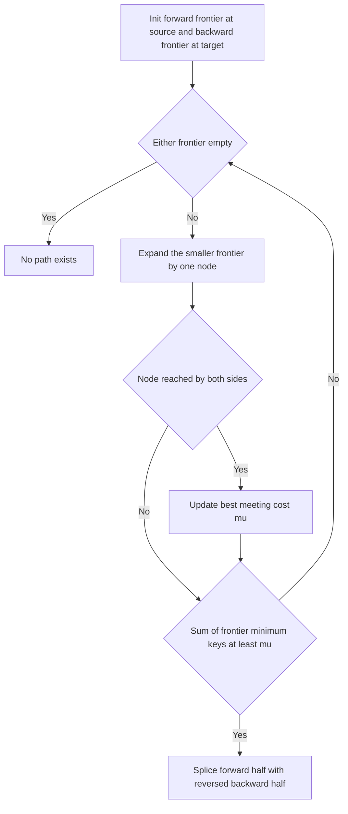

---
topic:
  - Computer Science
subtopic:
  - Algorithms
level:
  - "4"
priority: Medium
status: Creation
publish: true
---

# Intro

Bidirectional search runs two searches at once — a forward search from the source and a backward search from the target — and stops when their frontiers meet in the middle. The payoff is exponential: an unidirectional [[DFS BFS|BFS]] that reaches depth `d` expands `O(b^d)` nodes (branching factor `b`), but two searches that each go only halfway expand `O(b^(d/2))` each, and `2·b^(d/2)` is vastly smaller than `b^d`. For `b = 10, d = 6` that is roughly `2,000` nodes instead of `1,000,000`. The intuition: two small circles growing toward each other sweep far less area than one large circle covering the same distance.

Reach for bidirectional search on point-to-point queries in large graphs where the goal is known in advance and the branching factor is high — routing meshes, puzzle state spaces (Rubik's cube, sliding puzzles), and word-ladder problems. It needs a graph you can traverse *backward* from the target (predecessors must be enumerable), so it fits explicit or reversible graphs but not searches where the goal is defined only by a test. It composes with weighting: a bidirectional [[Dijkstra]] or bidirectional [[A-Start Search|A* Search]] applies the same halving to cost-based search, and modern road routers (contraction hierarchies) are built on it. When you don't know the target node concretely, or the graph can't be reversed, fall back to unidirectional [[A-Start Search|A* Search]] or [[Dijkstra]].

## How It Works

1. Maintain two frontiers: `F` grown from `source` (following edges forward) and `B` grown from `target` (following edges backward). Keep a visited set with recorded distances for each side.
2. Alternate expansion — typically expand whichever frontier is currently smaller, to keep the two balanced and minimize total work.
3. When a node `x` is reached by *both* sides, record a candidate meeting: the path cost is `dist_F[x] + dist_B[x]`. Keep the best (`μ`) candidate seen so far, but **do not stop yet**.
4. Terminate only when the search can no longer improve `μ`: once the sum of the two frontiers' minimum keys (`top_F + top_B` for uniform BFS, or the min `f` on each side for cost-based variants) is `≥ μ`, no unexpanded path can beat the best meeting, so `μ` is optimal.
5. Reconstruct the path by splicing the forward half (`source → x`) with the reversed backward half (`x → target`).

The termination condition is the whole game. The first time the two frontiers *touch* gives you *a* path, but not necessarily the shortest one — a cheaper meeting can still be found at a *different* node that neither side has fully expanded. Stopping at first contact is the classic bidirectional-search bug. You must keep expanding until the cheapest still-possible completion (`top_F + top_B`) provably cannot undercut the best meeting cost `μ`.

Two designs exist for bidirectional **heuristic** search:

- **Front-to-back**: each side's heuristic estimates distance to the *static* origin of the opposite search (the forward side estimates distance to `target`, the backward side to `source`). Cheap to compute but the two heuristics can be inconsistent with each other, complicating optimality.
- **Front-to-front**: each side estimates distance to the *current frontier* of the opposite search. More accurate and better-focused, but far more expensive because the heuristic target keeps moving, requiring many pairwise estimates per expansion.

Complexity: time and space both drop to `O(b^(d/2))` from `O(b^d)` for uniform-cost search — a genuine exponential improvement in the depth of the solution. The space saving is often the bigger practical win, since both frontiers still have to be held in memory but are individually far smaller.

## Example

```text
Unweighted graph, find shortest path from S to T with BFS from both ends.

  S - a - b - c - T
       \        /
        d ---- e

Forward frontier from S:      Backward frontier from T:
  depth 0: {S}                  depth 0: {T}
  depth 1: {a}                  depth 1: {c, e}
  depth 2: {b, d}               depth 2: {b, d}   (b via c, d via e)

At depth 2 both sides reach b AND d simultaneously.
  Meeting at b: dist_F[b]=2 + dist_B[b]=2 = 4  -> S-a-b-c-T
  Meeting at d: dist_F[d]=2 + dist_B[d]=2 = 4  -> S-a-d-e-T
Both are length 4; μ = 4.

Why not stop at the FIRST touch? Suppose the forward side had reached b at
depth 2 while the backward side reached b at depth 3 (a longer back-half).
First contact would report cost 5, but continuing one more layer could reveal
the depth-2/depth-2 meeting at d with cost 4. The rule top_F + top_B >= μ is
what guards against committing to that premature, worse meeting.
```

## Diagram



## Pitfalls

### Stopping at the first frontier collision

- **What goes wrong**: the code returns as soon as a node appears in both visited sets, reporting a path that can be longer than the true shortest one.
- **Why it happens**: the first meeting is only the first *discovered* connection, not the cheapest. A shorter path can pass through a different node whose two halves haven't both been expanded yet.
- **How to avoid it**: track the best meeting cost `μ` and keep expanding until `top_F + top_B ≥ μ` (frontier minimums can no longer improve the meeting). Only then is `μ` provably optimal.

### The graph can't be searched backward

- **What goes wrong**: the backward search has nothing to expand because predecessors of a node aren't available — common when edges are generated on the fly or the goal is defined only by a predicate.
- **Why it happens**: bidirectional search assumes you can enumerate *incoming* edges (or that the graph is undirected). Directed graphs need a reverse adjacency list; implicit state spaces need an invertible move function.
- **How to avoid it**: build a reverse adjacency list up front for directed graphs, or confirm every move operator is invertible. If the target is only a goal-test with no concrete node, bidirectional search doesn't apply — use unidirectional [[A-Start Search|A* Search]].

### Unbalanced frontiers erase the speedup

- **What goes wrong**: if one side is always expanded, or the two sides have very different branching factors, one frontier balloons to near `O(b^d)` and the `O(b^(d/2))` benefit evaporates.
- **Why it happens**: the halving argument assumes both searches advance to roughly `d/2`. Expanding a single side, or a side with a much higher branching factor, breaks that symmetry.
- **How to avoid it**: always expand the frontier with fewer nodes (or lower total estimated cost) next, keeping the two searches balanced by size rather than by depth.

## Tradeoffs

| Choice | Bidirectional | Unidirectional | Decision criteria |
| --- | --- | --- | --- |
| vs [[DFS BFS\|BFS]] | `O(b^(d/2))` time and space | `O(b^d)` | Use bidirectional for point-to-point queries with a known target and high branching; plain BFS when the graph is small or the target isn't a concrete node. |
| vs [[A-Start Search\|A* Search]] | Bidirectional A* roughly square-roots the explored region | A* with a good heuristic | Bidirectional wins on large graphs with reversible edges; a single strong heuristic and forward-only A* is simpler when the graph can't be reversed or the heuristic already prunes hard. |
| Heuristic design | Front-to-front: accurate, expensive | Front-to-back: cheap, weaker | Front-to-back is the default; front-to-front only pays off when its sharper focus outweighs the many extra pairwise heuristic evaluations. |
| Cost model | Bidirectional [[Dijkstra]] for weighted graphs | Bidirectional BFS for unweighted | Use the weighted variant when edge costs differ; the termination test generalizes from frontier depth to frontier minimum `f`. |

Consistent with the [[A-Start Search|A* Search]] and [[Greedy Best-First Search]] tables: bidirectional search is an orthogonal *optimization* of an existing search (BFS, Dijkstra, or A*), not a different point on the greedy–Dijkstra spectrum. Layer it on when the query is point-to-point and the graph is reversible; it does not replace a good heuristic, it multiplies its effect.

## Questions

> [!QUESTION]- Why does bidirectional search reduce complexity from `O(b^d)` to `O(b^(d/2))`?
> - A single search reaching depth `d` expands `O(b^d)` nodes because the frontier grows exponentially with depth.
> - Two searches meeting in the middle each reach only depth `d/2`, expanding `O(b^(d/2))` nodes apiece.
> - Since `2·b^(d/2)` is exponentially smaller than `b^d`, total work collapses — for `b=10, d=6` that's roughly `2,000` nodes versus `1,000,000`.
> - The insight is geometric: two small search "spheres" growing toward each other sweep far less volume than one large sphere of the same reach — which is why it's a go-to optimization for high-branching point-to-point queries, and why the win is often in memory as much as time.

> [!QUESTION]- Why is it wrong to stop bidirectional search the moment the two frontiers meet?
> - The first node found in both visited sets gives *a* connecting path, but not necessarily the shortest one.
> - A cheaper path can pass through a different node whose forward and backward halves haven't both been expanded yet, so first contact can over-report the cost.
> - The correct rule tracks the best meeting cost `μ` and keeps expanding until the sum of the two frontiers' minimum keys (`top_F + top_B`) is at least `μ`, proving no unexpanded path can do better.
> - This is the single subtlest part of the algorithm: a naive implementation that returns on first collision is a common, silent correctness bug — the termination condition, not the meeting, is what makes the answer optimal.

> [!QUESTION]- What must a graph support for bidirectional search to be usable, and what is front-to-front vs front-to-back?
> - The graph must be searchable *backward* from the target: predecessors must be enumerable (a reverse adjacency list for directed graphs, or an invertible move function for implicit state spaces).
> - The target must be a concrete node, not merely a goal-test, since the backward search needs a starting point.
> - For bidirectional heuristic search, front-to-back estimates distance to the opposite search's fixed origin (cheap, weaker), while front-to-front estimates distance to the opposite search's current frontier (accurate, expensive).
> - These requirements decide applicability: on a reversible, point-to-point routing graph bidirectional A* is a big win, but on a forward-only implicit search defined by a goal predicate it simply doesn't apply — pick unidirectional [[A-Start Search|A* Search]] there.

## References

- [Bidirectional search (Wikipedia)](https://en.wikipedia.org/wiki/Bidirectional_search) — the `O(b^(d/2))` argument, termination conditions, and heuristic variants.
- [Bidirectional Search That Is Guaranteed to Meet in the Middle (Holte et al., AAAI 2016)](https://ojs.aaai.org/index.php/AAAI/article/view/10346) — the MM algorithm and a rigorous treatment of the optimal termination condition.
- [Contraction Hierarchies (Wikipedia)](https://en.wikipedia.org/wiki/Contraction_hierarchies) — how production road routers combine bidirectional Dijkstra with preprocessing for millisecond continental queries.
