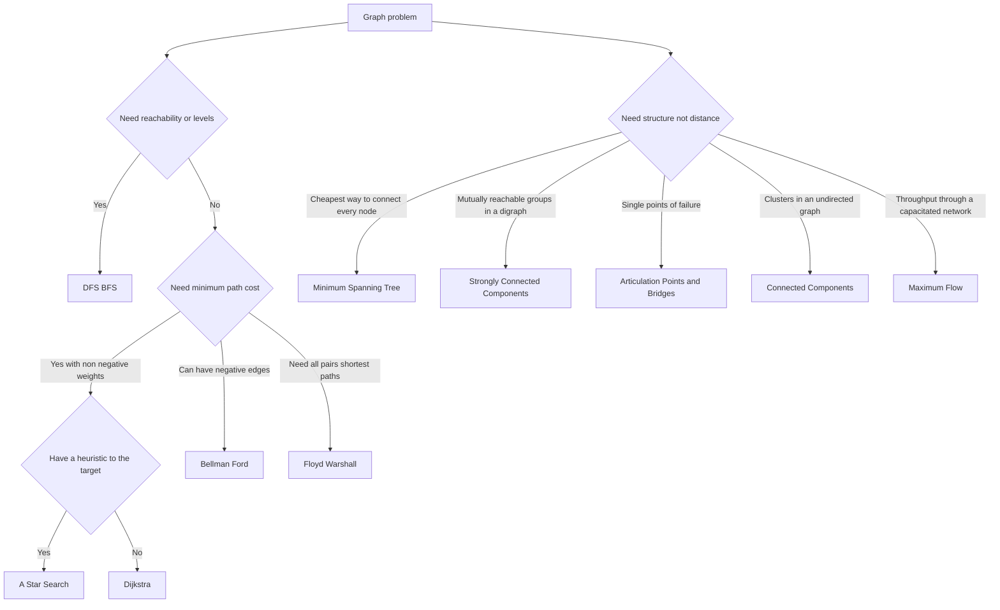

---
topic:
  - Computer Science
subtopic:
  - Algorithms
summary: "Algorithms to traverse, rank, and optimize graph relationships: reachability, shortest paths, connectivity, and flow."
tags: [FolderNote]
publish: true
level:
  - "4"
status: Creation
priority: High
---

Graph algorithms turn edges into answers about reachability, dependency order, path cost, connectivity, or capacity. The required output comes first. Direction, weight semantics, and input density then narrow the valid choices. Breadth-first search finds a minimum-hop route, while Dijkstra minimizes total weight and becomes invalid as soon as an edge can be negative.

```datacorejsx
const { FolderStructureMap } = await dc.require("Assets/components/devbook-folder-map.jsx");
return FolderStructureMap;
```

# Diagram



# Algorithm Selection

## Shortest Path

| Algorithm | Solves | Time | Constraint |
| --- | --- | --- | --- |
| [[Home/Computer Science/Algorithms/Graph Algorithms/DFS BFS\|BFS]] | Reachability, shortest path by edge count | O(V + E) | Unweighted graphs |
| [[Home/Computer Science/Algorithms/Graph Algorithms/DFS BFS\|DFS]] | Traversal, cycle detection, finish-order primitives | O(V + E) | General graphs. Topological order still requires a DAG |
| [[Home/Computer Science/Algorithms/Graph Algorithms/Dijkstra\|Dijkstra]] | Single-source shortest path | O((V + E) log V) | Non-negative weights |
| [[Home/Computer Science/Algorithms/Graph Algorithms/A-Star Search\|A* Search]] | Point-to-point shortest path | O((V + E) log E) with a consistent heuristic and lazy heap. Reopenings make runtime re-expansion-dependent | Non-negative weights. Consistency permits close-once optimality, while an admissible but inconsistent heuristic requires reopenings |
| [[Home/Computer Science/Algorithms/Graph Algorithms/Greedy Best-First Search\|Greedy Best-First Search]] | Fast point-to-point path, not necessarily optimal | O((V + E) log E) with a lazy heap | Heuristic only. Sacrifices optimality for speed |
| [[Home/Computer Science/Algorithms/Graph Algorithms/Bidirectional Search\|Bidirectional Search]] | Point-to-point shortest path | About O(b^(d/2)) rather than O(b^d) in the ideal state-space model | Target known. Backward search must be available |
| [[Home/Computer Science/Algorithms/Graph Algorithms/Bellman-Ford\|Bellman-Ford]] | Single-source shortest path | O(V·E) | Handles negative edges. Detects reachable negative cycles |
| [[Home/Computer Science/Algorithms/Graph Algorithms/Floyd-Warshall\|Floyd-Warshall]] | All-pairs shortest path | Θ(V³) time, Θ(V²) space | Small or dense graphs. Detects negative cycles |

## Structure and Connectivity

| Algorithm | Solves | Time | Constraint |
| --- | --- | --- | --- |
| [[Home/Computer Science/Algorithms/Graph Algorithms/Minimum Spanning Tree\|Minimum Spanning Tree]] | Cheapest edge set connecting all vertices | O(E log V) | Connected, undirected, weighted |
| [[Home/Computer Science/Algorithms/Graph Algorithms/Topological Sort\|Topological Sort]] | Linear order respecting dependencies | O(V + E) | Directed acyclic graph |
| [[Home/Computer Science/Algorithms/Graph Algorithms/Strongly Connected Components\|Strongly Connected Components]] | Maximal mutually-reachable vertex sets | O(V + E) | Directed graphs |
| [[Home/Computer Science/Algorithms/Graph Algorithms/Connected Components\|Connected Components]] | Maximal connected vertex sets | O(V + E) | Undirected graphs |
| [[Home/Computer Science/Algorithms/Graph Algorithms/Articulation Points and Bridges\|Articulation Points and Bridges]] | Cut vertices and cut edges | O(V + E) | Undirected graphs |
| [[Home/Computer Science/Algorithms/Graph Algorithms/Maximum Flow\|Maximum Flow]] | Max s–t throughput. Min cut | O(V·E²) (Edmonds–Karp) | Capacitated network |

> [!NOTE]
> Not every graph problem admits a polynomial-time algorithm. [[Home/Computer Science/Algorithms/Graph Algorithms/Hamiltonian Cycle|Hamiltonian Cycle]] asks for a cycle that visits every vertex exactly once and is **NP-complete**. No polynomial-time algorithm is known. Exact methods take exponential time in the worst case.

# References

- [Graph algorithms](https://algs4.cs.princeton.edu/40graphs/)
