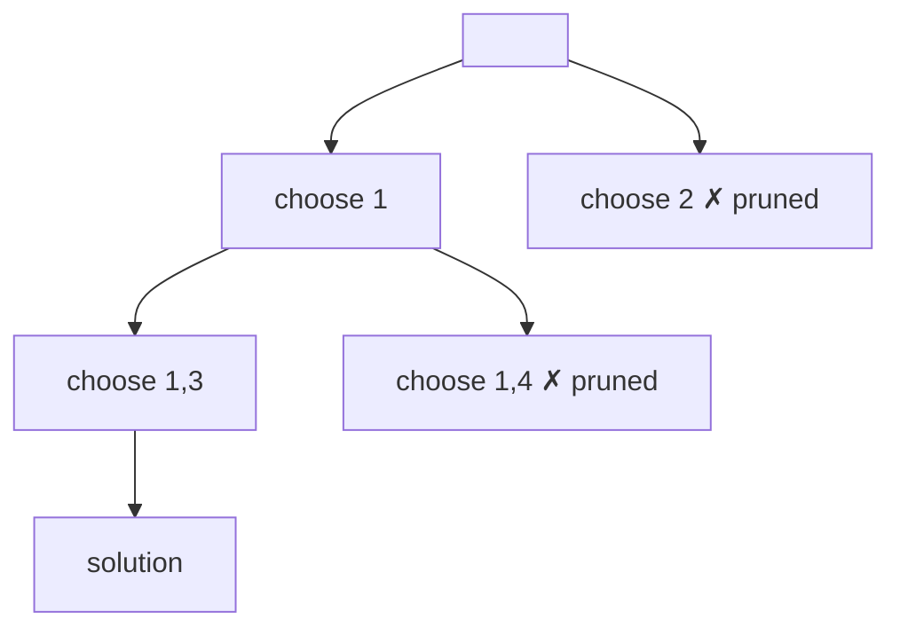

---
topic:
  - Computer Science
subtopic:
  - Algorithms
summary: "A refined brute force that builds candidate solutions incrementally and prunes a partial candidate the moment it can't possibly succeed."
level:
  - "4"
priority: Medium
status: Ready to Repeat
publish: true
---

# Intro

Backtracking is a systematic way to explore all candidate solutions by building them incrementally and **abandoning a partial candidate ("pruning") as soon as it can't possibly succeed**. It's a refined brute force: instead of generating every configuration and then testing it, you grow a solution one choice at a time and retreat the moment a constraint is violated, cutting off whole branches of the search tree. It solves constraint-satisfaction and combinatorial-enumeration problems — permutations/combinations/subsets, N-Queens, Sudoku, maze/path finding, and word search.

## How It Works

The shape is a depth-first search over a tree of partial solutions:

1. **Choose** — make a candidate decision and add it to the current partial solution.
2. **Explore** — recurse to make the next decision.
3. **Un-choose (backtrack)** — undo the decision and try the next candidate.

Pruning is the difference between backtracking and naive enumeration: a `if (!isValid) continue;` (or a bound check) abandons a branch early, so you never expand the doomed subtree. The more aggressively you prune, the faster it runs — though the worst case stays exponential.



## Visualization

Watch the board fill one queen per row (the row index *is* the recursion depth) while the faint shading marks every square the placed queens already attack. 4-Queens has no solution beneath its first choice: after committing a queen to column 0 it exhausts every branch, so it must **retreat all the way back to row 0**, tear that queen off, and only then — starting from column 1 — does it find the arrangement. That retreat-and-undo, with whole subtrees pruned before they are ever expanded, is exactly the choose / explore / un-choose loop above.

```steptrace
{"algorithm":"n-queens","n":4}
```

## Example

Generate all permutations — the canonical choose / explore / un-choose loop:

```csharp
public static IList<IList<int>> Permutations(int[] nums)
{
    var results = new List<IList<int>>();
    var current = new List<int>();
    var used = new bool[nums.Length];

    void Backtrack()
    {
        if (current.Count == nums.Length)
        {
            results.Add(new List<int>(current));   // a complete solution
            return;
        }
        for (int i = 0; i < nums.Length; i++)
        {
            if (used[i]) continue;                  // prune: each element once
            used[i] = true; current.Add(nums[i]);   // choose
            Backtrack();                            // explore
            used[i] = false; current.RemoveAt(current.Count - 1); // un-choose
        }
    }

    Backtrack();
    return results;
}
```

N-Queens-style pruning is the same skeleton with a constraint check (`IsSafe(row, col)`) before each `choose`, which discards most of the board placements before they're ever expanded.

## Pitfalls

- **Forgetting to un-choose** — the state mutation made before recursing *must* be reverted after, or sibling branches inherit corrupt state. The single most common backtracking bug is a missing "undo" line.
- **Snapshotting the result** — when you record a solution, copy it (`new List<int>(current)`); adding the live `current` list stores a reference that later mutations will clobber, leaving you with N copies of the same final state.
- **Weak pruning ⇒ exponential blowup** — backtracking without good constraint checks degenerates to brute force. The art is pruning early and cheaply (constraint propagation, bounds, ordering choices to fail fast).
- **Duplicate solutions** — with repeated input elements, naive enumeration yields duplicate permutations/subsets; you typically sort and skip equal siblings (`if (i > start && a[i] == a[i-1]) continue;`) to dedupe.

## Tradeoffs

| Approach | Explores | Cost | Use when |
|---|---|---|---|
| **Backtracking** | Valid partial branches only (pruned DFS) | Exponential worst case, far better in practice | Enumerate/solve constraint problems; need *all* or *a* valid configuration |
| Brute force | Every full configuration | Always exponential | Almost never — strictly worse |

**Decision rule**: use backtracking when you must **search a space of configurations** under constraints and pruning can eliminate most of it — Sudoku, N-Queens, generating subsets/permutations, parsing. If the problem is *optimisation* with overlapping subproblems, DP is usually exponentially faster; if a greedy rule provably works, it's faster still. Branch-and-bound is backtracking plus a bound to prune for optimisation problems.

## Questions

> [!QUESTION]- What distinguishes backtracking from plain brute force?
> Brute force generates every complete candidate and then checks it. Backtracking builds candidates incrementally and **prunes** — the instant a partial candidate violates a constraint, it abandons that entire subtree without expanding it. Same worst case, but pruning often removes the overwhelming majority of the search space in practice.

> [!QUESTION]- Why must you "un-choose" after recursing?
> Backtracking shares one mutable state (the current partial solution / used-set) across all branches to avoid copying. After exploring a choice you must revert it so the next sibling branch starts from the correct state. Skipping the undo leaks state between branches and produces wrong results.

> [!QUESTION]- When is backtracking the wrong tool?
> When the problem is an *optimisation* with overlapping subproblems (use DP — exponentially faster) or when a provable greedy choice exists (faster still). Backtracking shines for *enumeration* and *constraint satisfaction* where you genuinely must search configurations, and where pruning makes the exponential worst case rare in practice.

## References

- [Backtracking (Wikipedia)](https://en.wikipedia.org/wiki/Backtracking) — formal definition, the search tree, and branch-and-bound.
- [Backtracking (GeeksforGeeks)](https://www.geeksforgeeks.org/backtracking-algorithms/) — N-Queens, Sudoku, and subset/permutation templates.
- [Recursion and backtracking (USACO Guide)](https://usaco.guide/silver/intro-backtracking) — categorised problems and pruning techniques.
