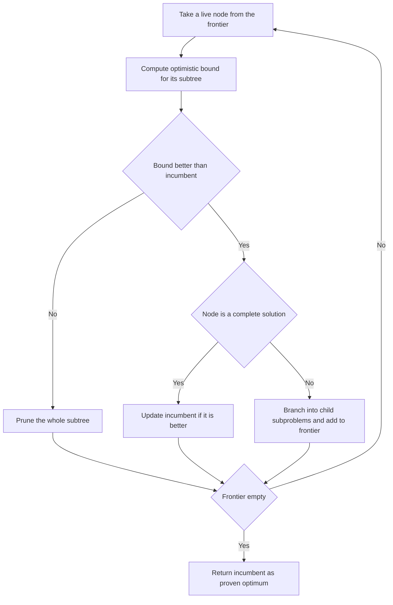

---
topic:
  - Computer Science
subtopic:
  - Algorithms
summary: "A search paradigm for optimisation that prunes any branch whose optimistic bound cannot beat the best solution so far."
level:
  - "4"
priority: Medium
status: Creation
publish: true
---

# Intro

Branch-and-bound is a systematic search paradigm for **optimisation** problems — find the configuration that minimises or maximises some objective, not just any valid one. It is the natural sibling of [[Backtracking]]: both explore a tree of partial solutions depth-first-ish and prune whole subtrees, but they prune on different grounds. Backtracking prunes a branch when it is **infeasible** — the partial solution already violates a constraint and can never be completed. Branch-and-bound prunes a branch when it is perfectly feasible but **provably cannot beat the best solution found so far**, using a *bound*: an optimistic estimate of the best objective achievable anywhere in that subtree.

That "optimistic estimate versus best-so-far" test is the whole idea. If the most hopeful outcome in a subtree is still worse than a complete solution you already hold, there is no reason to explore it — you discard it unexpanded. It is the standard engine for 0/1 knapsack, the travelling salesman problem, and integer linear programming; every commercial mixed-integer-programming (MIP) solver — CPLEX, Gurobi — is branch-and-bound at its core. When your problem is pure constraint satisfaction with no objective to optimise, drop the bound and use plain [[Backtracking]]; when a local rule provably reaches the optimum, [[Greedy Algorithms]] is faster still.

## How It Works

Four moving parts:

1. **Branch** — split the problem at a decision point into subproblems (e.g. "item *i* is in the knapsack" vs "item *i* is out"), forming a search tree.
2. **Bound** — for each node, compute a bound: an optimistic estimate of the best objective reachable in that subtree. For a maximisation problem this is an *upper* bound (never lower than the true best below); for minimisation, a *lower* bound.
3. **Prune** — maintain the **incumbent**: the best complete solution found so far. If a node's optimistic bound is no better than the incumbent's objective, the entire subtree is discarded — nothing in it can improve the answer.
4. **Select** — pick the next live node to expand, by some strategy (below), and repeat until no live nodes remain. The final incumbent is provably optimal.

### The bound must be optimistic — the A* connection

Correctness hinges on one condition: the bound must be **optimistic (admissible)** — it must never be *worse* than the true best achievable in the subtree. If a maximisation bound ever *under*-estimates, you might prune a subtree that actually contained the optimum, and return a wrong answer. This is the *exact* same admissibility condition as [[A-Start Search|A* Search]]'s heuristic, which must never *over*estimate the remaining distance to the goal or A\* can settle a node before its true shortest path is found. Both algorithms explore a tree guided by an optimistic estimate of "how good could this get," and both stay correct only while that estimate never lies in the pessimistic direction. Branch-and-bound is, in effect, A\* applied to the decision tree of an optimisation problem; the bounding function is its heuristic.

The tension is the same too: a **tighter** bound prunes more (explores fewer nodes) but costs more to compute per node, exactly as a sharper A\* heuristic expands fewer nodes but costs more per expansion. A loose bound (say, "assume every remaining item fits at full value") is cheap but prunes little; the art is a bound that is tight yet fast.

### Node selection and the incumbent

- **Best-first search** — keep live nodes in a priority queue ordered by bound, always expanding the most promising node. This tends to reach a strong incumbent and prove optimality with the fewest expansions, but the queue can hold exponentially many nodes, so **memory** is the risk.
- **Depth-first search** — dive to a complete solution quickly, using `O(depth)` memory like [[Backtracking]]. It finds *an* incumbent fast, which then starts pruning siblings — but may waste effort in unpromising regions a best-first search would have skipped.

A good **early incumbent** is worth a lot: the sooner you hold a strong complete solution, the higher the bar every bound must clear, so more subtrees get pruned. In practice solvers seed the incumbent with a fast heuristic — often a [[Greedy Algorithms|greedy]] solution — before the search even starts, precisely to accelerate pruning.

**Complexity:** the worst case is still exponential — branch-and-bound is exact search, and on adversarial inputs it prunes nothing and degenerates to brute-force enumeration. It improves the **constant factor and the typical case**, often dramatically, but never the complexity class. NP-hard problems stay NP-hard; you are buying practicality, not a polynomial algorithm.

## Example

0/1 knapsack, maximise value within a weight capacity. The classic bound is the **fractional-LP relaxation**: at any node, fill the remaining capacity greedily by value-to-weight ratio, allowing the *last* item to be taken fractionally. Because the fractional knapsack optimum can only be `≥` the 0/1 optimum, this is a valid (optimistic) upper bound.

```text
Capacity 10.  Items sorted by value/weight ratio:
  A: value 40, weight 2   (ratio 20)
  B: value 30, weight 5   (ratio  6)
  C: value 25, weight 5   (ratio  5)
  D: value 12, weight 3   (ratio  4)

Root bound (fractional fill): A(40,w2) + B(30,w5) + C partial 3/5 of 25 = 15
  -> upper bound 85, no incumbent yet.

Branch on A:
  [take A]   capacity 8 left, value 40. Bound = 40 + B(30) + C 3/5*25=15 = 85.
  [skip A]   bound = B(30)+C(25)+... = well under 85 -> less promising.

Dive [take A] -> [take B] -> [take C]: weight 2+5+5=12 > 10, infeasible on C.
  Backtrack; [take A][take B][skip C][take D]: weight 2+5+3=10, value 82. INCUMBENT = 82.

Now every live node whose bound <= 82 is pruned:
  the [skip A] subtree had upper bound well below 82  -> pruned unexpanded.
  [take A][skip B] subtree bound = 40 + C(25) + D(12) = 77 <= 82 -> pruned.

No live node has a bound > 82. Incumbent 82 is proven optimal.
```

The pruning is the payoff: once the incumbent reaches 82, entire branches are discarded on a single bound comparison, never expanded. Note the bound stayed **optimistic** throughout (it always assumed the best possible fractional fill) — that is what makes the pruning safe. A bound that ever under-shot the true subtree optimum could have pruned the branch holding the real answer.

## Diagram



## Pitfalls

### A non-optimistic bound prunes the optimum

- **What goes wrong**: if the bound ever estimates a subtree as *worse* than it truly is (under-estimating for maximisation), branch-and-bound prunes a branch that contained the optimal solution and returns a wrong answer.
- **Why it happens**: people tune bounds for tightness and accidentally cross from optimistic to pessimistic, or forget the relaxation must dominate the true objective.
- **How to avoid it**: prove the bound is admissible — for maximisation it must be `≥` the true best in the subtree, for minimisation `≤`. This is the same admissibility rule as an [[A-Start Search|A* Search]] heuristic; when in doubt, use a provably valid relaxation (LP relaxation, ignoring integrality) even if looser.

### Best-first search exhausts memory

- **What goes wrong**: a best-first frontier can grow to hold exponentially many live nodes, running out of RAM long before it runs out of time.
- **Why it happens**: best-first keeps every unexpanded node in the priority queue, and hard instances generate enormous frontiers.
- **How to avoid it**: use depth-first or iterative-deepening branch-and-bound for `O(depth)` memory, or hybrid schemes (beam-limited frontiers) — trading some pruning quality for a bounded footprint.

### Expecting branch-and-bound to beat the complexity class

- **What goes wrong**: teams deploy a B&B solver on a large NP-hard instance and are surprised when it runs for hours or never terminates.
- **Why it happens**: pruning helps the *typical* case, but the worst case is still exponential; on adversarial or large instances the bound prunes almost nothing.
- **How to avoid it**: for large instances, accept approximation — an early incumbent from a [[Greedy Algorithms|greedy]] heuristic, or an LP-rounding / metaheuristic solution — rather than waiting for a proven optimum you may never get.

## Tradeoffs

| Choice | Branch-and-bound | Alternative | Decision criteria |
| --- | --- | --- | --- |
| Node selection | Best-first (fewest expansions, `O(2^n)` memory) | Depth-first (`O(depth)` memory, weaker pruning) | Best-first when memory is ample and a tight bound exists; depth-first when memory is the binding constraint. |
| Exact vs approximate | Proven optimum, unbounded time | Greedy / LP-rounding heuristic, fast, no guarantee | Use B&B when optimality must be certified; switch to a heuristic when the instance is too large to solve exactly in the time budget. |

## Questions

> [!QUESTION]- How does branch-and-bound differ from backtracking?
> - Both explore a tree of partial solutions and prune subtrees, but on different criteria.
> - [[Backtracking]] prunes a branch when it becomes **infeasible** — the partial solution already violates a constraint.
> - Branch-and-bound prunes a branch that is feasible but whose **optimistic bound cannot beat the incumbent** — the best complete solution found so far.
> - So backtracking answers "does a valid configuration exist / enumerate them," while B&B answers "which valid configuration is *optimal*."
> - The practical upshot: the moment your problem has an objective function to optimise, you want a bound, and plain backtracking leaves that pruning power on the table.

> [!QUESTION]- Why must the bounding function be optimistic, and how does that mirror A* search?
> - The bound is an estimate of the best achievable in a subtree; pruning happens when that estimate is no better than the incumbent.
> - If the bound ever under-estimates (for maximisation), a subtree containing the true optimum could be pruned — giving a wrong answer.
> - So the bound must be **admissible**: never worse than the real subtree optimum — the exact same condition as an [[A-Start Search|A* Search]] heuristic never overestimating the remaining cost.
> - Both algorithms are guided tree searches whose correctness depends on an estimate that only ever errs in the optimistic direction; B&B is essentially A* over an optimisation decision tree.
> - This is why you can safely borrow LP relaxations as bounds: an optimal fractional solution provably dominates the integer one, so it can never lie pessimistically.

> [!QUESTION]- Does branch-and-bound change the complexity class of NP-hard problems?
> - No — the worst case remains exponential; on adversarial inputs the bound prunes nothing and it degenerates to brute-force enumeration.
> - It improves the constant factor and the typical case, often by orders of magnitude, which is why real MIP solvers (CPLEX, Gurobi) rely on it.
> - A tight bound and a strong early incumbent (often a [[Greedy Algorithms|greedy]] seed) prune more subtrees and shrink the practical runtime.
> - The takeaway for a real decision: B&B buys you *practicality and a certificate of optimality*, not polynomial time — so on very large instances, budget for a heuristic fallback rather than a proven optimum.

## References

- [Branch and bound (Wikipedia)](https://en.wikipedia.org/wiki/Branch_and_bound) — the general framework, bounding functions, and node-selection strategies.
- [Branch and bound: knapsack (GeeksforGeeks)](https://www.geeksforgeeks.org/0-1-knapsack-using-branch-and-bound/) — the fractional-LP bound worked through the 0/1 knapsack tree.
- [Integer programming (Wikipedia)](https://en.wikipedia.org/wiki/Integer_programming) — how LP-relaxation bounds drive branch-and-bound in commercial MIP solvers.
- [Admissible heuristic (Wikipedia)](https://en.wikipedia.org/wiki/Admissible_heuristic) — the optimism condition shared with A* search.
