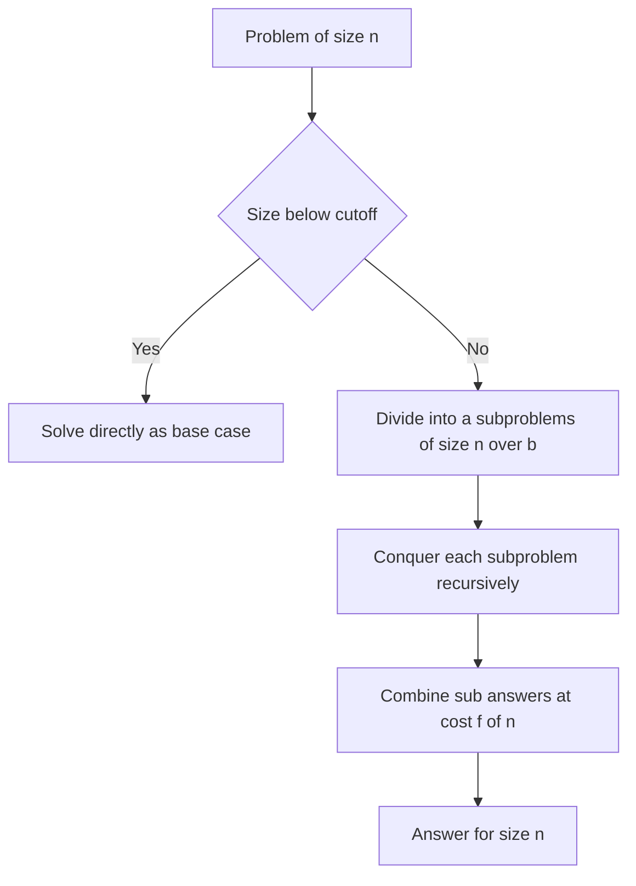

---
topic:
  - Computer Science
subtopic:
  - Algorithms
summary: "Solves a problem by breaking it into smaller independent instances of itself, solving those recursively, and combining their answers."
level:
  - "4"
priority: Medium
status: Creation
publish: true
---

# Intro

Divide-and-conquer solves a problem by breaking it into smaller instances of the **same** problem, solving those recursively, and combining their answers into the answer for the whole. The shape is three steps: **divide** the input into subproblems, **conquer** each by recursing until a base case is small enough to solve directly, and **combine** the sub-results. Because every subproblem is a scaled-down copy of the original, the running time obeys a recurrence `T(n) = a·T(n/b) + f(n)` — and that is the paradigm's real gift: the **Master Theorem** reads the complexity straight off `a`, `b`, and the combine cost `f(n)`, so the analysis is mechanical rather than clever.

It powers [[Merge Sort]], [[Quick Sort]], [[Binary Search]], Karatsuba multiplication, Strassen's matrix multiply, the closest-pair-of-points algorithm, and the FFT. Reach for it when a problem splits into pieces that can be solved **independently**. If instead the pieces overlap and keep re-solving each other's work, divide-and-conquer recomputes that shared work every time — that is exactly the gap [[Dynamic Programming]] fills.

## How It Works

The template is three steps plus a stopping rule:

1. **Divide** — split the size-`n` input into `a` subproblems, each of size roughly `n/b`.
2. **Conquer** — solve each subproblem recursively. Below a size cutoff, stop recursing and solve directly (the **base case**).
3. **Combine** — merge the `a` sub-answers into the answer for the original, at cost `f(n)`.

The difficulty and the cost live in different places depending on the algorithm. In [[Merge Sort]] the divide is trivial (split in the middle) and all the work is in the combine (merging two sorted halves, `O(n)`). In [[Quick Sort]] it is the reverse: the partition *is* the work and the combine is free. In [[Binary Search]] there is only **one** subproblem (`a = 1`) — you discard the half that cannot contain the target and recurse into the other — which is why it is sometimes called *decrease*-and-conquer.

### The Master Theorem

For `T(n) = a·T(n/b) + f(n)` with `a ≥ 1`, `b > 1`, compare the combine cost `f(n)` against `n^(log_b a)` — the total cost of the leaves of the recursion tree. Whichever grows faster dominates:

- **Case 1 — leaves win.** If `f(n) = O(n^(log_b a − ε))` for some `ε > 0`, then `T(n) = Θ(n^(log_b a))`. Most of the work is at the bottom of the tree.
- **Case 2 — balanced.** If `f(n) = Θ(n^(log_b a))`, then `T(n) = Θ(n^(log_b a) · log n)`. Every level costs the same, and there are `log n` of them — this is where the extra log factor comes from.
- **Case 3 — root wins.** If `f(n) = Ω(n^(log_b a + ε))` (and `a·f(n/b) ≤ c·f(n)` for some `c < 1`, the regularity condition), then `T(n) = Θ(f(n))`. The top-level combine dominates everything below it.

Worked against real recurrences:

```text
Algorithm            Recurrence          a  b  log_b(a)   f(n)   Case  Result
-------------------  ------------------  --  -  --------  -----  ----  -----------
Merge Sort           2T(n/2) + O(n)       2  2   1        n^1     2    O(n log n)
Binary Search        1T(n/2) + O(1)       1  2   0        n^0     2    O(log n)
Karatsuba multiply   3T(n/2) + O(n)       3  2   1.585    n^1     1    O(n^1.585)
Naive matrix mult.   8T(n/2) + O(n^2)     8  2   3        n^2     1    O(n^3)
Strassen matrix      7T(n/2) + O(n^2)     7  2   2.807    n^2     1    O(n^2.807)
```

Karatsuba is the paradigm at its most striking: it replaces one of the four half-size multiplications in schoolbook `O(n^2)` multiplication with additions, turning `4T(n/2)` into `3T(n/2)`. That single dropped subproblem moves the exponent from `2` to `log_2 3 ≈ 1.585`. Strassen does the same trick for matrices — `8` recursive multiplies become `7` — dropping the exponent from `3` to `log_2 7 ≈ 2.807`. The number of subproblems `a` is not a constant factor; it is *in the exponent*.

### Disjoint subproblems — the line against dynamic programming

The defining property is that the subproblems are **disjoint**: they operate on separate slices of the input and never need each other's answers. This is the entire distinction from [[Dynamic Programming]], which exists precisely because *its* subproblems **overlap**. The test is concrete: memoising [[Merge Sort]] buys you nothing, because each recursive call sorts a different slice of the array exactly once — there is no repeated subproblem to cache. Memoising naive Fibonacci buys you *everything* (exponential to linear), because `fib(n-1)` and `fib(n-2)` both recompute `fib(n-3)`, `fib(n-4)`, and so on, over and over. Same recursive shape, opposite payoff — and the deciding factor is whether the subproblems overlap.

Two structural consequences follow from disjointness:

- **It parallelises for free.** Disjoint subproblems share no mutable state, so the `a` recursive calls can run on separate cores with no locking or coordination — the natural fit for fork/join frameworks and GPU kernels. Overlapping (DP) subproblems, by contrast, contend over the shared table.
- **The base-case cutoff matters.** Recursion has per-call overhead (stack frames, function calls) that dominates when the subproblem is tiny. Real sorts stop recursing well above `n = 1` and hand small slices to [[Insertion Sort]], whose tight inner loop beats recursion on small inputs — the exact reason [[Introsort]] and [[Tim Sort]] fall back to insertion sort below a threshold (around 16–32 elements).

**Complexity:** determined by the recurrence via the Master Theorem above; typical results are `O(n log n)` (balanced split with linear combine) down to `O(log n)` (single subproblem, constant combine). Space is usually `O(log n)` for the recursion stack, plus whatever the combine step allocates — `O(n)` for merge sort's auxiliary buffer, `O(1)` for in-place partitioning.

## Example

Merge sort is the paradigm in its cleanest form — divide is trivial, combine does the work:

```csharp
public static void MergeSort(int[] a, int lo, int hi)
{
    if (hi - lo <= 16)          // base-case cutoff: small slices go to insertion sort
    {
        InsertionSort(a, lo, hi);
        return;
    }
    int mid = lo + (hi - lo) / 2;
    MergeSort(a, lo, mid);      // conquer left half  (disjoint)
    MergeSort(a, mid, hi);      // conquer right half (disjoint)
    Merge(a, lo, mid, hi);      // combine: O(n) merge of two sorted runs
}
```

The two recursive calls touch disjoint index ranges, so they could run on separate threads with no synchronisation. The recurrence is `2T(n/2) + O(n)` — Master Theorem Case 2 — giving `O(n log n)`. Note the cutoff: below 16 elements the recursion overhead outweighs the algorithmic advantage, so it defers to [[Insertion Sort]], exactly as [[Tim Sort]] and [[Introsort]] do in production libraries.

## Diagram



## Pitfalls

### Assuming the split is free when combine dominates

- **What goes wrong**: people quote `O(n log n)` for any "split in half" algorithm, but the complexity lives in the combine cost `f(n)`, not the split.
- **Why it happens**: the divide step is visually obvious; the combine step is where the real work (and the Master-Theorem case) is decided.
- **How to avoid it**: always write the recurrence explicitly and classify `f(n)` against `n^(log_b a)`. A quadratic combine can push an otherwise-logarithmic-depth algorithm all the way to Case 3.

### Reaching for divide-and-conquer when subproblems overlap

- **What goes wrong**: solving an overlapping-subproblem problem (Fibonacci, edit distance, coin change) with plain recursion blows up exponentially because the same subproblem is recomputed on every branch.
- **Why it happens**: the recursive decomposition looks like textbook divide-and-conquer, but the pieces are not disjoint.
- **How to avoid it**: check whether subproblems repeat. If they do, cache them — that is [[Dynamic Programming]], and it is the difference between `O(2^n)` and `O(n)`.

### No base-case cutoff — recursion overhead swamps small inputs

- **What goes wrong**: recursing all the way to `n = 1` spends more time on call frames than on useful work for small slices, and can overflow the stack on adversarial inputs.
- **Why it happens**: the mathematically clean base case (`n ≤ 1`) is not the performant one.
- **How to avoid it**: cut over to an iterative algorithm ([[Insertion Sort]] for sorting) below a tuned threshold — the standard trick in every production sort.

## Tradeoffs

| Choice | Divide-and-conquer | Alternative | Decision criteria |
| --- | --- | --- | --- |
| vs [[Dynamic Programming]] | Disjoint subproblems, solved once, no table | Overlapping subproblems, cached in a table | If subproblems repeat, DP avoids exponential recomputation; if they are disjoint, DP's table is pure overhead. |
| vs iterative / single-pass | Recursive split, `O(log n)` depth, parallelisable | One linear pass, no recursion overhead | Prefer iterative for problems that do not decompose (running sums, single scans); D&C when independent subproblems unlock a lower exponent or `n log n`. |
| Base case: recurse to 1 vs cutoff | Clean but slow on small slices | Hand small inputs to insertion sort | Use a cutoff (≈16–32) in any performance-sensitive implementation; recurse-to-1 only for pedagogy. |

## Questions

> [!QUESTION]- State the Master Theorem and apply it to merge sort and Karatsuba.
> - For `T(n) = a·T(n/b) + f(n)`, compare `f(n)` with `n^(log_b a)` (the leaf work).
> - Case 1 (`f` smaller): `Θ(n^(log_b a))`; Case 2 (`f` equal): `Θ(n^(log_b a) · log n)`; Case 3 (`f` larger, regular): `Θ(f(n))`.
> - Merge sort is `2T(n/2)+O(n)`: `log_2 2 = 1`, `f(n)=n` matches, so Case 2 gives `O(n log n)`.
> - Karatsuba is `3T(n/2)+O(n)`: `log_2 3 ≈ 1.585`, `f(n)=n` is smaller, so Case 1 gives `O(n^1.585)`.
> - The count of subproblems `a` sits in the *exponent*, not a constant factor — which is why dropping one recursive multiply (4→3) is a genuine asymptotic win, not a micro-optimisation.

> [!QUESTION]- Why does memoising merge sort buy nothing while memoising Fibonacci buys everything?
> - Merge sort's subproblems are **disjoint**: each recursive call sorts a distinct slice of the array exactly once, so there is no repeated work to cache.
> - Naive Fibonacci's subproblems **overlap**: `fib(n-1)` and `fib(n-2)` both recompute `fib(n-3)` and below, exponentially many times.
> - Caching only helps when the same subproblem recurs — that is the definition of [[Dynamic Programming]] versus plain divide-and-conquer.
> - So the decision to memoise is not about the recursive *shape* (both look identical) but about whether subproblems are shared — get this wrong and you either waste memory or miss an exponential speedup.

> [!QUESTION]- Why does divide-and-conquer parallelise so naturally, and where does the base-case cutoff fit?
> - The subproblems are disjoint, so they share no mutable state and can run on separate cores with no locking — the model behind fork/join and map-style GPU kernels.
> - The recursion depth is only `O(log n)`, so the tree is wide and shallow — lots of independent work to spread out.
> - The base-case cutoff exists because per-call overhead dominates on tiny inputs, so real implementations defer small slices to an iterative algorithm like [[Insertion Sort]].
> - This is why production sorts ([[Introsort]], [[Tim Sort]]) are hybrids: divide-and-conquer for the asymptotics, insertion sort for the constant factor — the paradigm is a scaffold, not the whole algorithm.

## References

- [Divide-and-conquer algorithm (Wikipedia)](https://en.wikipedia.org/wiki/Divide-and-conquer_algorithm) — the general schema, worked examples, and parallelism.
- [Master theorem (Wikipedia)](https://en.wikipedia.org/wiki/Master_theorem_(analysis_of_algorithms)) — all three cases with the regularity condition and derivations.
- [Divide and conquer (cp-algorithms)](https://cp-algorithms.com/) — closest pair, Karatsuba, and FFT as divide-and-conquer.
- [Karatsuba algorithm (Wikipedia)](https://en.wikipedia.org/wiki/Karatsuba_algorithm) — the three-multiplication recurrence and its `O(n^1.585)` analysis.
