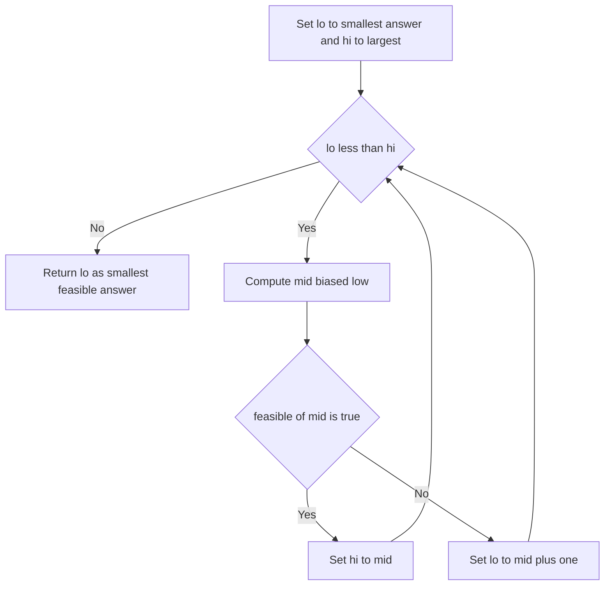

---
topic:
  - Computer Science
subtopic:
  - Algorithms
summary: "Binary-searches the space of possible answers using a monotonic feasibility test, for 'minimise the maximum' or 'maximise the minimum' problems."
level:
  - "4"
priority: Medium
status: Creation
publish: true
---

# Intro

Binary search on the answer applies [[Binary Search]] not to an array of data but to the **space of possible answers**. Instead of asking "where is value `x`?" you ask "is answer `x` feasible?" and binary-search the smallest (or largest) `x` for which the answer is yes. It works whenever the feasibility test is **monotonic**: there is a threshold below which every value fails and above which every value succeeds — `feasible(x)` reads `false, false, …, false, true, true, …, true`. That single boundary is exactly what binary search locates.

Reach for it when a problem says **"minimise the maximum"**, **"maximise the minimum"**, or **"smallest/largest value such that some condition holds"** — Koko eating bananas at the slowest speed that still finishes in time, splitting an array so the largest subarray sum is as small as possible, the least ship capacity that clears the backlog in `D` days, or the integer square root of `x`. The tell is that you are optimising a *scalar answer* whose validity you can cheaply check, not searching stored data. When the answer space isn't monotonic — feasibility flips on and off — this pattern is wrong; fall back to search or [[Dynamic Programming]].

## How It Works

1. **Identify the answer range** `[lo, hi]`. `lo` is the smallest conceivable answer, `hi` the largest (e.g. Koko's speed ranges from `1` to `max(pile)`).
2. **Write `feasible(x)`** — a predicate returning whether answer `x` satisfies the problem's constraint. For "ship in `D` days", `feasible(cap)` greedily fills days at capacity `cap` and checks the day count is `≤ D`.
3. **Prove monotonicity** — if `feasible(x)` is true, `feasible(x+1)` must also be true (a bigger capacity never needs *more* days). This is the precondition; without it the search is meaningless.
4. **Binary-search the boundary** with the half-open template: while `lo < hi`, test `mid`; if `feasible(mid)` pull `hi` down to `mid`, else push `lo` up to `mid + 1`. When `lo == hi` you have the smallest feasible answer.

Complexity: `O(log(range) · C)`, where `range = hi − lo` and `C` is the cost of one `feasible` check. Koko is `O(log(maxPile) · n)`; ship-packages is `O(log(sum) · n)`. Space is `O(1)` beyond whatever `feasible` needs. The crucial point is that the log factor is over the *numeric range of the answer*, not the input size — so even a range of `10^18` costs only ~60 checks.

## Example

The reusable template and two instantiations. Note that every problem differs *only* in the predicate and the bounds.

```csharp
// Smallest x in [lo, hi] with feasible(x) true, given feasible is monotonic false->true.
public static long SearchBoundary(long lo, long hi, Func<long, bool> feasible)
{
    while (lo < hi)
    {
        long mid = lo + (hi - lo) / 2;   // biased low; pairs with hi = mid
        if (feasible(mid)) hi = mid;      // mid works, but maybe smaller does too
        else               lo = mid + 1;  // mid fails, answer is strictly larger
    }
    return lo;                            // lo == hi == smallest feasible answer
}

// Koko eating bananas (LeetCode 875): slowest speed that clears all piles in h hours.
public static int MinEatingSpeed(int[] piles, int h)
{
    bool CanFinish(long speed)
    {
        long hours = 0;
        foreach (int p in piles) hours += (p + speed - 1) / speed; // ceil(p / speed)
        return hours <= h;
    }
    return (int)SearchBoundary(1, piles.Max(), CanFinish);
}

// Capacity to ship packages in D days (LeetCode 1011).
public static int ShipWithinDays(int[] weights, int days)
{
    bool CanShip(long cap)
    {
        long used = 1, load = 0;
        foreach (int w in weights)
        {
            if (w > cap) return false;        // one package exceeds capacity
            if (load + w > cap) { used++; load = 0; }
            load += w;
        }
        return used <= days;
    }
    return (int)SearchBoundary(weights.Max(), weights.Sum(), CanShip);
}
```

Split-array-largest-sum (LeetCode 410) is the same `CanShip` predicate with `days` renamed to the allowed number of subarrays — a sign that this whole family is one idea wearing different words. Integer `sqrt(x)` is the degenerate case where `feasible(m)` is just `m * m <= x`.

## Diagram



## Pitfalls

- **Trusting the search before proving monotonicity** — the single most common wrong step. If `feasible` is not monotone the boundary doesn't exist and binary search returns garbage confidently. Before writing any code, argue: "a larger candidate can only make the condition easier (or only harder), never flip back." If you can't, this pattern doesn't apply.
- **Boundary template that loops forever** — pair the update with the midpoint bias. For the smallest-feasible form use `mid = lo + (hi - lo) / 2` (biased low) with `hi = mid` / `lo = mid + 1`. For the largest-feasible form bias `mid` *high* (`+ 1` before the divide) and use `lo = mid` / `hi = mid - 1`, or you spin on `lo == mid` and never terminate.
- **Float answers and epsilon comparisons** — for real-valued answers (e.g. "minimum radius") don't loop until `hi - lo < eps`; the right eps is problem-dependent and easy to get wrong. Instead **iterate a fixed number of times** (100 iterations halves the range by `2^100`, far beyond double precision) and return `lo`. It's simpler and immune to precision stalls.

## Tradeoffs

| Choice | Binary search on answer | Alternative | Decision criteria |
| --- | --- | --- | --- |
| vs direct formula | `O(log(range) · C)`, needs only a checker | closed form, `O(1)` | Use the search when no formula exists but feasibility is cheap to test; a closed form always wins when you have one. |
| vs linear scan of answers | `O(log(range) · C)` | `O(range · C)` | The search needs monotonic feasibility; a plain scan does not but is exponentially slower over wide numeric ranges. |
| vs [[Dynamic Programming]] | search wraps a greedy/`O(n)` checker | DP computes the optimum directly, often `O(n·k)` | Reach for the search when checking a candidate answer is far cheaper than computing the optimum outright (split-array-largest-sum: `O(n log sum)` beats `O(n²k)` DP). |

## Questions

> [!QUESTION]- What precondition makes binary search on the answer valid, and how do you check it?
> - The feasibility predicate must be **monotonic**: `feasible(x)` transitions exactly once from false to true (or true to false) as `x` increases.
> - That single boundary is what binary search locates; if feasibility oscillates there is no boundary to find.
> - Verify it by argument, not code: show a larger candidate can only make the condition easier to satisfy (more capacity never needs more days).
> - Skipping this proof is the classic failure — the search still runs and returns a confident but wrong answer, so monotonicity is the first thing to establish, before touching the template.

> [!QUESTION]- Why is the complexity `O(log(range) · C)` and not tied to input size the usual way?
> - Each step halves the *answer* range `[lo, hi]`, so it takes `log(hi − lo)` iterations.
> - Every iteration runs the `feasible` check, costing `C` (often `O(n)` — a single greedy pass over the input).
> - So total cost is `O(log(range) · C)`; for Koko that's `O(log(maxPile) · n)`.
> - The log is over the numeric range, so even a `10^18`-wide answer space is only ~60 checks — which is why this beats DP whenever the checker is cheap relative to computing the optimum directly.

> [!QUESTION]- How do you handle a real-valued (floating-point) answer without an epsilon comparison?
> - Don't loop until `hi - lo < eps`: the correct eps is problem-specific and a too-tight value can stall on floating-point rounding.
> - Instead run a **fixed iteration count** — around 100 iterations shrinks the range by `2^100`, far past double precision.
> - Return `lo` (or `(lo + hi) / 2`) after the fixed loop.
> - This trades a negligible amount of extra work for guaranteed termination and no precision-tuning, which matters because eps bugs are silent and hard to reproduce.

## References

- [Binary search (CP Algorithms)](https://cp-algorithms.com/num_methods/binary_search.html) — the "binary search on the answer" section and the monotonic-predicate framing.
- [Koko Eating Bananas (LeetCode #875)](https://leetcode.com/problems/koko-eating-bananas/) — canonical minimise-the-speed instance.
- [Capacity To Ship Packages Within D Days (LeetCode #1011)](https://leetcode.com/problems/capacity-to-ship-packages-within-d-days/) — the ship-in-D-days predicate.
- [Split Array Largest Sum (LeetCode #410)](https://leetcode.com/problems/split-array-largest-sum/) — same predicate, "minimise the maximum" wording.
