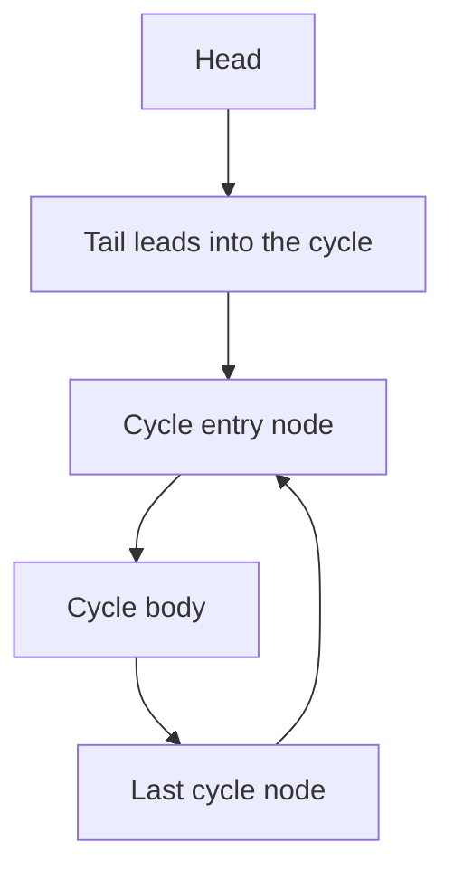

---
topic:
  - Computer Science
subtopic:
  - Algorithms
summary: "Floyd's tortoise-and-hare: two pointers moving at different speeds detect cycles, midpoints, or duplicates in O(1) space."
level:
  - "4"
priority: Medium
status: Creation
publish: true
---

# Intro

Fast and slow pointers — Floyd's tortoise-and-hare — walk one pointer at speed 1 and another at speed 2 through a sequence defined by "follow the next link." Because the fast pointer gains one step on the slow pointer every iteration, if the path ever loops the gap closes by one each step and the two **must eventually land on the same node**; if the fast pointer runs off the end, the path is acyclic. The whole technique needs only two pointers and no auxiliary memory, which is its entire reason to exist over a visited-set approach.

**Reach for it when you see** a **cycle in a linked list or functional graph**, "find the middle of a list in one pass," or "find the duplicate in `[1..n]` without extra space." The unifying shape is a sequence where each element has exactly one successor (`node.next`, or `i -> nums[i]`) and you must reason about repetition or midpoint using `O(1)` space. This is a special case of the [[Two Pointers]] family — the "same-direction, different-speed" configuration; the converging ends-in variant (pair-sum on a sorted array, in-place partition) lives in that note.

## How It Works

**Phase 1 — detection.** Start both pointers at the head. Each step, advance `slow` by one node and `fast` by two. If `fast` (or `fast.next`) reaches `null`, there is no cycle. If `slow == fast`, a cycle exists and they have met somewhere inside it.

**Phase 2 — find the cycle entry.** Reset one pointer to the head. Advance **both** one step at a time; they meet exactly at the node where the cycle begins.

**Why phase 2 works (the step people memorise without understanding).** Let `mu` be the distance from the head to the cycle entry and `lambda` the cycle length. When the pointers first meet, `slow` has travelled `d` steps and `fast` has travelled `2d`. The fast pointer has lapped the slow one some whole number of times inside the cycle, so their difference is a multiple of the cycle length: `2d - d = d = k * lambda`. The meeting point is `d` steps from the head, which is `d - mu` steps *into* the cycle. Now reset a pointer to the head and step both by one. After `mu` steps the head pointer arrives at the entry; the other pointer, starting `d - mu` into the cycle, is now `d - mu + mu = d = k * lambda` steps in — and `k * lambda` is congruent to `0` modulo `lambda`, i.e. back at the entry. So they coincide there. The algebra is why you reset to the head and step in lockstep, rather than it being a lucky recipe.

**Cycle length** falls out for free: after the meeting, keep one pointer fixed and walk the other around until it returns; the number of steps is `lambda`.

Complexity: `O(n)` time (the fast pointer covers at most a constant multiple of the path length), `O(1)` space — the defining win over a hash-set visited approach, which is also `O(n)` time but `O(n)` space.

## Example

```csharp
public class ListNode { public int val; public ListNode next; }

// Returns the node where the cycle begins, or null if the list is acyclic.
public static ListNode DetectCycle(ListNode head)
{
    ListNode slow = head, fast = head;
    while (fast != null && fast.next != null)      // guard both, or the .next.next throws
    {
        slow = slow.next;                          // speed 1
        fast = fast.next.next;                      // speed 2
        if (slow == fast)                           // reference equality: same node, met in-cycle
        {
            ListNode p = head;                      // phase 2: reset one pointer to the head
            while (p != slow) { p = p.next; slow = slow.next; }
            return p;                               // meet exactly at the cycle entry
        }
    }
    return null;                                    // fast fell off the end: no cycle
}
```

For **LeetCode 287 (Find the Duplicate Number)**, the array `nums` of `n + 1` values in `[1..n]` is read as an implicit functional graph: from index `i` follow the edge `i -> nums[i]`. Because two indices share a value, two edges point to the same node, which forces a cycle — and the cycle's *entry* is the duplicate value. Running the same tortoise-and-hare with `slow = nums[slow]` and `fast = nums[nums[fast]]` finds it in `O(n)` time and `O(1)` space, without mutating the read-only array or allocating a seen-set.

## Diagram



## Pitfalls

### Dereferencing the fast pointer without a null guard

- **What goes wrong**: `fast.next.next` throws a `NullReferenceException` on an acyclic list of even length, because `fast.next` becomes `null` right before the second hop.
- **Why it happens**: only the slow pointer is guaranteed to stay on the list; the fast pointer is the one that can run off the end mid-step.
- **How to avoid it**: gate every iteration on `fast != null && fast.next != null` before advancing, and return "no cycle" when it fails.

### Comparing values instead of node identity

- **What goes wrong**: testing `slow.val == fast.val` reports a false cycle when two distinct nodes happen to hold the same value.
- **Why it happens**: in the array/functional-graph framing you *do* compare values, so the habit leaks into the linked-list version where you must compare references.
- **How to avoid it**: for linked lists compare the node references (`slow == fast`); only compare values when the "nodes" are array indices standing in for identity.

### Treating the meeting point as the cycle entry

- **What goes wrong**: returning the phase-1 meeting node as the answer gives a node somewhere inside the cycle, not where it begins.
- **Why it happens**: the first collision feels like "the" cycle point, and it is easy to skip the second phase.
- **How to avoid it**: always run phase 2 — reset one pointer to the head and step both by one until they coincide; that node is the entry.

## Tradeoffs

| Choice | Fast/slow pointers | Alternative | Decision criteria |
| --- | --- | --- | --- |
| Cycle detection | `O(n)` time, `O(1)` space | [[HashMap]] visited set `O(n)` time, `O(n)` space | Same time; choose fast/slow whenever space is constrained or the structure is read-only. The set is only simpler when you already need the visited nodes for something else. |
| Detecting on a functional graph or array | Floyd on `i -> nums[i]`, `O(1)` space, no mutation | Marking/negating array entries `O(1)` space but destructive | Use Floyd when the input must stay intact (LeetCode 287 forbids mutation); marking is fine only when you may clobber the array. |
| Minimising pointer advances | Floyd, simple, up to `3 * lambda` extra steps | Brent's algorithm, same `O(n)` with fewer slow moves and no double-speed pointer | Brent's is measurably faster in constant factors and finds the cycle length directly; prefer it in hot loops, Floyd for clarity in interviews. |

## Questions

> [!QUESTION]- Why must the fast and slow pointers meet if and only if there is a cycle?
> - The fast pointer gains exactly one step on the slow pointer every iteration.
> - With no cycle the path ends, so the fast pointer reaches `null` and the loop stops without a meeting.
> - With a cycle both pointers eventually enter it; thereafter the gap between them shrinks by one each step, modulo the cycle length, so it inevitably reaches zero.
> - This biconditional is what makes the test sound: a meeting proves a cycle and running off the end proves acyclicity, with no false positives either way.

> [!QUESTION]- After the pointers meet, why does resetting one to the head and stepping both find the cycle entry?
> - At the meeting, slow has gone `d` steps and fast `2d`, and their difference `d` is a whole number of cycle lengths `k * lambda`.
> - The meeting node is therefore `d - mu` steps into the cycle, where `mu` is the head-to-entry distance.
> - A pointer restarted at the head reaches the entry after `mu` steps; the other, stepped `mu` times from `d - mu` into the cycle, lands at `d = k * lambda`, which is the entry again modulo `lambda`.
> - Understanding this is what lets you re-derive the second phase under interview pressure instead of hoping you remembered "reset to head" correctly.

> [!QUESTION]- When would you prefer a hash-set visited approach over fast and slow pointers?
> - Both detect cycles in `O(n)` time; the set costs `O(n)` space, Floyd costs `O(1)`.
> - The set trivially gives you the *set* of visited nodes and the entry (the first repeat) without a second phase.
> - Fast/slow needs the extra entry-finding phase but touches no extra memory and never mutates the structure.
> - So the deciding factor is space and mutability: pick Floyd when memory is tight or the data is read-only, and the hash set only when you already need the visited nodes for another purpose.

## References

- [Cycle detection (Wikipedia)](https://en.wikipedia.org/wiki/Cycle_detection) — Floyd's and Brent's algorithms with correctness proofs and the entry-point derivation.
- [Floyd's tortoise and hare (cp-algorithms)](https://cp-algorithms.com/others/tortoise_and_hare.html) — the cycle-finding method and its length/entry extensions.
- [Linked List Cycle II (LeetCode #142)](https://leetcode.com/problems/linked-list-cycle-ii/) — return the cycle entry node.
- [Find the Duplicate Number (LeetCode #287)](https://leetcode.com/problems/find-the-duplicate-number/) — the functional-graph application in `O(1)` space.
