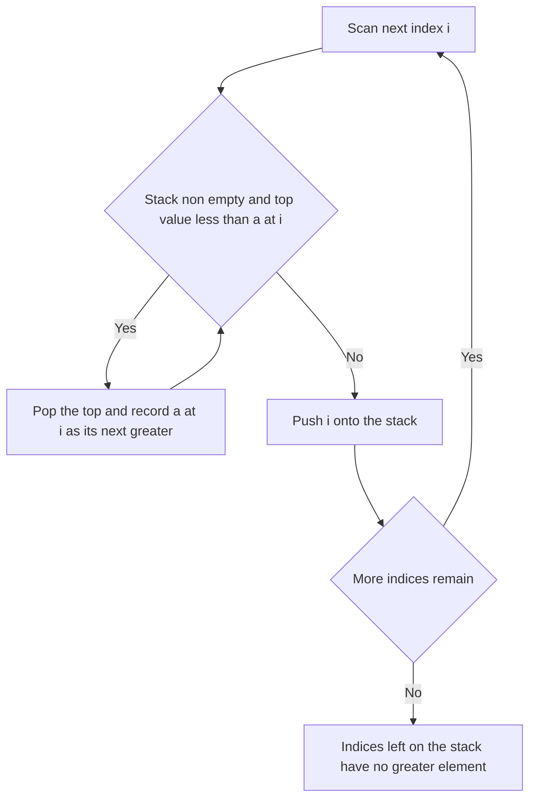

---
topic:
  - Computer Science
subtopic:
  - Algorithms
summary: "A stack or deque kept sorted by popping dominated elements, answering next-greater and window-extremum queries in linear time."
level:
  - "4"
priority: Medium
status: Creation
publish: true
---

# Intro

A monotonic stack (or deque) is a stack/deque whose contents are kept sorted — increasing or decreasing — by **popping any element that can never again be the answer** before pushing a new one. The discarded elements are exactly those the incoming element dominates: if you are scanning left to right looking for the next *greater* element, any smaller value still on the stack has just found its answer and is removed. What looks like a doubly nested loop (an outer scan plus an inner "pop while") is actually linear, because the inner pops are paid for globally, not per outer step.

**Reach for it when you see** "next/previous greater or smaller element" for every position, or a **sliding-window maximum/minimum**. The tell is that you need, for each index, a comparison against the *nearest* qualifying neighbour — and a nested scan would be `O(n^2)`. A monotonic **stack** handles the next/previous-element family and its descendants (largest rectangle in a histogram, daily temperatures, trapping rain water); a monotonic **deque** handles the sliding-window extremum that a plain [[Sliding Window]] cannot, since you cannot "subtract" a maximum the way you subtract a sum.

## How It Works

**Monotonic stack (next greater element).** Scan left to right holding indices whose values *decrease* from bottom to top. Before pushing index `i`, pop every index whose value is less than `a[i]` — `a[i]` is their answer (their next greater element). Push `i`. Indices left on the stack at the end have no greater element to their right.

- **Largest rectangle in a histogram** — for each bar, the rectangle it anchors extends until a strictly shorter bar on each side. A monotonic stack finds the previous-smaller and next-smaller boundaries in one pass, giving `O(n)` where the naive width-expansion is `O(n^2)`.
- **Daily temperatures** — "days until a warmer temperature" is next-greater-element measured as a *distance*, which is why you store indices, not values.
- **Trapping rain water** — a decreasing stack of bar indices; when a taller bar arrives it forms a basin with the bar below the popped one, and the trapped water is the bounded width times the height difference.

**Monotonic deque (sliding-window maximum).** Hold indices whose values *decrease* from front to back. For each new index: drop the front if it has slid out of the window, pop from the back every index with a value `<= a[i]` (they can never be the max while `a[i]` is present and newer), then push `i`. The front is always the current window's maximum.

**Amortised analysis — the heart of it.** Each index is pushed exactly once and popped at most once across the entire scan. The inner "pop while" loop therefore runs at most `n` times *in total*, not per outer iteration, so the whole thing is `O(n)` despite reading like `O(n^2)`. This is the same accounting that makes [[Union-Find|union by rank]] and dynamic-array growth cheap: charge each expensive step to a unique element that pays only once.

Complexity: `O(n)` time, `O(n)` space (worst case the whole input sits on the stack, e.g. a strictly monotonic array).

## Example

```csharp
// Next greater element to the right; result[i] = index of the next greater value, or -1.
public static int[] NextGreater(int[] a)
{
    int n = a.Length;
    var res = new int[n];
    Array.Fill(res, -1);
    var stack = new Stack<int>();                  // indices, values decreasing bottom to top
    for (int i = 0; i < n; i++)
    {
        while (stack.Count > 0 && a[stack.Peek()] < a[i])
            res[stack.Pop()] = i;                  // a[i] is the answer for each popped index
        stack.Push(i);
    }
    return res;                                    // indices never popped keep -1
}

// Maximum of every window of size k, O(n) via a monotonic deque of indices.
public static int[] MaxSlidingWindow(int[] a, int k)
{
    var dq = new LinkedList<int>();                // indices, values decreasing front to back
    var res = new int[a.Length - k + 1];
    for (int i = 0; i < a.Length; i++)
    {
        if (dq.Count > 0 && dq.First.Value <= i - k)
            dq.RemoveFirst();                      // front slid out of the window
        while (dq.Count > 0 && a[dq.Last.Value] <= a[i])
            dq.RemoveLast();                       // smaller/equal values can never be the max now
        dq.AddLast(i);
        if (i >= k - 1) res[i - k + 1] = a[dq.First.Value]; // front is the window max
    }
    return res;
}
```

## Diagram



## Pitfalls

### Storing values instead of indices

- **What goes wrong**: "daily temperatures" and "largest rectangle" need a *distance* or *width* (`i - j`), but a stack of raw values has thrown away the positions, so you cannot recover the gap.
- **Why it happens**: the value is what you compare on, so it feels natural to push it; the index is only needed at pop time.
- **How to avoid it**: push indices by default and read `a[index]` for comparisons. You can always get the value from the index, never the reverse.

### Wrong strictness on ties

- **What goes wrong**: using `<` versus `<=` in the pop condition changes how equal values interact — whether a duplicate is treated as "still a candidate" or "superseded" — which flips answers for problems with repeated values (histogram widths, first-vs-last occurrence).
- **Why it happens**: both compile and pass simple no-duplicate tests, so the bug hides until equal neighbours appear.
- **How to avoid it**: decide deliberately whether equal elements should evict each other, and test an input with adjacent duplicates against a brute-force oracle.

### Forgetting to drain or evict

- **What goes wrong**: elements left on a monotonic stack at the end still need an answer (typically "none"/-1); in the deque version, failing to remove the front when it slides out of the window returns a stale maximum from a position no longer in range.
- **Why it happens**: the main loop's happy path pushes and pops, so the boundary bookkeeping is easy to omit.
- **How to avoid it**: initialise results to the "no answer" sentinel up front, and make the out-of-window front check the first thing each iteration does.

## Tradeoffs

| Choice | Monotonic structure | Alternative | Decision criteria |
| --- | --- | --- | --- |
| Next/previous greater or smaller for every index | Monotonic stack `O(n)` | Nested comparison `O(n^2)` | Any input beyond tiny sizes: the stack's linear pass dominates once `n` exceeds a few hundred. |
| Maximum/minimum of every fixed window | Monotonic deque `O(n)` | Balanced BST or heap over the window `O(n log k)` | Deque wins on pure min/max; a heap or multiset is only needed when you also want, say, the median or `k`-th order statistic. |

## Questions

> [!QUESTION]- Why is a monotonic stack O(n) when it looks like a nested loop?
> - The outer loop visits each index once and the inner loop only pops.
> - Every index is pushed exactly once and can be popped at most once, so total pops across the whole run are bounded by `n`.
> - The inner "pop while" therefore does at most `n` work summed over all outer iterations, not `n` work per iteration.
> - This amortised bound is the whole reason to reach for the pattern: it converts an obvious `O(n^2)` nearest-greater scan into `O(n)`, which is the difference between usable and not on large inputs.

> [!QUESTION]- Why store indices rather than values on a monotonic stack?
> - The comparison only needs the value, which you can fetch as `a[index]` at any time.
> - Many target problems (daily temperatures, histogram width, trapping rain water) ask for a *distance* or *width* between positions.
> - Distance is `i - j`; with only values on the stack the positions are gone and the answer is unrecoverable.
> - Defaulting to indices costs nothing and keeps every distance-based variant reachable, so it is the safer habit even when a given problem needs only the value.

> [!QUESTION]- Why can't a plain sliding window give the maximum of every window in O(n)?
> - A sliding window maintains an aggregate updated as elements enter and leave.
> - A sum supports removal — subtract the departing element — so it updates in `O(1)`.
> - A maximum has no inverse operation: when the current max leaves, you do not know the next-largest without rescanning.
> - A monotonic deque solves this by keeping only "still possibly maximal" indices in decreasing order, so the front is the max and each index enters and leaves once, preserving `O(n)`.

## References

- [Monotonic stack (LeetCode article)](https://leetcode.com/discuss/general-discussion/2347639/A-comprehensive-guide-and-template-for-monotonic-stack-based-problems) — patterns and templates for the next-greater family.
- [Largest Rectangle in Histogram (LeetCode #84)](https://leetcode.com/problems/largest-rectangle-in-histogram/) — the canonical monotonic-stack application.
- [Sliding Window Maximum (LeetCode #239)](https://leetcode.com/problems/sliding-window-maximum/) — the monotonic-deque problem.
- [Amortized analysis (Wikipedia)](https://en.wikipedia.org/wiki/Amortized_analysis) — the accounting argument behind the `O(n)` bound.
