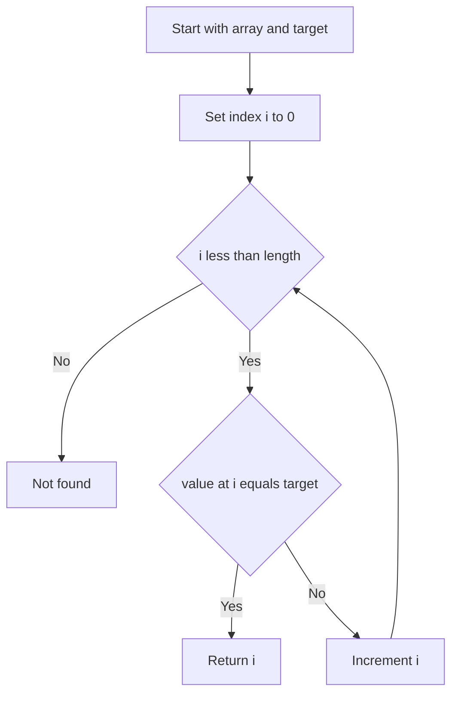

---
topic:
  - Computer Science
subtopic:
  - Algorithms
summary: "Scans elements one at a time until a match, assuming nothing about the data; O(n) but the always-works fallback."
level:
  - "4"
priority: Medium
status: Done
publish: true
---

# Intro

Linear Search finds a target by scanning elements one at a time from start to end, comparing each against the target until it matches or the sequence runs out. It makes no assumptions about the data: no sorting, no index, no random access. That gives `O(n)` time but also unmatched generality — it is the fallback that always works. Example: finding the first log line that mentions an error in a freshly captured, unsorted buffer.

## How It Works

- Walk the sequence left to right, comparing each element with the target.
- Return the index on the first match; return a sentinel (e.g. `-1`) if the scan ends with no match.
- Nothing is ever eliminated in advance — every unchecked element remains a candidate — which is exactly why it tolerates unsorted input where [[Binary Search]] cannot.
- Complexity: `O(n)` time (worst and average case), `O(1)` extra space; best case `O(1)` when the target is first.

## Visualization

This uses the **same array and target** as [[Binary Search]]. Count the probes: linear search makes 15 comparisons to reach index 14, while binary search finds it in 4 — the O(n) vs O(log n) gap made concrete. Notice that linear search never greys out any bar, because it eliminates nothing; binary search fades out each discarded half.

```steptrace
{"algorithm":"linear-search","array":[4,9,13,18,22,27,31,38,45,52,58,64,70,77,83,91],"target":83}
```

## Example

```csharp
public static int LinearSearch(int[] arr, int target)
{
    for (int i = 0; i < arr.Length; i++)
    {
        if (arr[i] == target)
        {
            return i;
        }
    }

    return -1;
}
```

## Diagram



## Pitfalls

- **Reaching for it at scale** — a linear scan over millions of elements repeated per request is a classic hidden `O(n·q)` cost. If you query the same collection many times, build an index (sort + [[Binary Search]], a [[HashMap]], or a tree) once and amortize.
- **Scanning inside a hot loop** — an innocuous "find" call nested in another loop silently becomes `O(n²)`. Hoist the lookup or replace it with a set/dictionary membership test.
- **Assuming it short-circuits** — the average case is only half the array *when the target is present*. Absent targets and "find all matches" always pay the full `O(n)`; size your budget for the worst case, not the lucky first hit.

## Tradeoffs

| Choice | Linear Search | Alternative | Decision criteria |
| --- | --- | --- | --- |
| vs [[Binary Search]] | O(n), works on any order, no preprocessing | O(log n), requires sorted data | Linear wins on unsorted data, tiny `n`, or one-shot queries where sorting first costs more than it saves; binary wins once data is sorted or searched repeatedly. |
| vs [[HashMap]] lookup | O(n), zero memory overhead, no hashing | O(1) average, extra memory, needs hashable keys | Use a hash for repeated exact-match lookups on large sets; linear scan when the set is tiny, built once and read once, or keys are not hashable. |
| over array vs over tree/list | Contiguous scan, cache-friendly, no per-node indirection | O(log n) tree search chases pointers across the heap | For small `n`, a linear scan of a packed array routinely beats an asymptotically faster tree because it avoids cache misses and branch misprediction. |

## Questions

> [!QUESTION]- When is linear search the *right* choice over binary search?
> - The data is unsorted and will be searched only once — sorting first costs `O(n log n)`, more than the single `O(n)` scan it would enable.
> - `n` is tiny (a handful of elements), where constant factors and cache behavior dominate asymptotic order.
> - The structure has no cheap random access (a singly linked list), so binary search cannot compute a midpoint in `O(1)`.
> - You need to find *all* matches or apply a predicate, not just one exact key.
> - In each case the precondition binary search needs (sorted, random-access) is absent or not worth establishing, so the simpler scan wins in practice.

> [!QUESTION]- Why can a linear scan of an array beat an asymptotically faster tree search?
> - A contiguous array is walked in strict address order, which the CPU prefetcher predicts perfectly, so most accesses hit cache.
> - A balanced tree stores nodes across the heap; each step follows a pointer to an unpredictable address, often causing a cache miss.
> - For small `n` the `O(log n)` node count is small, so the miss penalty per node outweighs the reduced number of comparisons.
> - Big-O ignores the constant factor of a memory access, which can span two orders of magnitude between L1 and main memory — so measure on realistic sizes before assuming the lower-complexity structure is faster.

> [!QUESTION]- What is the average number of comparisons for a successful vs unsuccessful linear search?
> - Successful search over `n` elements averages `(n + 1) / 2` comparisons, assuming each position is equally likely to hold the target.
> - Unsuccessful search always performs all `n` comparisons before concluding the target is absent.
> - This means "not found" is the true worst case and it happens on every miss, not rarely.
> - Budget capacity and latency for the full `O(n)`; the halved average only applies to guaranteed hits with uniform positions.

## References

- [Linear search (Wikipedia)](https://en.wikipedia.org/wiki/Linear_search) — average/worst-case analysis and the sentinel-value optimization that removes the bounds check from the loop.
- [Array.IndexOf method (.NET API)](https://learn.microsoft.com/dotnet/api/system.array.indexof) — the framework's built-in linear scan; returns `-1` when the value is absent.
- [Latency numbers every programmer should know (Jeff Dean)](https://gist.github.com/jboner/2841832) — the L1-cache vs main-memory gap that explains why a cache-friendly linear scan can beat a pointer-chasing structure at small sizes.
