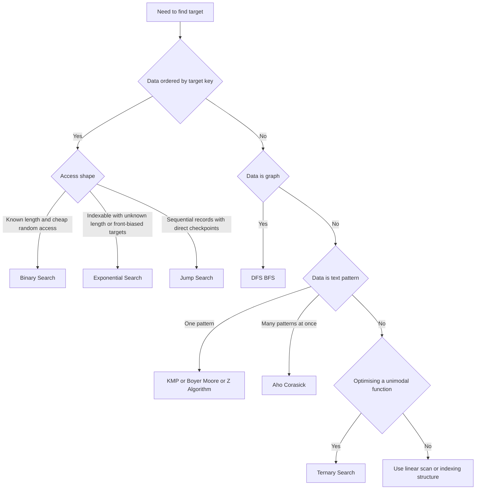

---
topic:
  - Computer Science
subtopic:
  - Algorithms
summary: "Techniques to find target values in arrays, graphs, or text, chosen by data ordering and shape."
tags: [FolderNote]
publish: true
priority: Medium
level:
  - "4"
status: Creation
---

Search starts with the shape of the data, not an algorithm name. An unsorted sequence usually needs a scan. Sorted random-access data can discard ranges, graph search follows edges, and text matching uses structure inside the pattern.

The workload matters too. A single lookup may not justify preprocessing, while repeated queries can repay the cost of sorting or building an index. Worst-case guarantees, memory, and update frequency then decide between the candidates that remain.

```datacorejsx
const { FolderStructureMap } = await dc.require("Assets/components/devbook-folder-map.jsx");
return FolderStructureMap;
```

# Diagram



# Algorithm Selection

## Searching an Array

| Data shape | Algorithm | Time | Precondition |
| --- | --- | --- | --- |
| Unsorted array, linked list, or one-pass stream | [[Linear Search]] | O(n) | None. Needs no index or random access |
| Sorted array | [[Binary Search]] | O(log n) | Sorted, random access |
| Sorted array, Fibonacci-offset probing | [[Home/Computer Science/Algorithms/Search Algorithms/Fibonacci Search|Fibonacci Search]] | O(log n) | Sorted, random access. Useful when division-free offset updates matter |
| Sorted, unknown length or target near front | [[Exponential Search]] | O(log(i + 1)) for target at index i | Sorted, indexable/random-access. Unknown length needs a detectable end |
| Sorted, uniformly distributed keys | [[Interpolation Search]] | O(log log n) avg, O(n) worst | Sorted **and** near-uniform **numeric** distribution |
| Sorted sequential records with explicit checkpoints | [[Jump Search]] | O(√n) | Sorted. Direct jump links and a route into the final block |
| Unimodal function, not an array | [[Ternary Search]] | O(log n) probes | Strict unimodality |

Binary Search also supports lower bounds, upper bounds, insertion points, and duplicate boundaries. Those operations are often the reason to preserve sorted order instead of building an exact-match hash index.

## Searching Text

Text search compares a pattern with positions inside a larger sequence rather than looking up an ordered key. [[Home/Computer Science/Algorithms/Search Algorithms/String Matching/String Matching|String Matching]] compares the preprocessing and skip rules used for that workload.

| Data shape | Algorithm | Time | Precondition |
| --- | --- | --- | --- |
| Text + one pattern | [[KMP (Knuth-Morris-Pratt) Algorithm\|KMP]] | O(n + m) | — |
| Text + one pattern, large alphabet | [[Boyer-Moore]] | O(n/m) best, O(n) with Galil | Sublinear in practice. Powers `grep` |
| Text + one pattern, prefix-structure problems | [[Z-Algorithm]] | O(n + m) | — |
| Text + many patterns at once | [[Aho-Corasick]] | O(n + matches) after build | Build cost is sum of pattern lengths |
| Text + rolling / multi-pattern hashing | [[Rabin Karp Search\|Rabin–Karp]] | O(n + m) avg | Good hash to avoid collisions |

## Searching a Graph

| Data shape | Algorithm | Time | Precondition |
| --- | --- | --- | --- |
| Graph (unweighted) | [[DFS BFS\|BFS / DFS]] | O(V + E) | — |
| Graph (weighted) | See [[Home/Computer Science/Algorithms/Graph Algorithms/Graph Algorithms\|Graph Algorithms]] | — | [[Dijkstra]], [[A-Star Search\|A* Search]], [[Bellman-Ford]] |

# References

- [Search algorithm (Wikipedia)](https://en.wikipedia.org/wiki/Search_algorithm)
