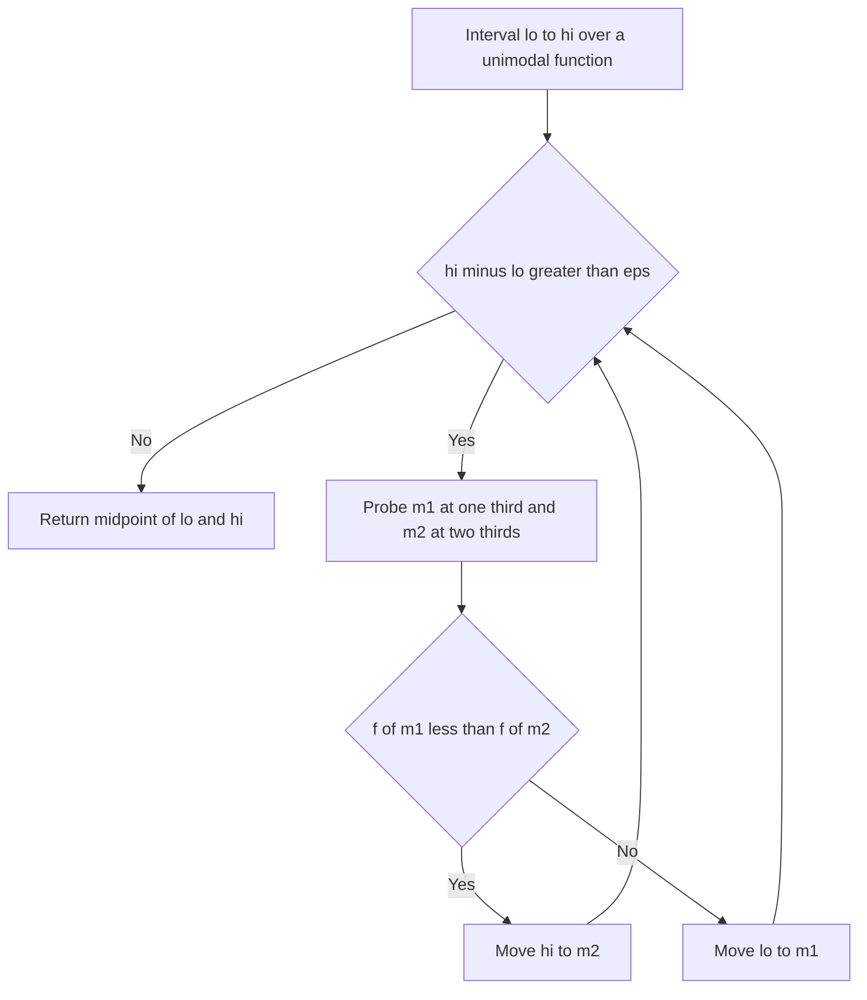

---
topic:
  - Computer Science
subtopic:
  - Algorithms
level:
  - "4"
priority: Medium
status: Creation
publish: true
---

# Intro

Ternary search splits a range into three parts using two interior probes instead of one, then discards the part that cannot contain the answer. On a **sorted array** this is strictly worse than [[Binary Search]]: each level costs two comparisons and shrinks the range to a third, so the total is `2·log₃ n ≈ 1.82·ln n` comparisons versus binary search's `log₂ n ≈ 1.44·ln n`. Never reach for it to look up a value in a sorted array — binary search wins.

Its real job is the one binary search cannot do: finding the **extremum of a unimodal function** — a function that strictly increases up to a single peak then strictly decreases (or the mirror for a valley). There is no ordering to binary-search against, but comparing two interior points `f(m1)` and `f(m2)` tells you which side the peak lies on, and that is enough to discard a third of the interval each step. This shows up in convex optimization over one parameter, geometry problems (closest point on a parabola), and [[Binary Search on Answer|parametric search]] where the objective is unimodal rather than monotonic.

## How It Works

For a function with a single **maximum** on `[lo, hi]`:

1. Pick two probes `m1 = lo + (hi − lo)/3` and `m2 = hi − (hi − lo)/3`.
2. If `f(m1) < f(m2)`, the peak cannot be left of `m1`, so set `lo = m1`. Otherwise it cannot be right of `m2`, so set `hi = m2`.
3. Repeat. Each iteration keeps `2/3` of the interval.

- **Continuous form** — loop while `hi − lo > eps` for a tolerance `eps`, then return the midpoint. The interval shrinks geometrically, so it takes `log_{3/2}(range/eps)` iterations.
- **Integer form** — loop while `hi − lo > 2`, then linearly scan the two or three remaining indices for the best value. Stopping earlier and finishing with a tiny scan avoids the off-by-one traps that plague integer three-way splits.
- **Golden-section search** — a constant-factor improvement: choose the two probes at the golden ratio so that one of them is **reused** as an interior probe on the next iteration. That cuts function evaluations from two per step to one, which matters when `f` is expensive (a simulation, a physical measurement) rather than an array lookup.

Complexity: `O(log((hi − lo)/eps))` evaluations for the continuous form, `O(log n)` for the integer form — but with a worse constant than binary search, so it only pays off when the problem is genuinely unimodal rather than monotonic. Space is `O(1)`.

## Example

```csharp
// Finds the argument minimizing a unimodal (convex-ish) function on [lo, hi].
public static double TernarySearchMin(Func<double, double> f, double lo, double hi, double eps = 1e-9)
{
    while (hi - lo > eps)
    {
        double m1 = lo + (hi - lo) / 3.0;
        double m2 = hi - (hi - lo) / 3.0;

        if (f(m1) < f(m2))
        {
            hi = m2;   // minimum is not to the right of m2
        }
        else
        {
            lo = m1;   // minimum is not to the left of m1
        }
    }

    return (lo + hi) / 2.0;
}
```

## Diagram



## Pitfalls

- **Flat plateau breaks strict unimodality** — if the function is constant over a stretch, `f(m1) == f(m2)` gives no information about which side to keep, and whichever branch you pick can throw away the interval holding the true extremum. Ternary search requires *strict* increase-then-decrease. For a discrete function with ties, fall back to scanning the plateau or reformulate the objective.
- **Applying it to a sorted array** — a common interview misfire. Three-way splitting a monotone sequence is legal but does strictly more comparison work than [[Binary Search]] for the same range reduction; there is no scenario where it is the right lookup tool.
- **`eps` too small for the float type** — set `eps` below the machine precision of `double` and `hi − lo` never crosses it, so the loop spins forever. Bound the iteration count as well, or size `eps` to the problem's real resolution.

## Tradeoffs

| Choice | Ternary Search | Alternative | Decision criteria |
| --- | --- | --- | --- |
| vs [[Binary Search]] on sorted data | `O(log n)`, `2·log₃ n` comparisons, monotone or unimodal | `O(log n)`, `log₂ n` comparisons, monotone only | Always prefer binary search for array lookups; use ternary only when the target is a unimodal *extremum*, not an ordered value. |
| vs golden-section search | 2 function evaluations per step | 1 reused evaluation per step | When `f` is costly, golden-section halves evaluations for the same convergence; ternary is fine when `f` is a cheap array index. |
| Continuous vs integer form | loop to `eps`, return midpoint | loop to width 3, scan the rest | Use the continuous form for real-valued domains; switch to integer form and a final linear scan when the domain is discrete to dodge rounding traps. |

## Questions

> [!QUESTION]- Why is ternary search the wrong choice for looking up a value in a sorted array?
> - Each level of ternary search spends two comparisons to shrink the range to one third, costing `2·log₃ n ≈ 1.82·ln n`.
> - Binary search spends one comparison to shrink to one half, costing `log₂ n ≈ 1.44·ln n`.
> - Both are `O(log n)`, but ternary's constant factor is strictly larger — more work for the same result.
> - The three-way split buys nothing on monotone data; reserve ternary search for unimodal extremum finding, where binary search does not apply at all.

> [!QUESTION]- Why can ternary search find a unimodal maximum when binary search cannot?
> - Binary search needs a single comparison at one point to decide which half to keep, which requires a monotone ordering.
> - A unimodal function is not monotone, so one probe cannot tell you which side of the peak you are on.
> - Two probes `f(m1)` and `f(m2)` do: whichever is smaller lies on the far side of the peak, so that third is safe to discard.
> - This is why the algorithm is the tool for one-dimensional convex optimization and geometric extremum problems, not for ordered lookups.

> [!QUESTION]- What is golden-section search and when does it beat plain ternary search?
> - Golden-section search places the two probes at the golden ratio so one probe lands exactly where a probe is needed next iteration.
> - That reused evaluation cuts the cost from two function calls per step to one.
> - The convergence rate per step is slightly slower, but with half the evaluations it wins on total function calls.
> - It matters when `f` is expensive — a simulation or physical measurement — and is irrelevant when `f` is a cheap array read.

## References

- [Ternary search (Wikipedia)](https://en.wikipedia.org/wiki/Ternary_search) — definition, unimodal requirement, and complexity.
- [Ternary search (cp-algorithms)](https://cp-algorithms.com/num_methods/ternary_search.html) — continuous and integer forms with correctness reasoning.
- [Golden-section search (Wikipedia)](https://en.wikipedia.org/wiki/Golden-section_search) — the evaluation-reuse trick and why the golden ratio is optimal.
