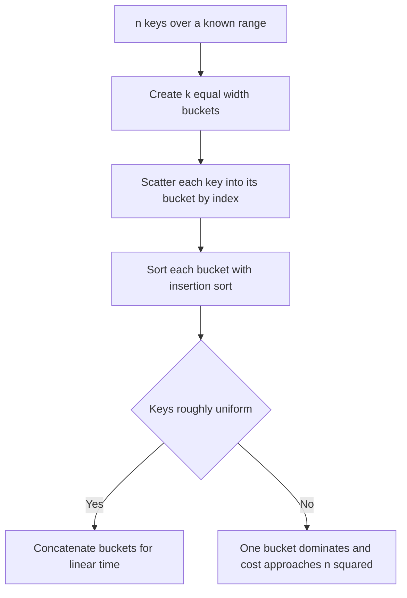

---
topic:
  - Computer Science
subtopic:
  - Algorithms
level:
  - "4"
priority: Medium
status: Creation
publish: true
---

# Intro

Bucket Sort scatters `n` elements into `k` buckets by key range, sorts each bucket independently (usually with [[Insertion Sort]], which is fast on the small near-sorted runs a good partition produces), then concatenates the buckets in order. Like [[Counting Sort]] and [[Radix Sort]], it beats the `Ω(n log n)` comparison lower bound in the average case — that bound only constrains sorts whose sole primitive is *comparing two elements*, and Bucket Sort instead reads each key's magnitude to compute which bucket it belongs in (`bucketIndex = floor(k · (key − min) / (max − min))`). The price for skipping comparisons is a strong assumption about the key domain: the keys must be roughly **uniformly distributed** over a known range, so that each bucket receives about `n / k` elements.

Reach for Bucket Sort when you are sorting floating-point values spread evenly over an interval (sensor readings normalized to `[0, 1)`, geographic coordinates, hash values) and you know the range in advance. Avoid it when the distribution is skewed or unknown — everything can pile into one bucket and it degrades to the cost of the inner sort. When keys are exact discrete integers, [[Counting Sort]] is the specialized cousin; when the key range is large, [[Radix Sort]] is the more robust linear option.

## How It Works

1. **Create** `k` empty buckets covering the key range in equal-width slices.
2. **Scatter** each element into the bucket for its key with an `O(1)` index computation — no comparisons.
3. **Sort** each bucket individually, typically with [[Insertion Sort]] because buckets are small and often nearly sorted.
4. **Gather** — concatenate the buckets in order; the result is fully sorted.

The average-case magic depends entirely on the uniformity assumption. With `n` elements uniformly spread over `k ≈ n` buckets, each bucket holds `O(1)` elements, every inner [[Insertion Sort]] is `O(1)` expected, and the total is `O(n + k)`. The moment the distribution skews, that guarantee collapses.

Complexity:

- **Average (uniform keys, `k ≈ n`)**: `O(n + k)`.
- **Worst case**: `O(n^2)` when all elements land in one bucket and the inner sort is [[Insertion Sort]]. Using an `O(m log m)` comparison sort per bucket instead caps the worst case at `O(n log n)` — trading the linear average for a safer tail.

## Example

```csharp
// Sorts values in [0, 1). Uniform input gives O(n) expected time.
public static void BucketSort(double[] a)
{
    int n = a.Length;
    if (n <= 1) return;

    var buckets = new List<double>[n];
    for (int i = 0; i < n; i++)
        buckets[i] = new List<double>();

    foreach (double x in a)                       // scatter: O(1) index, no comparison
        buckets[(int)(n * x)].Add(x);

    int pos = 0;
    foreach (var bucket in buckets)
    {
        InsertionSort(bucket);                    // stable inner sort; buckets are small when uniform
        foreach (double x in bucket)
            a[pos++] = x;                         // gather in bucket order
    }
}

private static void InsertionSort(List<double> b)
{
    for (int i = 1; i < b.Count; i++)
    {
        double key = b[i];
        int j = i - 1;
        while (j >= 0 && b[j] > key)              // strict >, so equal keys never swap: stable
        {
            b[j + 1] = b[j];
            j--;
        }
        b[j + 1] = key;
    }
}
```

For keys outside `[0, 1)`, normalize first with `(key − min) / (max − min)`. The scatter step touches each element once with no comparisons; all the ordering work is deferred to the small per-bucket sorts.

**Bucket Sort is stable only if its inner sort is.** Scatter preserves input order within a bucket (elements append in the order they are read) and the gather concatenates buckets in key order, so stability hinges entirely on step 3. [[Insertion Sort]] above is stable; calling .NET's `List<T>.Sort` instead would *not* be, because it is an [[Introsort]] and therefore unstable. That distinction is invisible when sorting bare `double`s, and it silently corrupts order the moment the keys carry satellite data.

## Diagram



## Pitfalls

### Skewed or Clustered Distribution

- **What goes wrong**: if keys cluster, most land in a few buckets and one bucket may hold nearly all `n` elements. The inner [[Insertion Sort]] on that bucket is `O(n^2)`, erasing every advantage.
- **Why it happens**: the `O(n)` average is conditional on uniform spread across buckets; real data (Zipfian, exponential, duplicate-heavy) violates it.
- **How to avoid it**: verify the distribution is roughly uniform, or map keys through a distribution-flattening transform. If you cannot guarantee uniformity, use [[Radix Sort]] or a comparison sort whose worst case is bounded.

### Wrong Bucket Count

- **What goes wrong**: too few buckets makes each inner sort large and slow; too many wastes memory and leaves most buckets empty, adding overhead with no benefit.
- **Why it happens**: the linear average assumes `k` scales with `n` (commonly `k = n`); a fixed small `k` or an enormous `k` breaks the balance.
- **How to avoid it**: choose `k ≈ n` so the expected load per bucket is `O(1)`, and size buckets from the actual data range, not a hard-coded constant.

### Unhandled Range Bounds

- **What goes wrong**: a key equal to `max` computes `bucketIndex = k`, an out-of-bounds slot, and crashes; a key outside the assumed range corrupts the partition.
- **Why it happens**: the index formula maps `[min, max)` onto `[0, k)` as a half-open interval, so the exact maximum falls off the end.
- **How to avoid it**: clamp the index to `k - 1`, or compute the range from the data so no key exceeds `max`.

## Tradeoffs

| Choice | Bucket Sort | Alternative | Decision criteria |
| --- | --- | --- | --- |
| vs [[Counting Sort]] | range buckets, inner sort per bucket | one bucket per distinct key, no inner sort | Bucket Sort for continuous keys over a range; Counting Sort for exact discrete integers with small `k`. |
| vs [[Radix Sort]] | one range partition, distribution-dependent | repeated stable bucketing by digit, distribution-independent | Radix Sort when you need a robust linear sort regardless of distribution; Bucket Sort when keys are known-uniform and you want simplicity. |
| inner sort choice | [[Insertion Sort]] per bucket, `O(n)` avg but `O(n^2)` worst | comparison sort per bucket, `O(n log n)` worst | Insertion Sort when uniformity is trusted; a comparison sort per bucket to cap the worst case when it is not. |

Bucket Sort also generalizes beyond memory. Partitioning keys into ranged buckets is exactly how **external sorts** and the **MapReduce / Spark shuffle** sort data too large for RAM: a partitioner sends each key to the bucket (reducer/partition) for its range, each bucket is sorted independently, and the sorted buckets concatenate in range order. The uniformity assumption reappears there as *data skew* — a hot partition that starves the rest, the distributed-systems face of the one-dominant-bucket worst case.

## Questions

> [!QUESTION]- Why is Bucket Sort only `O(n)` on average, and what breaks that?
> - The scatter step is `O(1)` per element with no comparisons, so cost is dominated by the per-bucket inner sorts.
> - With uniformly distributed keys and `k ≈ n` buckets, each bucket holds `O(1)` elements and every inner sort is `O(1)` expected, giving `O(n + k)` total.
> - Skewed data piles elements into few buckets; a single dominant bucket makes its [[Insertion Sort]] `O(n^2)`, collapsing the average-case win.
> - The uniformity precondition is the whole ballgame — assert it or bound the worst case with a comparison sort per bucket, because on real skewed data Bucket Sort silently degrades to quadratic.

> [!QUESTION]- How do Bucket Sort, Counting Sort, and Radix Sort relate?
> - All three are non-comparison sorts that read key structure to beat the `Ω(n log n)` bound, differing in how they bucket.
> - [[Counting Sort]] uses one bucket per distinct integer key and needs no inner sort — it is Bucket Sort's degenerate case for small discrete ranges.
> - [[Radix Sort]] applies stable bucketing repeatedly, once per digit, which removes Bucket Sort's dependence on a uniform distribution.
> - Choosing among them is really choosing which domain assumption you can afford: exact small integers (Counting), fixed-width keys of any distribution (Radix), or known-uniform continuous keys (Bucket).

> [!QUESTION]- How does Bucket Sort connect to sorting data that does not fit in memory?
> - Partitioning keys into ranged buckets is the same idea used by external merge sorts and the MapReduce / Spark shuffle: a partitioner routes each key to the bucket for its range.
> - Each bucket is sorted independently — on disk, or on a separate reducer — and the sorted buckets concatenate in range order.
> - The uniformity assumption resurfaces as data skew: a hot partition that holds most keys starves the others, exactly the one-dominant-bucket worst case at cluster scale.
> - Understanding Bucket Sort's failure mode is what lets you diagnose and fix a skewed distributed shuffle, so the toy algorithm maps directly onto a real production bottleneck.

## References

- [Bucket sort (Wikipedia)](https://en.wikipedia.org/wiki/Bucket_sort) — average-case analysis, uniform-distribution assumption, and the generalized/MSD radix relationship.
- [Bucket sort and its analysis (CLRS chapter overview, MIT OCW)](https://ocw.mit.edu/courses/6-006-introduction-to-algorithms-spring-2020/) — the expected-time proof under the uniformity assumption.
- [MapReduce: Simplified Data Processing on Large Clusters (Dean and Ghemawat)](https://research.google.com/archive/mapreduce-osdi04.pdf) — the shuffle/partition-then-sort model that bucketing generalizes to out-of-core data.
