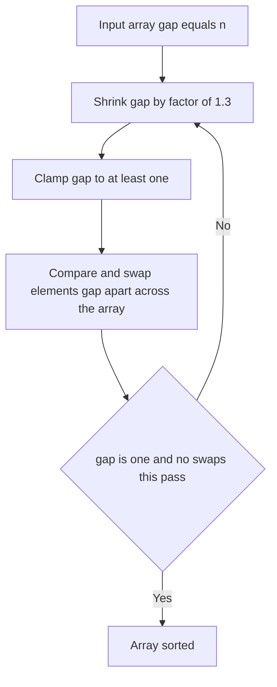

---
topic:
  - Computer Science
subtopic:
  - Algorithms
summary: "Bubble sort with a shrinking gap that kills turtles, curing bubble sort's quadratic flaw in practice."
level:
  - "4"
priority: Medium
status: Creation
publish: true
---

# Intro

Comb sort is [[Bubble Sort]] with a shrinking gap. Where bubble sort always compares adjacent elements (gap `1`), comb sort starts with a large gap — the array length divided by a shrink factor of about `1.3` — and compares elements that far apart, swapping any out of order, then divides the gap by `1.3` again on each pass until it reaches `1`, after which it finishes as an ordinary bubble sort. The point of the gap is to kill **turtles**: small values sitting near the *end* of the array. In plain bubble sort a turtle can only move left one position per pass, so a small element stranded at the tail needs `O(n)` passes to crawl home, which is exactly why bubble sort is slow. A wide gap lets that element leap most of the way in a single comparison.

Comb sort is a genuine improvement over bubble sort — it turns most quadratic inputs into something close to `O(n log n)` in practice — but it is not competitive with [[Shell Sort]] (its gap-based cousin built on [[Insertion Sort]] instead), let alone [[Quick Sort]] or [[Introsort]]. Its real value is pedagogical: it isolates and names the single structural flaw (turtles) that makes bubble sort quadratic, and shows that one cheap change removes it. Do not ship comb sort; ship a library sort.

## How It Works

1. **Initialize** `gap = n`.
2. **Each pass**: set `gap = floor(gap / 1.3)` (clamped to a minimum of `1`). Walk `i` from `0` while `i + gap < n`, comparing `a[i]` with `a[i + gap]` and swapping if they are out of order.
3. **Repeat** passes until a full pass runs with `gap == 1` *and* performs no swaps — at that point the array is sorted.

The shrink factor `1.3` is empirical: it was found (by Lacey and Box, and later refined by Dobosiewicz) to minimize total comparisons across random inputs. A useful refinement is the "combsort11" rule — when the computed gap would be `9` or `10`, force it to `11` — which avoids a bad residual pattern and measurably speeds convergence.

Worst case is still `O(n²)` (you can construct inputs where the gap passes achieve little). In practice comb sort runs in roughly `O(n² / 2^p)` where `p` is the number of gap shrinks, which for random data behaves close to `O(n log n)`. Space is `O(1)`, in place. Comb sort is **not stable**: a wide-gap swap can jump one equal key past another.

## Example

```csharp
public static void CombSort(int[] a)
{
    int n = a.Length;
    int gap = n;
    bool swapped = true;

    while (gap > 1 || swapped)
    {
        // Shrink the gap by ~1.3 each pass, floor at 1.
        gap = (int)(gap / 1.3);
        if (gap < 1) gap = 1;

        swapped = false;
        for (int i = 0; i + gap < n; i++)
        {
            if (a[i] > a[i + gap])
            {
                (a[i], a[i + gap]) = (a[i + gap], a[i]);
                swapped = true;
            }
        }
    }
}
```

Take `[5, 2, 8, 1, 9, 3, 7, 0]` (`n = 8`). The first gap is `8 / 1.3 = 6`, comparing `a[0]↔a[6]` and `a[1]↔a[7]` — this immediately drags the trailing `0` (a turtle) six positions left in one swap, work that plain bubble sort would spread across six separate passes. Subsequent gaps `4, 3, 2, 1` clean up the rest, and the final `gap == 1` pass confirms order.

## Diagram



## Pitfalls

- **The final gap-1 pass is not optional.** Comb sort is only *guaranteed* correct because it keeps running full passes until a `gap == 1` pass makes zero swaps — the loop condition is `gap > 1 || swapped`. Stopping when the gap first reaches `1` (without the no-swap check) can leave adjacent inversions the wide passes never touched. This is the same "did anything move" termination test that bubble sort needs.
- **The shrink factor is not free to change.** `1.3` is empirically tuned; larger factors shrink the gap too slowly (extra passes) and smaller ones collapse to bubble sort too fast (turtles survive). Values that make the gap pass through `9` or `10` also hit a known bad pattern — the combsort11 fix forcing those to `11` exists precisely because a plausible-looking factor degraded performance.
- **It is still not the right tool.** Comb sort's headline is "better than bubble sort," which is a low bar. Its `O(n²)` worst case remains, it is not stable, and [[Shell Sort]] applies the same shrinking-gap idea to the stronger [[Insertion Sort]] base and wins. In production, reach for [[Introsort]] or [[Tim Sort]]; use comb sort to explain a concept, not to sort data.

## Tradeoffs

| Choice | Comb Sort | Alternative | Decision criteria |
| --- | --- | --- | --- |
| vs [[Bubble Sort]] | `O(n² / 2^p)` typical, kills turtles | `O(n²)`, turtles crawl one slot per pass | Comb sort strictly dominates bubble sort on almost every input at the same code complexity; there is no reason to pick bubble sort except to teach the naive baseline. |
| vs [[Shell Sort]] | Shrinking gap over bubble-style swaps | Shrinking gap over insertion sort | Both use decreasing gaps; Shell sort's insertion-based passes leave less residual disorder and it is the better constrained-environment choice — prefer it whenever you were tempted by comb sort. |
| vs [[Introsort]] / [[Tim Sort]] | `O(n²)` worst, not stable, `O(1)` space | `O(n log n)` guaranteed | For any real workload use the bounded library sort; comb sort's only edge is conceptual simplicity, which production code does not reward. |

## Questions

> [!QUESTION]- What is a "turtle" and why does it make bubble sort slow?
> - A turtle is a small value near the *end* of the array; bubble sort's forward passes move small values leftward only one position per pass.
> - So a small element stranded at the tail needs `O(n)` passes to reach the front, which is the dominant cost that keeps bubble sort at `O(n²)`.
> - Large values near the front ("rabbits") are not the problem — they move right quickly — the asymmetry is what hurts.
> - Comb sort fixes exactly this by starting with a wide gap so a turtle jumps most of the way home in one comparison — naming the failure mode is more useful than the algorithm itself.

> [!QUESTION]- How does comb sort's shrinking gap relate to Shell sort's?
> - Both start with a large gap and shrink it to `1`, using the wide gaps to move elements a long way cheaply and the final `gap = 1` pass to finish.
> - Comb sort applies the gap to [[Bubble Sort]]-style adjacent-comparison-and-swap; [[Shell Sort]] applies it to [[Insertion Sort]], which shifts a run of elements to open a hole.
> - Insertion sort leaves each subsequence fully sorted per pass, so Shell sort carries less residual disorder forward and performs better.
> - They are the same idea on two different bases, and the stronger base wins — which is why Shell sort, not comb sort, is the one that survives into real constrained-environment code.

> [!QUESTION]- Is comb sort ever the right production choice?
> - Its worst case is still `O(n²)`, it is not stable, and typical performance only approximates `O(n log n)`.
> - [[Shell Sort]] beats it with the same gap idea on a better base, and [[Introsort]] / [[Tim Sort]] beat both with guaranteed `O(n log n)`.
> - Its one advantage is that it is trivially short and explains, in a few lines, *why* bubble sort is quadratic.
> - Treat it as a teaching device, not a tool — if you find yourself typing comb sort into shipping code, you wanted a library sort instead.

## References

- [Comb sort (Wikipedia)](https://en.wikipedia.org/wiki/Comb_sort) — the `1.3` shrink factor, the combsort11 refinement, and the turtle/rabbit intuition.
- [A Comb Sort (Stephen Lacey and Richard Box, BYTE, April 1991)](https://en.wikipedia.org/wiki/Comb_sort#References) — the article that popularized the algorithm and the empirical shrink factor.
- [Sorting algorithms comparison (Big-O Cheat Sheet)](https://www.bigocheatsheet.com/) — time and space complexity of comb sort next to the standard sorts.
