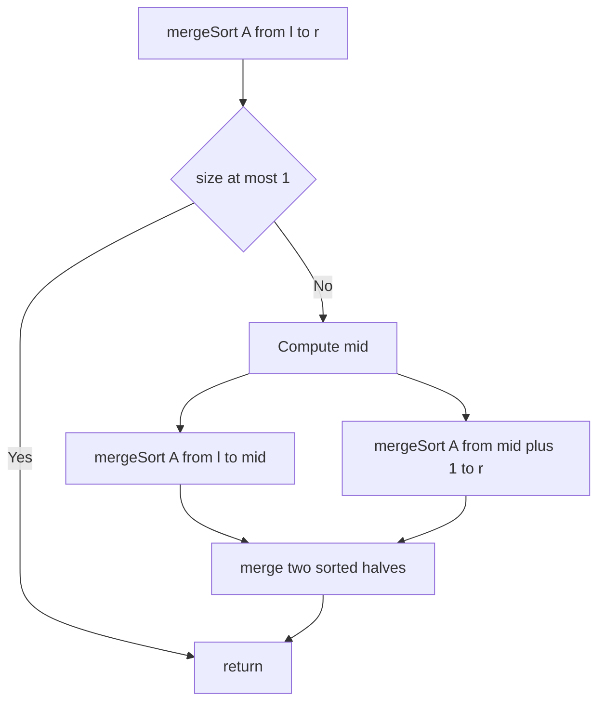

---
topic:
  - Computer Science
subtopic:
  - Algorithms
summary: "Divide-and-conquer sort that is stable and O(n log n) in all cases at the cost of O(n) space."
level:
  - "4"
priority: Low
status: Ready to Repeat
publish: true
---
# Intro

Merge sort is a divide-and-conquer algorithm: split the array in half, recursively sort each half, then merge the two sorted halves into one. It guarantees O(n log n) time in all cases and is stable, at the cost of O(n) extra memory. It is the algorithm of choice when stability matters or when sorting linked lists and external data.
## Mechanism

Recursively split until each partition has size 1 (trivially sorted). Then merge pairs of sorted partitions by repeatedly taking the smaller front element from the two halves.



## Visualization

The card animates the split-then-merge: blue marks the pair being compared at the heads of the two halves, violet marks the element being moved into place, and bars turn green with a white check as a merged run locks into sorted order. The i/j pins track the two read heads; WATCH shows i, j, and the swap count — watch sorted runs double in width with each round of merging.

```steptrace
{"algorithm":"merge-sort","array":[8,3,5,1,9,2,7,4]}
```

## Complexity

| Case | Time | Space |
|------|------|-------|
| Best | O(n log n) | O(n) |
| Average | O(n log n) | O(n) |
| Worst | O(n log n) | O(n) |

**Properties:** stable, not in-place (requires O(n) merge buffer for arrays), O(1) extra space for linked lists.

## C# Implementation

```csharp
public static void MergeSort(int[] a, int left, int right)
{
    if (left >= right) return;

    int mid = left + (right - left) / 2;
    MergeSort(a, left, mid);
    MergeSort(a, mid + 1, right);
    Merge(a, left, mid, right);
}

private static void Merge(int[] a, int left, int mid, int right)
{
    int[] temp = new int[right - left + 1];
    int i = left, j = mid + 1, k = 0;

    while (i <= mid && j <= right)
        temp[k++] = a[i] <= a[j] ? a[i++] : a[j++];

    while (i <= mid)  temp[k++] = a[i++];
    while (j <= right) temp[k++] = a[j++];

    Array.Copy(temp, 0, a, left, temp.Length);
}
```

## When to Use

- **Stability required:** merge sort preserves the relative order of equal elements. Use when sorting objects by a secondary key after a primary sort.
- **Linked lists:** merge sort is O(1) extra space on linked lists (no random access needed for merging).
- **External sorting:** sorting data that does not fit in memory — merge sort's sequential access pattern maps well to disk I/O.
- **Predictable worst case:** unlike quick sort, merge sort never degrades to O(n²).

For in-memory array sorting where stability is not required, `Array.Sort` (introsort) is typically faster due to better cache behavior.

### Bottom-up variant and counting inversions

The recursive version above is **top-down**. A **bottom-up** merge sort skips recursion entirely: merge adjacent runs of width 1, then 2, then 4… doubling each pass. Same O(n log n), but no recursion stack — handy for very large arrays or stack-constrained environments.

Merge sort's merge step also solves a classic problem for free: **counting inversions** (pairs out of order, a measure of "how unsorted" data is). When the right half's front element is taken before the left half is exhausted, every remaining left element forms an inversion — so you can count all inversions in O(n log n) instead of the brute-force O(n²).

## Pitfalls

### Allocating a New Buffer on Every Merge Call

**What goes wrong**: a naive implementation allocates a new `int[]` temp buffer inside every `Merge` call. For n=1,000,000, this creates ~2,000,000 small allocations, causing significant GC pressure and slowing the sort by 2–5×.

**Mitigation**: allocate a single temp buffer of size n once before the sort begins and pass it through all recursive calls. This reduces allocations from O(n log n) to O(1).

### Using Merge Sort When Stability Is Not Required

**What goes wrong**: merge sort is used for general-purpose sorting where stability is not needed. It is 20–40% slower than quick sort (introsort) in practice due to the O(n) auxiliary array and cache-unfriendly merge step.

**Mitigation**: use `Array.Sort` (introsort) for general-purpose in-memory sorting. Use merge sort (or `Array.Sort` with a stable comparer, or LINQ `OrderBy`) only when stability is required.

**Decision rule**: use merge sort when stability is required or when sorting linked lists (O(1) extra space on linked lists). For in-memory array sorting without stability requirements, use `Array.Sort` (introsort). For nearly-sorted data, Timsort (Python/Java default) is optimal.


## Questions

> [!QUESTION]- Why is merge sort preferred over quick sort for linked lists?
> Merge sort requires no random access — it only needs to traverse lists sequentially and re-link nodes. The merge step is O(1) extra space on linked lists (just pointer manipulation, no copy buffer). Quick sort's partitioning requires random access to swap elements by index, which is O(n) on a linked list. For linked list sorting, merge sort is O(n log n) time and O(1) extra space; quick sort degrades to O(n²) or requires O(n) extra space.

> [!QUESTION]- When does merge sort's O(n) space cost become a real problem?
> When sorting large datasets in memory-constrained environments: sorting 1 GB of data requires another 1 GB merge buffer. For external sorting (data larger than RAM), merge sort's sequential access pattern is actually an advantage — it maps well to disk I/O. For in-memory sorting where stability is not required and memory is constrained, quick sort (in-place, O(log n) stack) is the better choice.


## References

- [Merge sort (Wikipedia)](https://en.wikipedia.org/wiki/Merge_sort) — algorithm description, stability proof, and external sort variant.
- [Merge sort (cp-algorithms)](https://cp-algorithms.com/sorting/merge_sort.html) — implementation details and inversion count application.

- [Timsort (Wikipedia)](https://en.wikipedia.org/wiki/Timsort) — the hybrid sort used by Python and Java; built on merge sort's merge step with insertion sort for small runs; the production evolution of merge sort.
- [Sorting algorithms comparison (Big-O Cheat Sheet)](https://www.bigocheatsheet.com/) — quick reference for time and space complexity of all common sorting algorithms.
