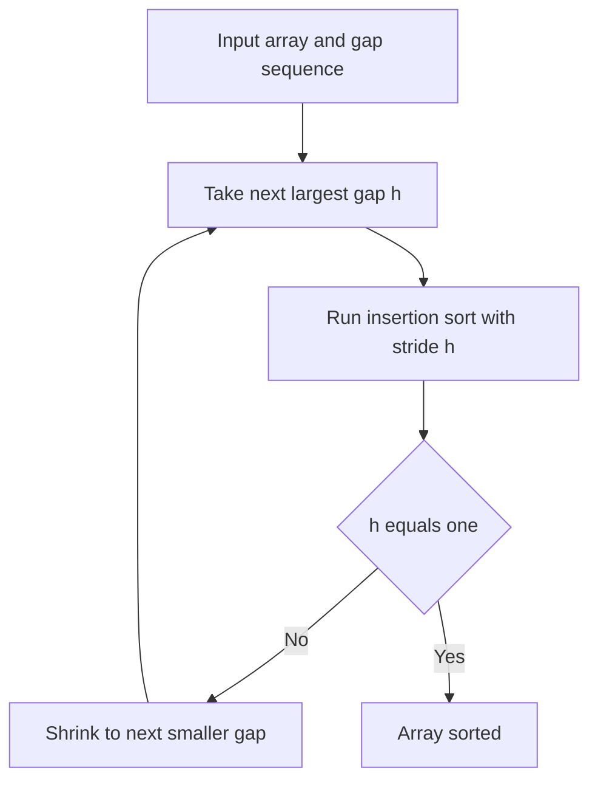

---
topic:
  - Computer Science
subtopic:
  - Algorithms
summary: "Runs insertion sort over decreasing gaps so elements jump far, beating O(n²) with no recursion or scratch memory."
level:
  - "4"
priority: Medium
status: Creation
publish: true
---

# Intro

Shell sort runs [[Insertion Sort]] over `h`-spaced subsequences of the array, repeating with a decreasing sequence of gaps `h` that ends at `h = 1`. A pass with gap `h` sorts every subsequence of elements `h` positions apart; the final pass (`h = 1`) is an ordinary insertion sort. The insight is that plain insertion sort only ever swaps *adjacent* elements, so an element that belongs `k` positions away needs `k` moves to get there — catastrophic on a reverse-sorted array. Large gaps let an element jump most of that distance in a single comparison, and because insertion sort is `O(n)` on nearly-sorted input, every gap pass makes the array "more sorted" so the expensive `h = 1` pass has almost nothing left to do.

Reach for Shell sort in constrained environments — embedded firmware, bootloaders, small C libraries — where you want to beat `O(n²)` without the recursion, the `O(n)` scratch buffer, or the code size of [[Merge Sort]] or [[Quick Sort]]. It ships in uClibc's `qsort`, for example. For general-purpose sorting on a real machine, prefer [[Introsort]] or [[Tim Sort]]: they are asymptotically better and, unlike Shell sort, come with a guaranteed bound.

## How It Works

1. **Pick a gap sequence** `h_t > … > h_2 > h_1 = 1` (see the complexity note — this choice *is* the algorithm's performance).
2. **For each gap `h`, in decreasing order**, run a gapped insertion sort: for every `i` from `h` to `n − 1`, save `key = a[i]`, then shift elements `a[i − h], a[i − 2h], …` that exceed `key` forward by `h`, and drop `key` into the resulting hole. This is exactly [[Insertion Sort]] with a stride of `h` instead of `1`, interleaving `h` independent subsequences.
3. **The last pass is `h = 1`** — a full insertion sort, but now over data that every prior pass has already brought close to sorted, so it runs in near-linear time.

Complexity depends *entirely* on the gap sequence. Shell's original `n/2, n/4, …, 1` is `O(n²)` worst case. Hibbard's `2^k − 1` (`1, 3, 7, 15, …`) gives `O(n^1.5)`. Ciura's empirically tuned `1, 4, 10, 23, 57, 132, 301, 701` is the best known in practice, with no proven tight bound. Space is `O(1)` — it sorts fully in place. Shell sort is **not stable**: gapped moves jump equal keys past one another.

## Example

```csharp
public static void ShellSort(int[] a)
{
    int n = a.Length;

    // Ciura's gap sequence, extended above 701 by the common *2.25 rule.
    int[] gaps = { 701, 301, 132, 57, 23, 10, 4, 1 };

    foreach (int gap in gaps)
    {
        if (gap >= n) continue;

        // Gapped insertion sort: h independent subsequences, interleaved.
        for (int i = gap; i < n; i++)
        {
            int key = a[i];
            int j = i;
            while (j >= gap && a[j - gap] > key)
            {
                a[j] = a[j - gap];   // shift by a whole gap, not by one
                j -= gap;
            }
            a[j] = key;
        }
    }
}
```

On `[9, 8, 7, 6, 5, 4, 3, 2, 1]` with gap `4`, the first pass compares positions `{0,4,8}`, `{1,5}`, `{2,6}`, `{3,7}` and already drags the largest values toward the end. By the time the `gap = 1` pass runs, no element is more than a couple of slots from home, so the final insertion sort is nearly linear instead of the `~36` swaps plain insertion sort would need here.

## Diagram



## Pitfalls

- **The gap sequence is the whole game.** Shell's original `n/2^k` sequence is not just slow in theory — every gap except the last is *even*, so elements at even indices are never compared with elements at odd indices until the final `h = 1` pass. That defeats the point and drags the worst case back to `O(n²)`. Use Ciura's sequence (or Hibbard/Sedgewick), whose gaps are coprime enough to mix positions early.
- **Do not expect stability.** Because a single move relocates an element by `h` positions, equal keys routinely leapfrog each other. If you are sorting records by a secondary key, Shell sort will scramble the primary order — use [[Insertion Sort]], [[Merge Sort]], or [[Tim Sort]] instead.
- **No guaranteed bound to lean on.** The best practical sequence (Ciura) has *no proven* asymptotic bound, and tuned sequences are calibrated for arrays of a few thousand elements. For large or adversarial inputs where you need a contractual `O(n log n)`, Shell sort cannot give it — [[Heap Sort]] or [[Introsort]] can.

## Tradeoffs

| Choice | Shell Sort | Alternative | Decision criteria |
| --- | --- | --- | --- |
| vs [[Insertion Sort]] | `O(n^1.5)` with a good gap sequence, in place | `O(n²)`, in place, stable | Use plain insertion sort only for tiny (`n ≤ 32`) or nearly-sorted arrays where stability matters; Shell sort wins the moment `n` grows into the thousands. |
| vs [[Quick Sort]] / [[Introsort]] | `O(n^1.5)`, `O(1)` space, no recursion | `O(n log n)` avg, `O(log n)` stack | Prefer Shell sort only when recursion and heap allocation are unwelcome (embedded, kernel, tiny libc); otherwise a library `O(n log n)` sort is faster and bounded. |
| Gap sequence | Ciura `1,4,10,23,57,132,301,701` | Shell `n/2^k` | Ciura is the empirical best for `n` up to ~10⁵; the naive `n/2` powers-of-two sequence keeps even and odd indices apart and degrades to `O(n²)`. |

## Questions

> [!QUESTION]- Why is Shell sort faster than plain insertion sort even though the final pass is a full insertion sort?
> - Plain insertion sort only swaps adjacent elements, so an element `k` slots from its home takes `k` moves — `O(n²)` on reverse-sorted data.
> - Large-gap passes let an element jump `h` positions per move, clearing most long-distance disorder cheaply and early.
> - Insertion sort is `O(n)` on nearly-sorted input, so after the coarse passes the final `h = 1` pass has almost nothing left to move.
> - The work is front-loaded into cheap coarse passes so the one expensive pass never actually gets expensive — that reshaping of *where* the work happens, not a better comparison, is the whole speedup.

> [!QUESTION]- Why does the choice of gap sequence change Shell sort's complexity class?
> - Each gap pass only guarantees the array is "`h`-sorted"; how much residual disorder survives into the next pass depends on how the gaps interleave positions.
> - Shell's original `n/2^k` keeps all gaps even until the last, so odd and even indices never mix until `h = 1`, leaving `O(n²)` work.
> - Hibbard's `2^k − 1` mixes positions and provably reaches `O(n^1.5)`; Ciura's tuned sequence is the best measured but has no proven bound.
> - The gap sequence is a tunable parameter that moves the whole algorithm between `O(n²)` and `O(n^1.5)`, which is why Shell sort is really a *family* of algorithms rather than one — pick the sequence deliberately.

> [!QUESTION]- When would you deploy Shell sort in real code today?
> - In constrained environments — bootloaders, firmware, minimal C libraries like uClibc's `qsort` — where recursion depth, an `O(n)` merge buffer, and code size all matter.
> - It is short, purely iterative, in place with `O(1)` space, and needs no auxiliary allocation, so it degrades gracefully under memory pressure.
> - On a general-purpose machine it is beaten by [[Introsort]] and [[Tim Sort]], which are asymptotically better and bounded.
> - Choose it when the operating constraints, not the input size, are the binding limit — otherwise a library `O(n log n)` sort is the right default.

## References

- [Shellsort (Wikipedia)](https://en.wikipedia.org/wiki/Shellsort) — gap sequences, the `O(n^1.5)` analysis, and the open problem of the optimal sequence.
- [Best Increments for the Average Case of Shellsort (Marcin Ciura, 2001)](https://web.archive.org/web/20180923235211/http://sun.aei.polsl.pl/~mciura/publikacje/shellsort.pdf) — the paper that derived the `1, 4, 10, 23, 57, 132, 301, 701` sequence.
- [Shellsort (Princeton Algorithms)](https://algs4.cs.princeton.edu/21elementary/) — Sedgewick's treatment with `h`-sorting intuition and gap-sequence experiments.
