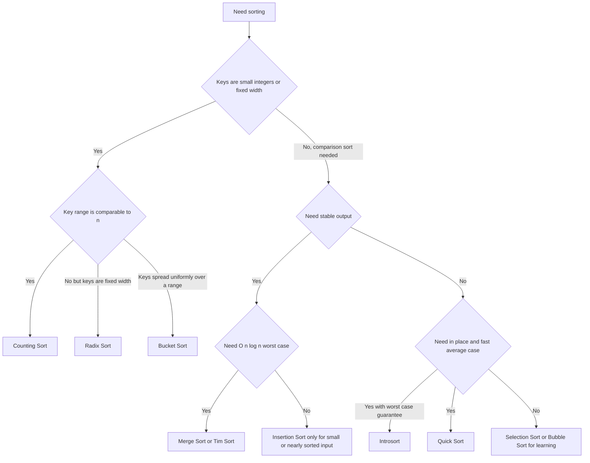

---
topic:
  - Computer Science
subtopic:
  - Algorithms
tags:
  - FolderNote
publish: true
priority: Medium
level:
  - '4'
status: Creation
---

# Intro

Sorting is a foundational operation that impacts performance all over the stack: databases, UIs, pipelines, and in-memory processing. The important part is not memorizing algorithms, but understanding stability, memory tradeoffs, and typical runtime behavior. Example: mergesort is stable and predictable, while quicksort is often fast in practice but has worst-case pitfalls.

## Diagram

## Algorithm Selection

### Comparison sorts — bounded below by `O(n log n)`

| Algorithm | Average | Worst | Space | Stable | Reach for it when |
| --- | --- | --- | --- | --- | --- |
| [[Bubble Sort]] | O(n²) | O(n²) | O(1) | Yes | Teaching only |
| [[Comb Sort]] | ~O(n² / 2^p) | O(n²) | O(1) | No | Teaching why bubble sort is slow |
| [[Selection Sort]] | O(n²) | O(n²) | O(1) | No | Writes are far costlier than reads |
| [[Insertion Sort]] | O(n²) | O(n²) | O(1) | Yes | Tiny or nearly-sorted input; base case of hybrids |
| [[Shell Sort]] | ~O(n^1.3) | O(n^1.5) with Hibbard | O(1) | No | No recursion, no scratch memory (embedded) |
| [[Heap Sort]] | O(n log n) | O(n log n) | O(1) | No | Hard worst-case bound with no extra memory |
| [[Merge Sort]] | O(n log n) | O(n log n) | O(n) | Yes | Stability required; linked lists; external sort |
| [[Quick Sort]] | O(n log n) | O(n²) | O(log n) | No | Cache-friendly in-memory default |
| [[Tim Sort]] | O(n log n) | O(n log n) | O(n) | Yes | Real-world partly-ordered data (Python, Java) |
| [[Introsort]] | O(n log n) | O(n log n) | O(log n) | No | Quicksort's speed without its O(n²) tail (C++, .NET) |

### Non-comparison sorts — beat the bound by reading key structure

| Algorithm | Time | Space | Stable | Precondition |
| --- | --- | --- | --- | --- |
| [[Counting Sort]] | O(n + k) | O(n + k) | Yes | Integer keys in a small range `[0, k)` |
| [[Radix Sort]] | O(d · (n + b)) | O(n + b) | Yes | Fixed-width keys; needs a stable inner sort |
| [[Bucket Sort]] | O(n + k) avg, O(n²) worst | O(n + k) | If inner sort is | Keys roughly uniform over a known range |

## Questions

> [!QUESTION]- How do you choose between Merge Sort and Quick Sort in production?
> - Merge sort gives reliable `O(n log n)` worst-case behavior and stable ordering.
> - Quick sort is often faster in practice on in-memory arrays due to cache behavior.
> - Quick sort has worst-case `O(n^2)` if pivot strategy is poor, so randomized or introspective variants are safer.
> - Why it matters: this choice affects latency tail risk, memory usage, and correctness when stable ordering is required.

> [!QUESTION]- When is Insertion Sort still a good choice?
> - It is strong on very small arrays because constant overhead is tiny.
> - It performs well on nearly sorted data where shifts are minimal.
> - It is commonly used as a base case inside hybrid production sort implementations.
> - Why it matters: knowing this avoids overengineering and explains hybrid sort internals in interviews.

> [!QUESTION]- What does .NET's built-in Array.Sort use, and why?
> .NET uses an introspective sort (IntroSort): it starts with Quick Sort for fast average performance, switches to Heap Sort when recursion depth exceeds a threshold (to guarantee O(n log n) worst case), and uses Insertion Sort for small partitions (to exploit its low overhead on nearly-sorted data).
> This hybrid approach demonstrates why production sort implementations combine multiple algorithms rather than using a single one.

## References

- [Sorting algorithm (Wikipedia)](https://en.wikipedia.org/wiki/Sorting_algorithm)
- [Array Sort method .NET](https://learn.microsoft.com/dotnet/api/system.array.sort)
- [Nearly all binary searches and mergesorts are broken](https://research.google/blog/extra-extra-read-all-about-it-nearly-all-binary-searches-and-mergesorts-are-broken/)
- [Sorting (Sedgewick and Wayne, Algorithms 4th ed.)](https://algs4.cs.princeton.edu/20sorting/) — implementations and empirical performance analysis for the whole family.
