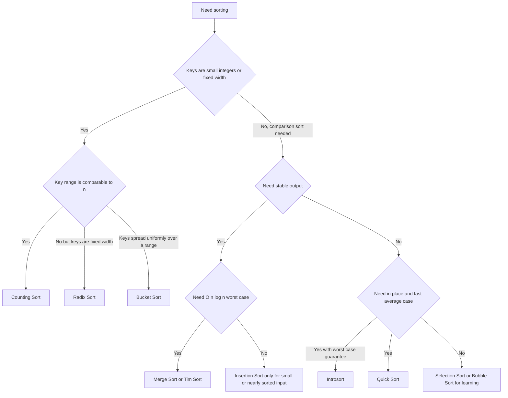

---
topic:
  - Computer Science
subtopic:
  - Algorithms
summary: "Comparing sorting algorithms by stability, memory tradeoffs, and typical runtime behavior to guide production choices."
tags: [FolderNote]
publish: true
priority: Medium
level:
  - "4"
status: Creation
---

Choosing a sorting algorithm is mostly a choice among guarantees. Stability preserves the input order of equal keys. Extra memory may buy predictable merges, while in-place partitioning usually improves locality. Key structure can remove the comparison bound entirely.

The input decides which tradeoff matters. Nearly sorted data favors adaptive algorithms, a small integer range can make counting sort linear, and strict memory limits narrow the field to in-place choices. The tables below keep those boundaries visible instead of treating one algorithm as a universal default.

```datacorejsx
const { FolderStructureMap } = await dc.require("Assets/components/devbook-folder-map.jsx");
return FolderStructureMap;
```

# Diagram


```mermaid
flowchart TD
  A[Need sorting] --> B{Keys are small integers or fixed width}
  B -->|Yes| B1{Key range is comparable to n}
  B1 -->|Yes| B2[Counting Sort]
  B1 -->|No but keys are fixed width| B3[Radix Sort]
  B1 -->|Keys spread uniformly over a range| B4[Bucket Sort]
  B -->|No, comparison sort needed| C{Need stable output}
  C -->|Yes| D{Need O n log n worst case}
  D -->|Yes| E[Merge Sort or Tim Sort]
  D -->|No| F[Insertion Sort only for small or nearly sorted input]
  C -->|No| G{Need in place and fast average case}
  G -->|Yes with worst case guarantee| H[Introsort]
  G -->|Yes| I[Quick Sort]
  G -->|No| J[Selection Sort or Bubble Sort for learning]
```

# Algorithm Selection

## Comparison Sorts — Worst-case lower bound `Ω(n log n)`

| Algorithm | Average | Worst | Space | Stable | Reach for it when |
| --- | --- | --- | --- | --- | --- |
| [[Bubble Sort]] | O(n²) | O(n²) | O(1) | Yes | Teaching only |
| [[Home/Computer Science/Algorithms/Sorting Algorithms/Cocktail Shaker Sort|Cocktail Shaker Sort]] | O(n²) | O(n²) | O(1) | Yes | Teaching bidirectional passes. Moves small tail values forward faster than Bubble Sort |
| [[Home/Computer Science/Algorithms/Sorting Algorithms/Gnome Sort|Gnome Sort]] | O(n²) | O(n²) | O(1) | Yes | Teaching inversion removal with one walking index |
| [[Home/Computer Science/Algorithms/Sorting Algorithms/Bogo Sort|Bogo Sort]] | Θ(n · n!) expected | Unbounded | O(1) | No | Bounded demonstrations only. Random retries make no progress guarantee |
| [[Comb Sort]] | Empirically near O(n log n) on random input. Not guaranteed | O(n²) | O(1) | No | Teaching why bubble sort is slow |
| [[Selection Sort]] | O(n²) | O(n²) | O(1) | No | Writes are far costlier than reads |
| [[Home/Computer Science/Algorithms/Sorting Algorithms/Cycle Sort|Cycle Sort]] | Θ(n²) | Θ(n²) | O(1) | No | Writes are exceptionally expensive and keys can be compared cheaply |
| [[Insertion Sort]] | O(n²) | O(n²) | O(1) | Yes | Tiny or nearly-sorted input. Base case of hybrids |
| [[Home/Computer Science/Algorithms/Sorting Algorithms/Odd-Even Sort|Odd-Even Sort]] | O(n²) sequential | O(n²) sequential | O(1) | Yes | Disjoint neighbor phases will run in parallel. Otherwise teaching only |
| [[Home/Computer Science/Algorithms/Sorting Algorithms/Pancake Sort|Pancake Sort]] | Θ(n²) | Θ(n²) | O(1) | No | The only permitted move is a prefix reversal |
| [[Home/Computer Science/Algorithms/Sorting Algorithms/Stooge Sort|Stooge Sort]] | Θ(n².7095) | Θ(n².7095) | O(log n) | No | Recurrence-analysis exercise only |
| [[Shell Sort]] | ~O(n^1.3) | O(n^1.5) with Hibbard | O(1) | No | No recursion, no scratch memory (embedded) |
| [[Heap Sort]] | O(n log n) | O(n log n) | O(1) | No | Hard worst-case bound with no extra memory |
| [[Merge Sort]] | O(n log n) | O(n log n) | O(n) | Yes | Stability required. Linked lists. External sort |
| [[Quick Sort]] | O(n log n) | O(n²) | O(log n) expected, O(n) worst | No | Cache-friendly in-memory default |
| [[Tim Sort]] | O(n log n) | O(n log n) | O(n) | Yes | Real-world partly-ordered data. Python lists and Java object arrays |
| [[Introsort]] | O(n log n) | O(n log n) | O(log n) | No | Quicksort's speed without its O(n²) tail (C++, .NET) |

## Non-comparison Sorts — Beat the Bound by Reading Key Structure

| Algorithm | Time | Space | Stable | Precondition |
| --- | --- | --- | --- | --- |
| [[Counting Sort]] | O(n + k) | O(n + k) | Yes | Integer keys in a small range `[0, k)` |
| [[Radix Sort]] | O(d · (n + b)) | O(n + b) | Yes | Fixed-width keys. Needs a stable inner sort |
| [[Bucket Sort]] | O(n + k) avg, O(n²) worst | O(n + k) | Depends. Stable with order-preserving scatter and stable per-bucket sort | Keys roughly uniform over a known range |

# References

- [Sorting (Sedgewick and Wayne, Algorithms 4th ed.)](https://algs4.cs.princeton.edu/20sorting/)
