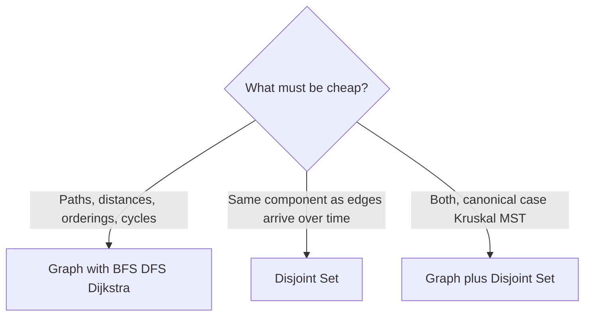

---
topic:
  - Computer Science
subtopic:
  - Data Structures
summary: "Graphs and disjoint sets for modelling relationships with cycles and multiple paths."
tags:
  - FolderNote
level:
  - "4"
priority: Medium
status: Not-Started
publish: true
---

# Intro

Graph structures model relationships between entities — service dependencies, social edges, road networks — where trees are too restrictive: cycles exist, multiple paths connect the same pair, and there's no root. .NET has no `Graph<T>` type; you compose one from primitives, and the composition depends on which relationship question must be cheap. A `Dictionary<TNode, List<TNode>>` adjacency list makes neighbor traversal cheap; a `bool[,]` matrix makes edge-existence O(1); two `int[]` arrays (a disjoint set) make "are these connected?" near-O(1) without storing edges at all.

That last option is the reason this folder has two notes rather than one. [[Graph]] is the explicit representation — you keep vertices and edges and run traversals (BFS, DFS, Dijkstra) over them. [[Disjoint Set]] keeps no edges: it collapses the graph into "which component is this vertex in?", trading every other question away for near-constant connectivity queries and merges.

```datacorejsx
const { FolderStructureMap } = await dc.require("Assets/components/devbook-folder-map.jsx");
return FolderStructureMap;
```

## Which Note You Need



The decision hinges on whether connectivity is **static or dynamic**. One-off "is B reachable from A?" on a fixed graph — a single BFS is simpler and answers directionality too. Edges arriving incrementally with connectivity queries interleaved — re-running BFS per query is O(V + E) each time, while a disjoint set amortizes to near-constant. The cost of the disjoint set: it only handles *undirected* connectivity and can never un-merge (no edge deletion).

## Questions

> [!QUESTION]- When does a disjoint set beat BFS for connectivity, and what do you give up?
> When edges arrive over time and connectivity queries interleave with insertions: each union/find is O(α(n)) ≈ O(1), versus O(V + E) to re-traverse per query. You give up everything except component identity — no paths, no distances, no directed reachability, and merges are irreversible (no edge deletion).

## References

- [Graph theory (Wikipedia)](https://en.wikipedia.org/wiki/Graph_theory) — vocabulary for vertices, edges, directed vs undirected, and connectivity; the shared language both child notes assume.
- [Disjoint-set data structure (Wikipedia)](https://en.wikipedia.org/wiki/Disjoint-set_data_structure) — the operations, the forest representation, and the O(α(n)) analysis.
- [PriorityQueue<TElement, TPriority> class](https://learn.microsoft.com/en-us/dotnet/api/system.collections.generic.priorityqueue-2) — the one .NET primitive built specifically for weighted-graph algorithms (Dijkstra, Prim).
