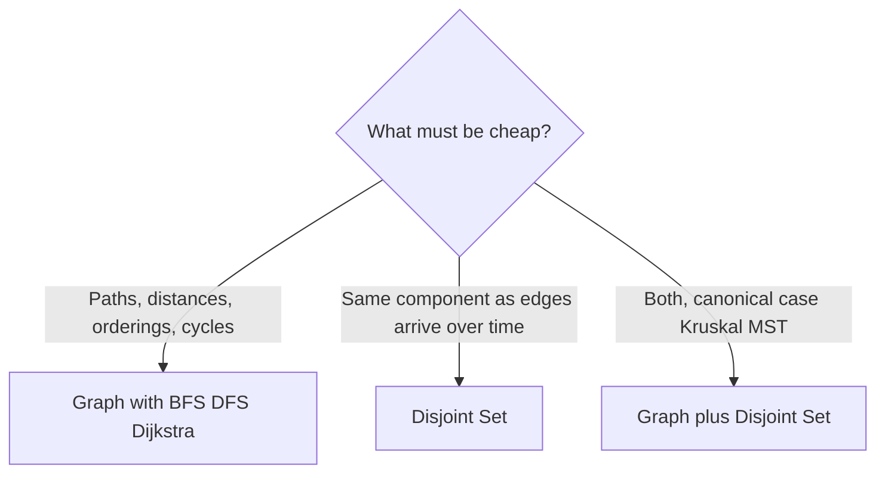

---
topic:
  - Computer Science
subtopic:
  - Data Structures
summary: "Graphs and disjoint sets for modelling relationships with cycles and multiple paths."
tags: [FolderNote]
level:
  - "4"
priority: Medium
status: Done
publish: true
---

Graph structures model relationships that do not fit a tree. Service dependencies can form cycles, roads may offer several routes between two places, and neither system needs a root. .NET has no general `Graph<T>` type, so the representation is assembled from collection primitives around the query that must stay cheap. A `Dictionary<TNode, List<TNode>>` makes neighbor traversal cheap. A `bool[,]` matrix makes an edge test O(1). Two `int[]` arrays can answer whether two vertices share a component in near-O(1) time without storing the edges at all.

This folder separates the full relationship from its component summary. [[Graph]] stores vertices and edges so traversals such as BFS, DFS, and Dijkstra can inspect the topology. [[Disjoint Set]] discards those edges and retains only the partition into connected components. [[Union-Find]] explains the rank and path-compression heuristics that keep the disjoint-set forest shallow, along with the amortized `O(α(n))` bound.

```datacorejsx
const { FolderStructureMap } = await dc.require("Assets/components/devbook-folder-map.jsx");
return FolderStructureMap;
```

# Graph or Disjoint Set


```mermaid
flowchart TD
    A{What must be cheap?} -->|Paths, distances, orderings, cycles| B[Graph with BFS DFS Dijkstra]
    A -->|Same component as edges arrive over time| C[Disjoint Set]
    A -->|Both, canonical case Kruskal MST| D[Graph plus Disjoint Set]
```

The useful dividing line is how the graph changes. For a one-off reachability question on a fixed graph, one BFS is simpler and preserves direction. When undirected edges arrive between queries, repeating BFS costs O(V + E) each time. A disjoint set updates and checks connectivity in near-constant time. It cannot recover a path or undo a merge.

# References

- [Graph theory (Wikipedia)](https://en.wikipedia.org/wiki/Graph_theory)
