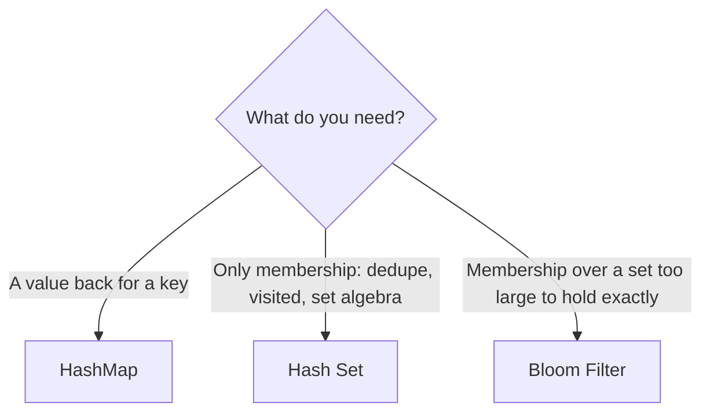

---
topic:
  - Computer Science
subtopic:
  - Data Structures
summary: "Dictionary, hash set, and Bloom filter, trading element ordering for near-O(1) key access."
tags:
  - FolderNote
level:
  - "4"
priority: Medium
status: Done
publish: true
---

Hash-based structures buy near-O(1) access by spending a hash function: the key's hash picks a bucket directly, so cost stays flat whether the collection holds 50 entries or 50 million. The guarantee is statistical, not absolute — it holds only while the hash distributes keys evenly. Skewed distribution (a `GetHashCode` returning constants, or an attacker flooding one bucket) collapses every structure in this family toward an O(n) scan, which is why the `GetHashCode`/`Equals` contract shows up as the top pitfall in each child note.

In .NET this family is `Dictionary<TKey, TValue>` and friends ([[HashMap]]), `HashSet<T>` ([[Hash Set]]), and the roll-your-own [[Bloom Filter]]. Reach for it whenever the access pattern is "by key" or "seen before?" and ordering doesn't matter — the price of hashing is losing order: enumeration order is unspecified for the map and the set, and the Bloom filter can't enumerate at all — it stores bits, not elements. How a table handles the collisions hashing makes inevitable — chaining, open addressing, or buckets — is a separate axis from what you store per element, worked through in [[Collision Resolution]].

```datacorejsx
const { FolderStructureMap } = await dc.require("Assets/components/devbook-folder-map.jsx");
return FolderStructureMap;
```

# Choosing Within the Family

Three structures, one axis: how much you store per element.

| | [[HashMap]] | [[Hash Set]] | [[Bloom Filter]] |
|---|---|---|---|
| Answers | "What value belongs to key k?" | "Is x in the set?" | "Might x be in the set?" |
| Stores per element | Key + value | The element | Nothing — ~10 bits of a shared bit array |
| Wrong answers | Never | Never | False positives (tunable, e.g. 1% at ~10 bits/element); never false negatives |
| Delete | Yes | Yes | No (needs counting/cuckoo variants) |
| .NET | `Dictionary<TKey,TValue>` | `HashSet<T>` | None built in — `BitArray` + k hashes |



A `Dictionary<TKey, bool>` used for membership wastes a value slot per entry and hides the intent, so prefer [[Hash Set]] there. The [[Bloom Filter]] wins when a small false-positive rate is cheaper than the memory: 100M URLs fit in ~120 MB at 1% false positives, versus many gigabytes as a `HashSet<string>`.

The Bloom filter is not a drop-in third option — it's a *pre-filter* in front of one of the exact structures (or a disk/network lookup). "Definitely not" skips the expensive check; "maybe" falls through to the authoritative source.

# Questions

> [!QUESTION]- When does putting a Bloom filter in front of a HashMap (or disk lookup) pay off?
> When most queries are for **absent** keys and the authoritative lookup is expensive (disk read, network call, or a map too big for RAM). The filter answers "definitely not" from a few bits per element, skipping the expensive path; only "maybe" (true hits plus the ~1% false positives) pays full price. If most queries hit, the filter is pure overhead — every hit still does the real lookup.

> [!QUESTION]- What single failure mode degrades every hash-based structure at once?
> Skewed hash distribution. A weak or non-uniform `GetHashCode` degrades all three: the map and set walk O(n) bucket chains, and the Bloom filter's false-positive rate inflates as correlated hashes concentrate bits. The hash-flooding *attack* specifically targets the bucketed structures — an attacker packs one chain with chosen keys.

# References

- [Selecting a collection class (Microsoft Learn)](https://learn.microsoft.com/en-us/dotnet/standard/collections/selecting-a-collection-class) — Microsoft's decision guide across hash-based and sorted collections.
- [Dictionary<TKey,TValue> class](https://learn.microsoft.com/en-us/dotnet/api/system.collections.generic.dictionary-2) — API reference; the remarks document the hash/equality contract the whole family depends on.
- [Bloom filter (Wikipedia)](https://en.wikipedia.org/wiki/Bloom_filter) — the math behind the bits-per-element vs false-positive-rate tradeoff quoted above.
