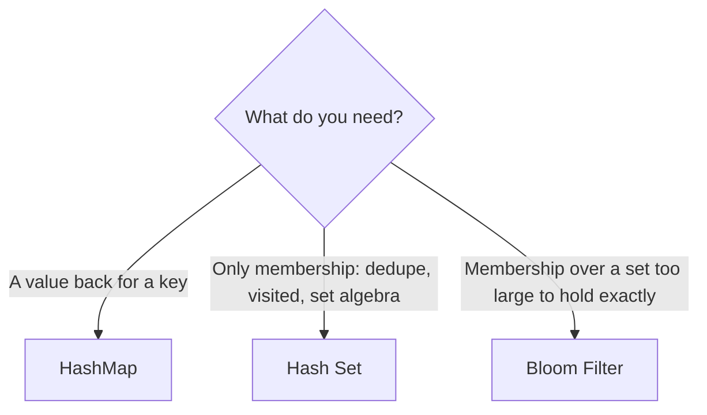

---
topic:
  - Computer Science
subtopic:
  - Data Structures
summary: "Dictionary, hash set, and Bloom filter, trading element ordering for near-O(1) key access."
tags: [FolderNote]
level:
  - "4"
priority: Medium
status: Done
publish: true
---

Hash-based structures use a key's hash to choose a small part of the collection to inspect. With a sound hash distribution and controlled load factor, lookup remains expected or amortized O(1) as the collection grows. That is a performance expectation, not a worst-case guarantee. A constant `GetHashCode` or deliberate hash flooding can force a map or set toward an O(n) scan. The `GetHashCode` contract governs that starting point. `Equals` then decides whether a candidate is the requested key.

In .NET, this family includes `Dictionary<TKey, TValue>` and related maps ([[HashMap]]) plus `HashSet<T>` ([[Hash Set]]). A [[Bloom Filter]] uses the same broad idea for probabilistic membership, but it stores shared bits rather than keys. These structures fit key lookup and duplicate detection when ordering is not part of the contract. [[Collision Resolution]] covers the separate question of what a table does when several keys choose the same home bucket.

```datacorejsx
const { FolderStructureMap } = await dc.require("Assets/components/devbook-folder-map.jsx");
return FolderStructureMap;
```

# Choosing Within the Family

The choice turns on how much information must survive insertion.

| | [[HashMap]] | [[Hash Set]] | [[Bloom Filter]] |
|---|---|---|---|
| Answers | "What value belongs to key k?" | "Is x in the set?" | "Might x be in the set?" |
| Stores per element | Key + value | The element | Nothing — ~10 bits of a shared bit array |
| Wrong answers | Never | Never | False positives (tunable, e.g. 1% at ~10 bits/element). Never false negatives |
| Delete | Yes | Yes | No (needs counting/cuckoo variants) |
| .NET | `Dictionary<TKey,TValue>` | `HashSet<T>` | None built in — `BitArray` + k hashes |


```mermaid
flowchart TD
    A{What do you need?} -->|A value back for a key| B[HashMap]
    A -->|Only membership: dedupe, visited, set algebra| C[Hash Set]
    A -->|Membership over a set too large to hold exactly| D[Bloom Filter]
```

A `Dictionary<TKey, bool>` used only for membership carries a value slot with no useful meaning. [[Hash Set]] expresses that contract directly. A [[Bloom Filter]] becomes attractive when exact keys are too expensive to retain: 100 million URLs need about 120 MB of filter bits at a 1% target false-positive rate, while an exact `HashSet<string>` takes far more memory.

The Bloom filter is a pre-filter, not an authoritative set. "Definitely not" can skip the expensive lookup. "Possibly present" still goes to the map, database, or other source of truth.

# References

- [Selecting a collection class (Microsoft Learn)](https://learn.microsoft.com/en-us/dotnet/standard/collections/selecting-a-collection-class)
