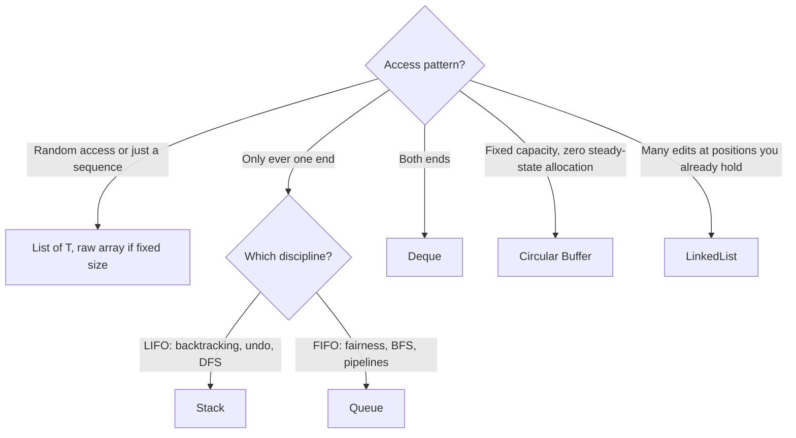

---
topic:
  - Computer Science
subtopic:
  - Data Structures
summary: "Sequence structures like arrays, lists, stacks, queues, and buffers, defined by access order."
tags:
  - FolderNote
level:
  - "4"
priority: Medium
publish: true
status: Done
---

# Intro

Linear structures store elements in a sequence. The academic category is about access order and position, not one concrete memory layout: arrays give index arithmetic and locality; linked lists trade locality for node-local edits; stacks, queues, deques, and circular buffers restrict which end can be read or written.

.NET's everyday defaults lean array-backed: `T[]`, `List<T>`, `Stack<T>`, and `Queue<T>` all use contiguous storage internally. `LinkedList<T>` lives here as the contrast case. It answers the same "ordered sequence" question, but pays pointer overhead and poor cache locality to avoid shifting elements during node-local edits.

```datacorejsx
const { FolderStructureMap } = await dc.require("Assets/components/devbook-folder-map.jsx");
return FolderStructureMap;
```

## The Family at a Glance

Every structure in this folder is an answer to two questions: *where can you touch the sequence* (any index, one end, both ends) and *what backs it* (one contiguous array, or nodes). Contiguous backing wins locality and allocation-free steady state; nodes win only when you hold a reference into the middle.

| Structure | Access discipline | Backing | Key costs | .NET |
|---|---|---|---|---|
| [[Arrays\|Array]] | Any index, O(1) | Contiguous, fixed size | Resize = reallocate + copy; middle insert/remove = O(n) shift | `T[]` |
| [[Dynamic Array]] | Any index, O(1); append amortized O(1) | Contiguous, grows ×2 | Mid-sequence insert/remove O(n) | `List<T>` |
| [[LinkedList]] | O(1) at a *held node*; O(n) to find it | Doubly-linked nodes | Allocation per node, cache-hostile traversal | `LinkedList<T>` |
| [[Stack]] | One end (LIFO) | Contiguous | Resize on growth; no access below the top | `Stack<T>` |
| [[Queue]] | In back, out front (FIFO) | Ring over an array | Unbounded growth if producers outpace consumers | `Queue<T>` |
| [[Deque]] | Both ends O(1); indexed access O(1) (ring) | Ring or linked nodes | No built-in .NET type | roll your own / `LinkedList<T>` |
| [[Circular Buffer]] | FIFO, fixed capacity, O(1) worst-case | Ring, wraps in place; zero steady-state allocation | Full ⇒ reject or overwrite oldest | hand-rolled; inside `Channel<T>` |
| [[Span]] | Any index — a *view*, owns nothing | Points at existing memory | Stack-only, can't cross `await` | `Span<T>` / `Memory<T>` |

## Choosing

Start from the access pattern, not the structure:



Wrap any contiguous sequence in [[Span]] to slice without copying. [[Stack]] and [[Queue]] make the restriction the feature: it states intent and can't be violated by a stray `Insert(0, …)`. .NET ships no [[Deque]] (bring a ring buffer, preferred over `LinkedList<T>`); [[Circular Buffer]] suits streaming and "last N events". [[LinkedList]] only wins for edits at held positions, and everywhere else its per-node allocations and pointer-chasing lose to contiguous storage (the numbers are in [[Arrays]]).

The recurring theme: contiguous beats linked unless you can prove otherwise with a profiler. Cache locality is the dominant constant factor (the [[Home/Data Persistence/Caching#Latency ladder|latency ladder]] shows why: a main-memory miss is ~100× an L1 hit), and every "O(1) insert" claim for linked nodes quietly assumes you already found the node.

## References

- [Collections and data structures (Microsoft Learn)](https://learn.microsoft.com/en-us/dotnet/standard/collections/) — overview of .NET collection families with complexity notes.
- [Selecting a collection class (Microsoft Learn)](https://learn.microsoft.com/en-us/dotnet/standard/collections/selecting-a-collection-class) — Microsoft's own decision guide across the linear (and other) collection types.
- [System.Array class (Microsoft Learn)](https://learn.microsoft.com/en-us/dotnet/api/system.array) — base API for the fixed-size contiguous storage everything here builds on.
- [Latency numbers every programmer should know](https://gist.github.com/jboner/2841832) — the cache/memory latencies behind the "contiguous beats linked" rule of thumb.
