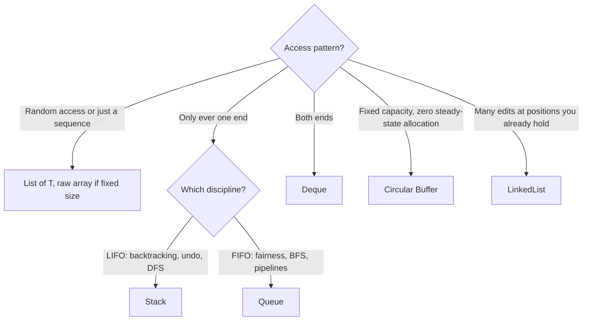

---
topic:
  - Computer Science
subtopic:
  - Data Structures
summary: "Sequence structures like arrays, lists, stacks, queues, and buffers, defined by access order."
tags: [FolderNote]
level:
  - "4"
priority: Medium
publish: true
status: Done
---

Linear structures arrange elements in a sequence. The category describes access order and position, not one memory layout. Arrays provide direct indexing and good locality. Linked lists trade that locality for edits around a node already in hand, while stacks and queues restrict which end may change.

.NET's usual choices lean array-backed: `T[]`, `List<T>`, `Stack<T>`, and `Queue<T>` all keep their elements in contiguous storage. `LinkedList<T>` is the contrast case. It avoids shifting during node-local edits, but pays for a node per element and pointer chasing during traversal.

```datacorejsx
const { FolderStructureMap } = await dc.require("Assets/components/devbook-folder-map.jsx");
return FolderStructureMap;
```

# The Family at a Glance

The choice comes down to access discipline and backing storage. Some structures expose any index, others one end or both. Contiguous storage usually wins on locality and steady-state allocation. Nodes become useful when the target node is already known.

| Structure | Access discipline | Backing | Key costs | .NET |
|---|---|---|---|---|
| [[Arrays\|Array]] | Any index, O(1) | Contiguous, fixed size | Resize = reallocate + copy. Middle insert/remove = O(n) shift | `T[]` |
| [[Dynamic Array]] | Any index, O(1). Append amortized O(1) | Contiguous, grows ×2 | Mid-sequence insert/remove O(n) | `List<T>` |
| [[LinkedList]] | O(1) at a *held node*. O(n) to find it | Doubly-linked nodes | Allocation per node, cache-hostile traversal | `LinkedList<T>` |
| [[Stack]] | One end (LIFO) | Contiguous | Resize on growth. No access below the top | `Stack<T>` |
| [[Queue]] | In back, out front (FIFO) | Ring over an array | Unbounded growth if producers outpace consumers | `Queue<T>` |
| [[Deque]] | Both ends O(1). Indexed access O(1) (ring) | Ring or linked nodes | No built-in .NET type | Custom ring / `LinkedList<T>` |
| [[Circular Buffer]] | FIFO, fixed capacity, O(1) worst-case | Ring, wraps in place. Zero steady-state allocation | Full ⇒ reject or overwrite oldest | hand-rolled. Inside `Channel<T>` |
| [[Span]] | Any index — a *view*, owns nothing | Points at existing memory | Stack-only, can't cross `await` | `Span<T>` / `Memory<T>` |

# Choosing

Start with the access pattern:


```mermaid
flowchart TD
    A{Access pattern?} -->|Random access or just a sequence| B[List of T, raw array if fixed size]
    A -->|Only ever one end| C{Which discipline?}
    C -->|LIFO: backtracking, undo, DFS| C1[Stack]
    C -->|FIFO: fairness, BFS, pipelines| C2[Queue]
    A -->|Both ends| D[Deque]
    A -->|Fixed capacity, zero steady-state allocation| E[Circular Buffer]
    A -->|Many edits at positions you already hold| F[LinkedList]
```

Wrap any contiguous sequence in [[Span]] when slicing must avoid a copy. [[Stack]] and [[Queue]] make restricted access part of the contract, so a stray `Insert(0, …)` cannot violate the intended order. .NET ships no [[Deque]]. A ring buffer is usually a better starting point than `LinkedList<T>`. [[Circular Buffer]] fits streams with a fixed capacity or a "last N events" policy. [[LinkedList]] earns its cost only for edits at nodes already held. Otherwise, its allocations and pointer chasing lose to contiguous storage (the numbers are in [[Arrays]]).

Contiguous storage is the default until measurement shows otherwise. Cache locality is often the deciding constant factor (the [[Home/Data Persistence/Caching#Measure the Actual Path|measurement boundary]] separates hardware-cache latency from application-cache latency). And every "O(1) insert" claim for a linked list assumes the target node has already been found.

# References

- [System.Array class](https://learn.microsoft.com/en-us/dotnet/api/system.array)
